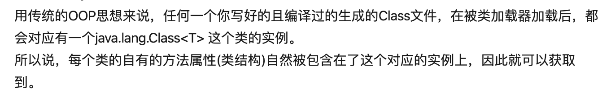

# Class对象与反射技术


参考：https://zhuanlan.zhihu.com/p/60805342


反射(Reflection)是 Java 程序开发语言的特征之一，它允许运行中的 Java 程序获取自身的信息，并且可以操作类或对象的内部属性。

<font color='gree' size=4>***通过反射机制，可以在运行时访问 Java 对象的属性，方法，构造方法等。***</font>

在运行时期动态创建对象；

获取对象的属性、方法

> 

------


##1、 反射的应用场景（优点）

- 开发通用框架 - 反射最重要的用途就是开发各种通用框架。很多框架（比如 Spring）都是配置化的（比如通过 XML 文件配置 ==**JavaBean**==、Filter 等），<font color='gree'>为了保证框架的通用性，它们可能需要根据配置文件加载不同的对象或类，调用不同的方法，这个时候就必须用到反射——运行时动态加载需要加载的对象。</font>
- <font color='gree'>动态代理 - 在切面编程（AOP）中</font>，需要拦截特定的方法，通常，会选择动态代理方式。这时，就需要反射技术来实现了。
- ==**注解**== - 注解本身仅仅是起到标记作用，它需要利用反射机制，根据注解标记去调用注解解释器，执行行为。如果没有反射机制，注解并不比注释更有用。
- 可扩展性功能 - 应用程序可以通过使用完全限定名称创建可扩展性对象实例来使用外部的用户定义类。

------


## 2、获取Class对象的三种方法

> 1. <font color='red'>**使用==Class类的static==方法：`Class.forName("类的全限定名")`**</font>
> 2. **直接获取某一个类的 class：`Boolean.class`**
> 3. <font color='red'>**==对象==调用 Object 的 `getClass` 方法：`object.getClass()`**</font>

------

举例

------

Admin类：

```java
public class Admin{
  
  //Field
	private int id;
  private String name;
  
  //Constructor
  public Admin(){
    sout("Admin.Admin()");
  }
  public Admin(String name){
    sout("Admin.Admin()"+name);
  }
    
  //Method
    ....getter,setter....
}
```


使用反射：获取对象，属性，方法

> - **getDeclaredConstructor**
> - **getDeclaredFields**
> - **getDeclaredMethod**
> - **Method.invoke**

```java
public void test{
  //全限定类名
  String className = "包+类";
  //得到类字节码，不知道类类型，所以用泛型<?>接收
  Class<?> clazz = Class.forName(className);
  
  //创建对象1:只能使用默认构造函数
  Admin admin = (Admin) clazz.newInstance();
  
  //创建对象2:通过构造器创建（该方式可调用含参构造函数）
  Constructor<?> constructor = clazz.getDeclaredConstructor(String.class);//要传入参数类型
  Admin admin = (Admin) constructor.newInstance("Jack"); //传入实际参数
  
  //获取所有属性
  Field[] fs = clazz.getDeclaredFields();
  for(Field f : fs){
    f.setAccessible(true);//设置强制访问
    String name = f.getName();
    Object value = f.get(admin);
  }
}

  //获取方法 public int getId(String name){}
	Method m = clazz.getDeclaredMethod("getId",String.class); //有参数，则传入参数类型，没有则不写
	//调用方法，因为刚才获取的方法有返回值
	Object r_value = m.invoke(admin); //传的是admin

```

<mark>上述为固定步骤</mark>

------

## 3、反射的缺陷

> **性能问题**
>
> 1. 使用反射基本上是一种解释操作，<font color='gree'>用于字段和方法接入时要远慢于直接代码。因此Java反射机制主要应用在对灵活性和扩展性要求很高的系统框架上,普通程序不建议使用。</font>
>
> 2. 反射包括了一些动态类型，所以JVM无法对这些代码进行优化。因此，反射操作的效率要比那些非反射操作低得多。我们应该避免在经常被 执行的代码或对性能要求很高的程序中使用反射。
>
> 3. 使用反射会模糊程序内部逻辑。程序人员希望在源代码中看到程序的逻辑，反射等绕过了源代码的技术，因而会带来维护问题。反射代码比相应的直接代码更复杂。
>
> **安全限制**
>
> ​		使用反射技术要求程序必须在一个没有安全限制的环境中运行。如果一个程序必须在有安全限		制的环境中运行，如Applet，那么这就是个问题了
>
> **内部暴露**
>
> ​		<font color='gree'>由于反射允许代码执行一些在正常情况下不被允许的操作（比如访问私有的属性和方法），所		以使用反射可能会导致意料之外的副作用</font>－－代码有功能上的错误，降低可移植性。反射代码		破坏了抽象性，因此当平台发生改变的时候，代码的行为就有可能也随着变化。
> 