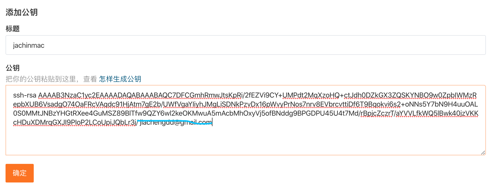
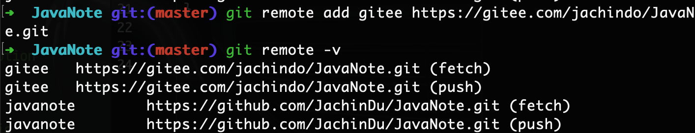
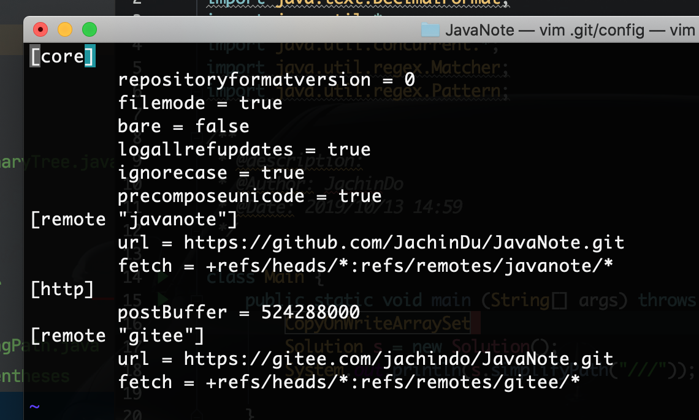

# Git简单操作

## 1、本地仓库建立

初始化本地git仓库

`git init`

## 2、与远程仓库连接ssh

> - `ssh-keygen -t rsa -C "你的邮箱"`，然后**一直按回车（不设置密码）**
>
> - `cd ~/.ssh`文件夹中的公钥文件id_rsa.pub文件内容复制出来，放到github或gitee的对应位置上**(切记去掉最后的邮箱，保留斜杠)**
>
>   ------
>
>   
>
> - ssh -T git@gitee.com或 ssh -T git@github.com验证公钥配置是否成功

------

## 3、添加远程仓库地址

> git remote add [name] https://xxx：添加一个远程地址
>
> git remote -v：查看所有添加的远程地址
>
> ​	
>
> git status：查看当前本地仓库状态
>
> .gitignore文件：配置忽略项

## 4、问题

> - 若push时没反应，可能是缓冲问题，需要执行以下配置：
>
>   `git config http.postBuffer 524288000`
>
> - 查看config文件：`vim .git/config`
>
>   
>
> - 可见，各种配置都在这里
>
> - **免密码可将url配置为：url = git@gitee.com:jachindo/JavaNote.git即在push/pull时无需密码，因为创建ssh时我们一路回车，没设置密码**

------

## 5、撤销commit或push

以好看的一行查看日志：**git log --pretty=oneline**

https://www.jianshu.com/p/491a14d414f6

------

## 6、常用命令

> - git branch < branch name>：创建分支
> - git checktout < branch name>：切换分支
> - git checkout -b \<branch name>：创建新分支并切换到该分支