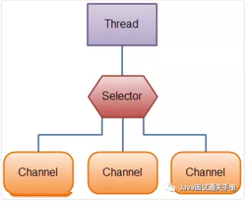

# Java IO API

**Java中提供的IO有关的API，在文件处理的时候，其实依赖操作系统层面的IO操作实现的。**比如在Linux 2.6以后，Java中NIO和AIO都是通过epoll来实现的，而在Windows上，AIO是通过IOCP来实现的。

可以把Java中的BIO、NIO和AIO理解为是Java语言对操作系统的各种IO模型的封装。程序员在使用这些API的时候，不需要关心操作系统层面的知识，也不需要根据不同操作系统编写不同的代码。只需要使用Java的API就可以了。

## 1、同步与异步

- **同步：** 同步就是发起一个调用后，被调用者未处理完请求之前，调用不返回。
- **异步：** **异步就是发起一个调用后，立刻得到被调用者的回应表示已接收到请求，但是被调用者并没有返回结果，此时我们可以处理其他的请求，被调用者通常依靠事件，回调等机制来通知调用者其返回结果。**

同步和异步的区别最大在于异步的话调用者不需要等待处理结果，被调用者会通过回调等机制来通知调用者其返回结果。

## 2、阻塞与非阻塞

- **阻塞：** 阻塞就是发起一个请求，调用者一直等待请求结果返回，也就是当前线程会被挂起，无法从事其他任务，只有当条件就绪才能继续。
- **非阻塞：** 非阻塞就是发起一个请求，调用者不用一直等着结果返回，可以先去干其他事情。

举个生活中简单的例子，你妈妈让你烧水，小时候你比较笨啊，在那里傻等着水开（**同步阻塞**）。等你稍微再长大一点，你知道每次烧水的空隙可以去干点其他事，然后只需要**时不时来看看**水开了没有（**同步非阻塞**）。后来，你们家用上了水开了会发出声音的壶，这样你就只需要听到响声后就知道水开了，在这期间你可以随便干自己的事情，你需要去倒水了（**异步非阻塞**）。

## 3、BIO(Blocking I/O)

同步阻塞I/O模式，数据的读取写入必须阻塞在一个线程内等待其完成。

> - ### **传统BIO：（可使用多线程实现伪异步）**
>
>   
>
> ​		 **我们再设想一下当客户端并发访问量增加后这种模型会出现什么问题？**
>
> ​		在 Java 虚拟机中，线程是宝贵的资源，线程的创建和销毁成本很高，除此之外，线程的切换成本也是很		高的。尤其在 Linux 这样的操作系统中，线程本质上就是一个进程，创建和销毁线程都是重量级的系统		函数。如果并发访问量增加会导致线程数急剧膨胀可能会导致线程堆栈溢出、创建新线程失败等问题，		最终导致进程宕机或者僵死，不能对外提供服务。
>
> - ### **伪异步IO(低并发)：*(线程池+任务队列)***
>
>   为了解决同步阻塞I/O面临的一个链路需要一个线程处理的问题，后来有人对它的线程模型进行了优化一一一**后端通过一个线程池来处理多个客户端的请求接入**，形成客户端个数M：线程池最大线程数N的比例关系，其中M可以远远大于N.通过线程池可以灵活地调配线程资源，设置线程的最大值，**防止由于海量并发接入导致线程耗尽。**
>
>   
>
>   采用线程池和任务队列可以实现一种叫做伪异步的 I/O 通信框架，它的模型图如上图所示。**当有新的客户端接入时，将客户端的 Socket 封装成一个Task（该任务实现`java.lang.Runnable`接口）投递到后端的线程池中进行处理，**JDK 的线程池维护一个任务队列和 N 个活跃线程，对任务队列中的任务进行处理。由于线程池可以设置消息队列的大小和最大线程数，因此，它的资源占用是可控的，无论多少个客户端并发访问，都不会导致资源的耗尽和宕机。
>
>   伪异步I/O通信框架采用了线程池实现，因此避免了为每个请求都创建一个独立线程造成的线程资源耗尽问题。不过因为它的**底层仍然是同步阻塞的BIO模型，因此无法从根本上解决问题。**

------

## 4、NIO(New I/O)

### 简介：

NIO是一种同步非阻塞的I/O模型，在Java 1.4 中引入了 NIO 框架，对应 java.nio 包，提供了 **Channel , Selector，Buffer等抽象。**

NIO中的N可以理解为Non-blocking，不单纯是New。***它支持面向缓冲的，基于通道的I/O操作方法***。 NIO提供了与传统BIO模型中的 `Socket` 和 `ServerSocket` 相对应的 `SocketChannel` 和 `ServerSocketChannel` 两种不同的套接字通道实现,两种通道都支持阻塞和非阻塞两种模式。阻塞模式使用就像传统中的支持一样，比较简单，但是性能和可靠性都不好；非阻塞模式正好与之相反。**对于低负载、低并发的应用程序，可以使用同步阻塞I/O来提升开发速率和更好的维护性；对于高负载、高并发的（网络）应用，应使用 NIO 的非阻塞模式来开发。**

### 结合NIO与普通IO的对比来描述NIO的特点：

> - **阻塞/非阻塞**：***IO流是阻塞的，NIO流是不阻塞的。***
>
>   Java NIO使我们可以进行非阻塞IO操作。比如说，单线程中从==**通道**==读取数据到==**buffer**==，同时可以继续做别的事情，当数据读取到buffer中后，线程再继续处理数据。写数据也是一样的。另外，非阻塞写也是如此。一个线程请求写入一些数据到某==**通道**==，但不需要等待它完全写入，这个线程同时可以去做别的事情。
>
>   Java IO的各种流是阻塞的。这意味着，当一个线程调用 `read()` 或 `write()` 时，该线程被阻塞，直到有一些数据被读取，或数据完全写入。该线程在此期间不能再干任何事情了
>
> - **Buffer(缓冲区)：** ***IO 面向流(Stream oriented)，而 NIO 面向缓冲区(Buffer oriented)。***
>
>   Buffer是一个对象，它包含一些要写入或者要读出的数据。在NIO类库中加入Buffer对象，体现了新库与原I/O的一个重要区别。**在面向流的I/O中·可以将数据直接写入或者将数据直接读到 Stream 对象中，而 NIO 却是直接读到 Buffer 中进行操作。**
>
>   在NIO库中，所有数据都是用缓冲区处理的。在读取数据时，它是直接读到缓冲区中的; 在写入数据时，写入到缓冲区中。**任何时候访问NIO中的数据，都是通过缓冲区进行操作。**
>
>   最常用的缓冲区是 ByteBuffer,一个 ByteBuffer 提供了一组功能用于操作 byte 数组。除了ByteBuffer,还有其他的一些缓冲区，事实上，每一种Java基本类型（除了Boolean类型）都对应有一种缓冲区。
>
> - **Channel(通道)：** ***NIO 通过Channel（通道） 进行读写。***
>
>   通道是==**双向**==的，可读也可写，而流的读写是单向的。无论读写，通道只能和Buffer交互。因为 Buffer，通道可以异步地读写。
>
> - **Selector(选择器)：** 
>
>   NIO有选择器，而IO没有。
>
>   选择器用于使用单个线程处理多个通道。因此，它需要较少的线程来处理这些通道。线程之间的切换对于操作系统来说是昂贵的。 因此，为了提高系统效率选择器是有用的。
>
>   

------

### NIO读/写方式

通常来说NIO中的所有IO都是从 Channel（通道） 开始的。

- 从通道进行数据读取 ：创建一个缓冲区，然后请求通道读取数据。
- 从通道进行数据写入 ：创建一个缓冲区，填充数据，并要求通道写入数据。

数据读取和写入操作图示：

## 5、AIO(Asynchronous I/O)

AIO 也就是 NIO 2。在 Java 7 中引入了 NIO 的改进版 NIO 2,它是**异步非阻塞的IO模型。异步 IO 是基于事件和回调机制实现的，也就是应用操作之后会直接返回，不会堵塞在那里，当后台处理完成，操作系统会通知相应的线程进行后续的操作。**

AIO 是异步IO的缩写，虽然 NIO 在网络操作中，提供了非阻塞的方法，但是 NIO 的 IO 行为还是同步的。**对于 NIO 来说，我们的业务线程是在 IO 操作准备好时，得到通知，接着就由这个线程自行进行 IO 操作，IO操作本身是同步的。**（除了 AIO 其他的 IO 类型都是同步的，这一点可以从底层IO线程模型解释）