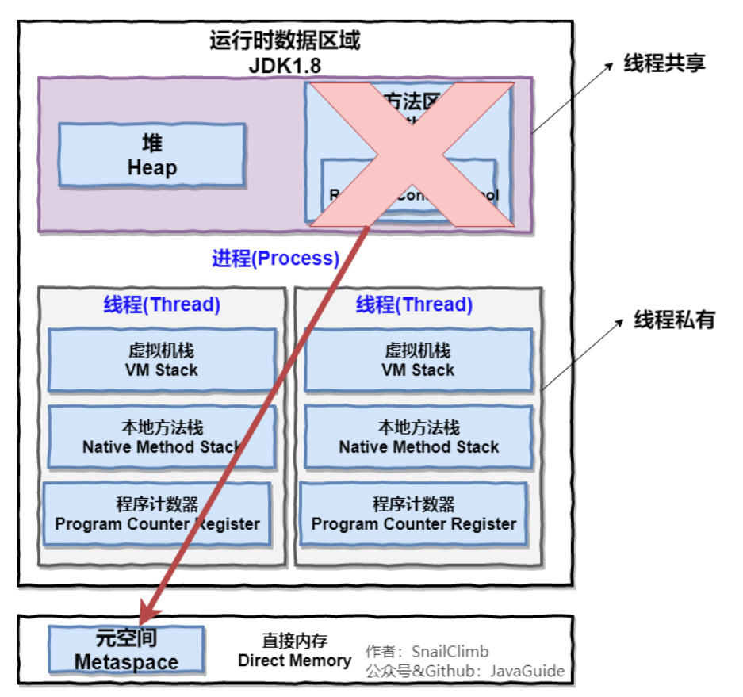
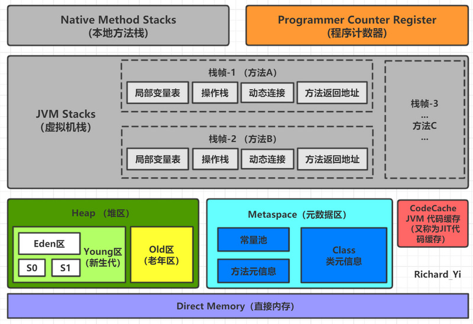
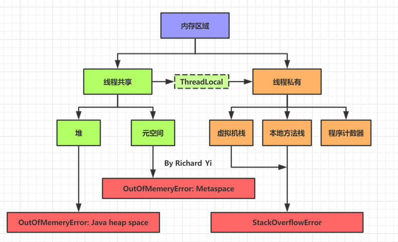
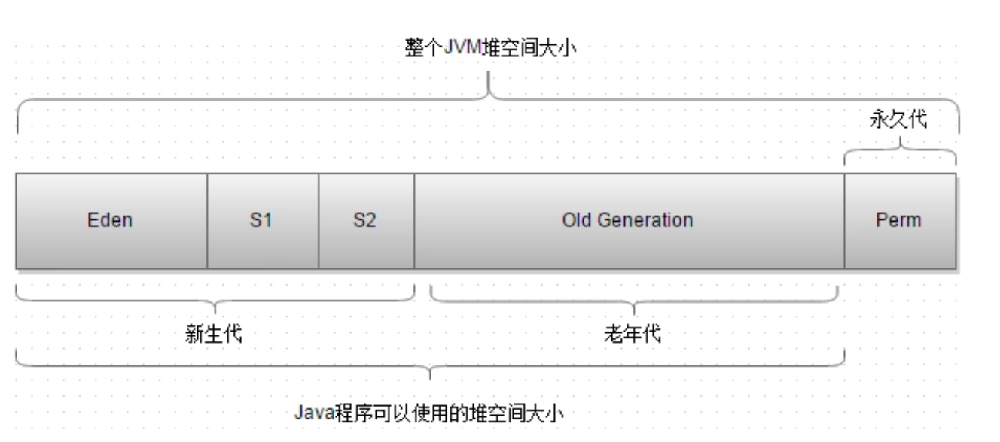
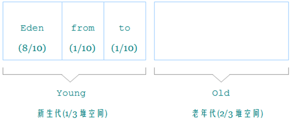
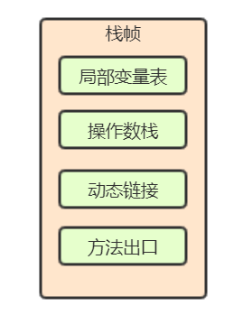
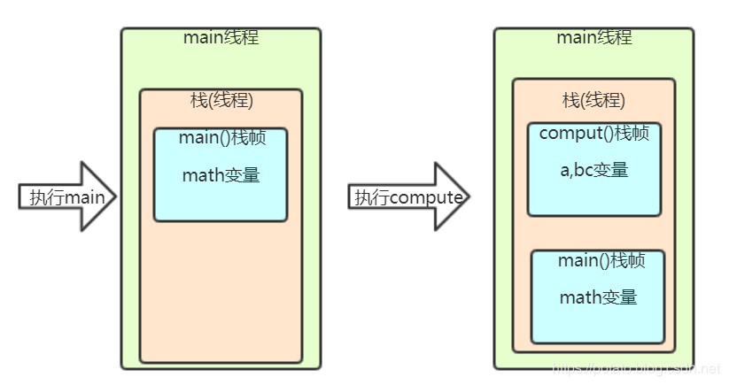
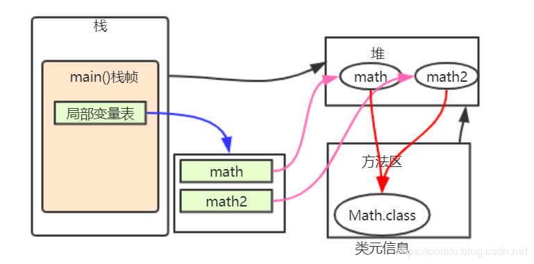

#  JVM内存区域详解

参考：https://segmentfault.com/a/1190000021424972

## 1、==内存区域（运行时数据区 ）==一览

==运行时数据区 != 运行时常量池==

### jdk1.8之前

------

### jdk1.8

可以看出主要有两个地方的更新：

- **由永久代在运行时数据区实现的方法区转为由元空间在==直接内存==实现。**
- **运行时常量池从方法区迁到了堆中。（这一项是jdk1.7开始就有的）**

------

------

------

------

## 2、堆空间分配

jdk1.8之前的堆内存示意图：

**1.8之前方法区由永久代实现在堆内存中，1.8之后，方法区由元空间实现在物理内存之中。**

>新生代进一步分为Eden + Survivor1 + Survivor2

***分区比例如下：***

> 通过参数可调堆大小，分区比例等。

------

### 1）内存分配策略

> 1. ***对象优先在Eden区分配***
>
> 2. ***大对象直接到老年代，减少分配担保带来的开销***
>
> 3. ***长期存活对象进入老年代***
>
> 4. ***动态对象年龄判定***
>
>    为了更好的适应不同程序的内存情况，虚拟机不是永远要求对象年龄必须达到了某个值才能进入老年代，如果 Survivor 空间中==**相同年龄所有对象大小的总和大于 Survivor 空间的一半，年龄大于或等于该年龄的对象就可以直接进入老年代，无需达到要求的年龄**==。
>
> 5. ***空间分配担保***
>
>    ***在发生Minor GC之前***，虚拟机会检查**老年代最大可用的==连续==空间**是否大于**新生代所有对象的总空间**，
>
>    - 如果大于，则此次**Minor GC是安全的**
>
>    - 如果小于，则虚拟机会查看==**HandlePromotionFailure**==设置值==***是否允许担保失败***==。
>       如果`HandlePromotionFailure=true`，那么会继续检查老年代最大可用连续空间是否大于***历次晋升到老年代的对象的==平均大小==***，如果大于，则==尝试进行一次Minor GC==，但这次Minor GC依然是有风险的；如果小于或者`HandlePromotionFailure=false`，==则改为进行一次Full GC==。
>
>    - 上面提到了Minor GC依然会有风险，是因为新生代采用**复制收集算法**，假如大量对象在Minor GC后仍然存活（最极端情况为内存回收后新生代中所有对象均存活），而Survivor空间是比较小的，这时就需要老年代进行分配担保，把Survivor无法容纳的对象放到老年代。**老年代要进行空间分配担保，前提是老年代得有足够空间来容纳这些对象**，但一共有多少对象在内存回收后存活下来是不可预知的，**因此只好取之前每次垃圾回收后晋升到老年代的对象大小的平均值作为参考**。使用这个平均值与老年代剩余空间进行比较，来决定是否进行Full GC来让老年代腾出更多空间。
>
>      取平均值仍然是一种**概率性的事件**，如果某次Minor GC后存活对象陡增，远高于平均值的话，必然导致担保失败，如果出现了分配担保失败，**就只能在失败后重新发起一次Full GC**。虽然存在发生这种情况的概率，***但大部分时候都是能够成功分配担保的，这样就避免了过于频繁执行Full GC。***

------

### 2）GC策略

> - 新生代：
>
>
> ​	MinorGC: 每一次MinorGC都会将Eden和某一个Survivor区(如Survivor1)中存活的对象转移到另一个Survivor(如Survivor2)中，然后清空前者。下一次MinorGC就清理Eden和另一个Survivor(这里该是Survivor2)，这样交替进行，每熬过一次MinorGC，对象年龄增加1。==***当要复制到的survivor满了时，将对象们都移动到老年代***==。
>
> - 老年代：FullGC/MajorGC

### 3）关于Survivor

> 1. 为什么需要Survivor？
>
>    如果没有有 Survivor 区，Eden 区每进行一次 Minor GC，存活的对象就会被送到老年代，==老年代很快就会被填满==。而有很多对象虽然一次 Minor GC 没有消灭，但其实也并不会蹦跶多久，或许第二次，第三次就需要被清除。这时候移入老年区，很明显不是一个明智的决定。
>
>    所以，Survivor 的存在意义就是减少被送到老年代的对象，进而减少 Major GC 的发生。Survivor 的预筛选保证，只有经历 16 次 Minor GC 还能在新生代中存活的对象，才会被送到老年代。
>
> 2. 为什么需要2个Survivor?
>
>    Survivor 如果只有一个区域。Minor GC 执行后，Eden 区被清空了，存活的对象放到了 Survivor 区，==而之前 Survivor 区中的对象，可能也有一些是需要被清除的==。问题来了，这时候我们怎么清除它们？在这种场景下，我们只能标记清除，而我们知道标记清除最大的问题就是==***内存碎片***==，在新生代这种经常会消亡的区域，采用标记清除必然会让内存产生严重的碎片化。因为 Survivor 有 2 个区域，所以每次 Minor GC，会将之前 Eden 区和 From 区中的存活对象复制到 To 区域。第二次 Minor GC 时，From 与 To 职责兑换，这时候会将 Eden 区和 To 区中的存活对象再复制到 From 区域，以此反复。
>
>    这种机制最大的好处就是，==整个过程中，永远有一个 Survivor space 是空的，另一个非空的 Survivor space 是无碎片的==。那么，Survivor 为什么不分更多块呢？比方说分成三个、四个、五个? 显然，如果 Survivor 区再细分下去，每一块的空间就会比较小，容易导致 Survivor 区满，两块 Survivor 区可能是经过权衡之后的最佳方案。

------

## 3、栈

> ***一个线程一个栈，一个方法一个栈帧***

------

## 4、方法区

***存放常量、静态变量、类元信息***

------

参考：

https://blog.csdn.net/qq_37141773/article/details/103138476#comments

https://segmentfault.com/a/1190000016187449

https://www.infoq.cn/article/ZOYqRI4c-BFKmUBmzmKN