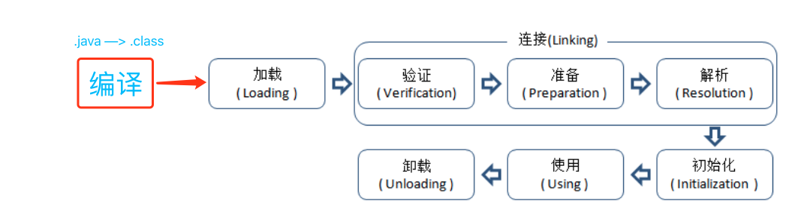
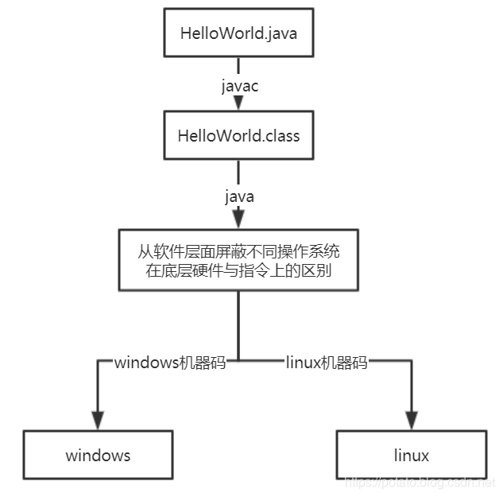
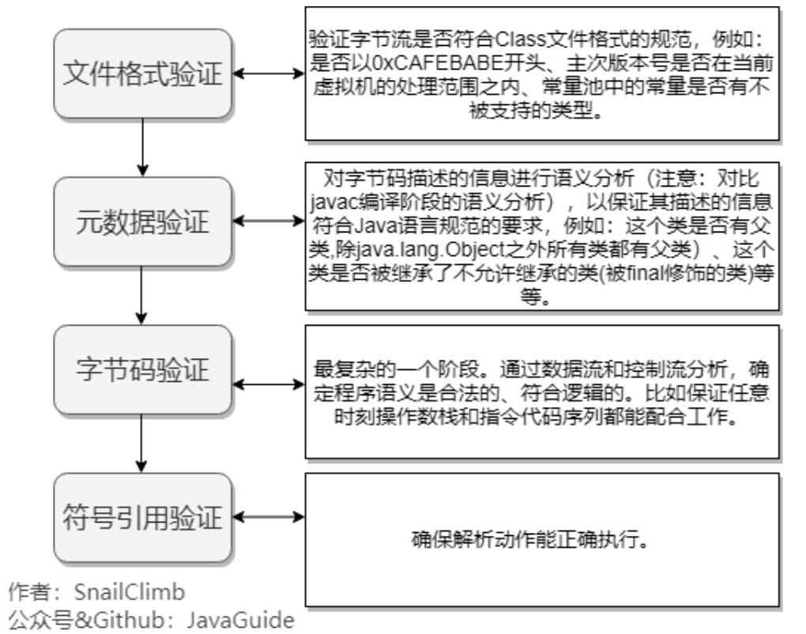

# JVM类生命周期与类的加载过程


类的生命周期：



==.class文件被加载到虚拟机内存后才可生效。==

类加载过程严格按照上述顺序“开始”，但不是按照上述顺序“进行”或“完成”，可能会交错。

------


## 0、java程序执行过程：




<font color='red'>Java 源代码---->编译器---->jvm 可执行的 Java 字节码(即虚拟指令)---->jvm---->jvm 中==***解释器***==----->机器可执行的==二进制机器码==---->程序运行。</font>

**采用字节码的好处：**

Java 语言通过字节码的方式，在一定程度上解决了传统解释型语言执行效率低的问题，同时又保留了解释型语言可移植的特点。所以 Java 程序运行时比较高效，而且，由于字节码==***并不专对一种特定的机器，因此，Java 程序无须重新编译便可在多种不同的计算机上运行***==。

------


## 1、关于类初始化时机

==当且仅当==对一个类进行==<font size=4>***主动引用***</font>==的时候才会触发初始化阶段。共有5种主动引用场景，详见文末参考文章。

> 主动引用：
>
> 1）创建类的实例(new)
>
> 2）访问类的静态变量(static)，==***final(常量)除外(final在“准备”阶段就初始化好了)***==
>
> 3）访问类的静态方法(static)
>
> 4）<font color='red'>***使用`java.lang.reflect`包的方法对类进行反射调用(Class.forName("xx.xx.xx))***</font>
>
> 5）初始化一个类时发现其父类还未初始化，则触发父类的初始化。==***接口与父接口不遵循***==
>
> 6）<font color='red'>***虚拟机启动时，先初始化定义了main()方法的那个类***</font>

------

其余==被动引用==不触发类的初始化，如：

> <font color='red'>1） 通过==子类引用父类的静态字段==，不会导致子类的初始化。父类自己引用自己的静态字段要触发初始化</font>
>
> <font color='red'>2）***由于静态字段导致的初始化，只有直接定义该静态字段的类被初始化，其父类及子类都不初始化。***</font>
>
> <font color='gree'>**3）通过数组定义来引用类，不会触发该类的初始化。**</font>如：
>
> ```java
> public class NotInitialization{
>     public static void main(String[] args){
>         SClass[] sca = new SClass[10];
>     }
> }
> ```
>
> 虚拟机并没有初始化Sclass， 而是触发了一个`[Lcn.edu.tju.rico.SClass`类的初始化，其中"["代表数组，该类直接继承于Object，创建动作由字节码指令newarray触发。
>
> 4）<font color='red'>常量在==**编译阶段会存入调用类的常量池**==中，不会触发==定义该常量的类==的初始化。</font>如：
>
> ```java
> // 定义类
> public class ConstClass{
> 
>     static{
>         System.out.println("ConstClass init!");
>     }
> 
>     public static  final String CONSTANT = "hello world";
> }
> // 调用类
> public class NotInitialization{
>     public static void main(String[] args){
>         System.out.println(ConstClass.CONSTANT);
>     }
> }/* Output: 
>         hello world
>  *///:~
> ```
>
> <font color='red'>4）访问类的常量(final)，不会触发类的初始化</font>
>
> <font color='red'>5）接口初始化不会导致父接口初始化</font>

------


## 2、进一步解释生命周期的每一步

### 1）加载

> - **<font color='blue'>根据一个类的全限定名将类的.class文件中的二进制数据读入JVM，并存储到==运行时内存区的方法区==中</font>**
> - **<font color='blue'>然后在堆上创建一个与目标类型对应的`java.lang.Class`==对象==。</font>**

------

<font color='red'>用户可通过==自定义类加载器==参与控制加载过程</font>

对于任何一个类，都需要由加载它的类加载器和这个类来确立其在JVM中的唯一性。也就是说，两个类来源于同一个Class文件，并且被同一个类加载器加载，这两个类才相等。

**<font color='blue'>加载阶段和连接阶段的部分内容是交叉进行的，加载阶段尚未结束，连接阶段可能就已经开始了。</font>**

------


### 2）验证

==虚拟机完全主导== ，cafebabe

> - 格式验证：验证是否符合class文件规范
>
> - ==语义验证==：
>   - 检查一个被标记为final的类型是否包含子类；
>   - 检查一个类中的final方法是否被子类进行重写；
>   - 确保父类和子类之间没有不兼容的一些方法声明（比如方法签名相同，但方法的返回值不同）
>
> - 操作验证：在操作数栈中的数据必须进行正确的操作，对常量池中的各种符号引用执行验证（通常在解析阶段执行，检查是否可以通过符号引用中描述的全限定名定位到指定类型上，以及类成员信息的访问修饰符是否允许访问等）



------


### ==3）准备阶段==

==虚拟机完全主导== 

> 为类中的所有***<font color='red'>静态变量</font>***==**分配内存**==空间，并为其==**设置一个初始零值**==（**<font color='red'>由于还没有产生对象，实例变量不在此操作范围内</font>**）
>
> **<font color='red'>被final修饰的static变量（常量），会直接赋值为指定值；</font>**

------


### 4）解析

>  **<font color='blue'>解析阶段是虚拟机将常量池内的==符号引用==替换为==直接引用==的过程，也就是==*得到类或者字段、方法在内存中的指针或者偏移量。*==</font>**
>
> **解析需要静态绑定的内容。// 所有不会被重写的方法和域都会被静态绑定**


以上2、3、4三个阶段又合称为链接阶段，

***<font color='red'>链接阶段要做的是将加载到JVM中的二进制字节流的类数据信息==合并到JVM的运行时状态中。==</font>***

------


### ==5）初始化阶段==

==第二次==对类变量初始化，这一次是按照程序员的意志。

<font color='red'>执行类构造器`<clinit>()`方法，整合，合并所有**类变量(static)**的==赋值动作==和==静态语句块==，类似于对象创建（类的实例化）中的实例构造器`<init>()`。</font>

> 注意：静态语句块只能访问到定义在静态语句块之前的变量，定义在它之后的变量，在前面的静态语句块可以赋值，但是不能访问。如下：
>
> ```java
> public class Test{
>     static{
>         i=0;
>         System.out.println(i);//Error：Cannot reference a field before it is defined（非法向前应用）
>     }
>     static int i=1;
> }
> ```
>
> 那么注释报错的那行代码，改成下面情形，程序就可以编译通过并可以正常运行了:
>
> ```java
> public class Test{
>     static{
>         i=0;
>         //System.out.println(i);
>     }
> 
>     static int i=1;
> 
>     public static void main(String args[]){
>         System.out.println(i);
>     }
> }/* Output: 
>         1
>  *///:~
> ```

==虚拟机会保证在子类类构造器`<clinit>()`执行之前，父类的类构造`<clinit>()`执行完毕。==

*<font color='gree'>**虚拟机会保证一个类的类构造器在多线程环境中被正确的加锁、同步，如果多个线程同时去初始化一个类，那么只会有一个线程去执行这个类的类构造器，其他线程都需要阻塞等待，直到活动线程执行()方法完毕。且，在同一个类加载器下，一个类型只会被初始化一次**。</font>*

------

<font color='red'>***最终，方法区会存储当前类类信息，包括类的静态变量、类初始化代码（定义静态变量时的赋值语句 和 静态初始化代码块）、实例变量定义、实例初始化代码（定义实例变量时的赋值语句实例代码块和构造方法）和实例方法，还有父类的类信息引用。***</font>

------


## 3、小结

结合java对象的创建，我们可以归纳，创建一个java对象需要经历如下几个阶段：

<font color='red'>**父类的类构造器() -> 子类的类构造器() -> 父类的成员变量和实例代码块 -> 父类的构造函数 -> 子类的成员变量和实例代码块 -> 子类的构造函数。**</font>


## 4、案例分析(类的初始化与实例化的纠结)

```java
public class StaticTest {
    public static void main(String[] args) {
        staticFunction();
    }

    static StaticTest st = new StaticTest();

    static {   //静态代码块
        System.out.println("1");
    }

    {       // 实例代码块
        System.out.println("2");
    }

    StaticTest() {    // 构造函数
        System.out.println("3");
        System.out.println("a=" + a + ",b=" + b);
    }

    public static void staticFunction() {   // 静态方法
        System.out.println("4");
    }

    int a = 110;    // 实例变量/成员变量
    static int b = 112;     // 静态变量
}
/* Output: 
        2
        3
        a=110,b=0 // 因为先进行了实例化，所以这里b是“准备”阶段的0值。
        1
        4
 *///:~
```

我们看一下上述代码的执行过程：

> 1. 首先第3行调用StaticTest类的静态方法，触发了该==类的初始化==。
> 2. 类的初始化执行的第一步就是第6行语句。
> 3. 由于第6行是==类的实例化，也就是说，这里将类的实例话嵌入到了类的加载过程之中，在准备阶段之后，类的初始化之前。==类似这样：
>
> ```java
> public class StaticTest {
>     <clinit>(){
>         a = 110;    // 实例变量
>         System.out.println("2");        // 实例代码块
>         System.out.println("3");     // 构造函数中代码的执行
>         System.out.println("a=" + a + ",b=" + b);  // 构造函数中代码的执行
>         类变量st被初始化
>         System.out.println("1");        //静态代码块
>         类变量b被初始化为112
>     }
> }
> ```
>
> 所以就有了上述的输出。
>
> 结论：<font color='red'>***实例初始化不一定要在类初始化结束之后才开始初始化。***</font>


参考文章：https://blog.csdn.net/justloveyou_/article/details/72466105

