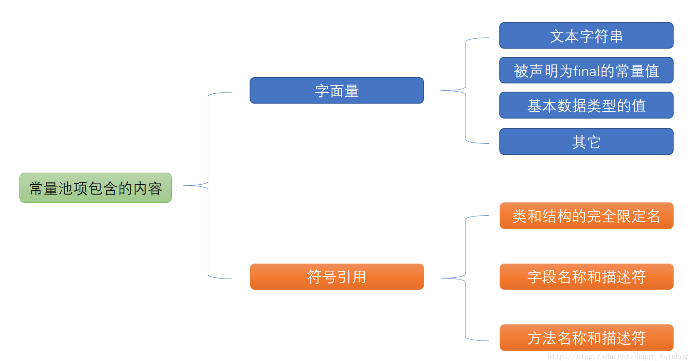

# Java中几种常量池的区分

## 1、(全局)字符串常量池(String Pool)

> 在类加载过程中，经过<font color='red'>验证、准备阶段后</font>：
>
> - 在堆中生成字符串<font color='red'>对象实例</font>
> - 将该字符串的对象实例<font color='red'>引用值</font>存到String Pool中

在HotSpot VM里实现的String pool功能的是一个StringTable类，它是一个哈希表，里面存的是驻留字符串(也就是我们常说的用双引号括起来的)的引用（而不是驻留字符串实例本身），也就是说在堆中的某些字符串实例被这个StringTable引用之后就等同被赋予了”驻留字符串”的身份。这个StringTable在每个HotSpot VM的实例只有一份，==被所有的类共享。==

------


## 2、class文件常量池

<font color='red'>生成与java文件编译为class文件后，每个类都有一个</font>	

class文件中除了包含类的版本、字段、方法、接口等描述信息外，还有一项信息就是常量池(constant pool table)，用于存放编译器生成的**各种字面量(Literal)和符号==引用==(Symbolic References)**。


字面量就是我们所说的常量概念，如文本字符串、被声明为==final==的常量值等。
符号引用是一组符号来描述所引用的目标，符号可以是任何形式的字面量，只要使用时能无歧义地定位到目标即可（它与直接引用区分一下，直接引用一般是指向方法区的本地指针，相对偏移量或是一个能间接定位到目标的句柄）。一般包括下面三类常量：

- 类和接口的全限定名
- 字段的名称和描述符
- 方法的名称和描述符

常量池的每一项常量都是一个表，一共有如下表所示的11种各不相同的表结构数据，这每个表开始的第一位都是一个字节的标志位（取值1-12），代表当前这个常量属于哪种常量类型。



## 3、运行时常量池

当类加载到内存后，==jvm就会将class常量池中的内容存放到运行时常量池当中。可见，运行时常量池也是每个类各有一个。==用于存储编译期就生成的字面常量、符号引用、翻译出来的直接引用（符号引用就是编码是用字符串表示某个变量、接口的位置，直接引用就是根据符号引用翻译出来的地址，将在类链接阶段完成翻译）；运行时常量池除了存储编译期常量外，也可以存储在运行时间产生的常量，比如String类的intern()方法，作用是String维护了一个常量池，如果调用的字符“abc”已经在常量池中，则返回池中的字符串地址，否则，新建一个常量加入池中，并返回地址。

**<font color='red' size = 4>*jdk1.7以前，运行时常量池是在方法区中。之后被放到了堆中，方法区也改为由元空间（直接内存）实现*</font>**


- ### 举例

  ```java
  String str1 = "abc";
  String str2 = new String("def");
  String str3 = "abc";
  String str4 = str2.intern(); // 返回全局字符串常量池中的引用
  String str5 = "def";
  System.out.println(str1 == str3);//true
  System.out.println(str2 == str4);//false
  System.out.println(str4 == str5);//true
  ```

  上面程序的首先经过==编译==之后，在该类的==class常量池中==存放一些==符号引用==，然后==类加载==之后，将class常量池中存放的符号引用==转存到运行时常量池==中，然后经过==验证，准备阶段==之后，在堆中生成==驻留字符串的实例对象==（也就是上例中str1所指向的”abc”实例对象），然后将这个==对象的引用存到全局String Pool==中，也就是StringTable中。最后在==解析阶段==，要把==运行时常量池中的符号引用替换成直接引用==，那么就直接查询StringTable，保证StringTable里的引用值与运行时常量池中的引用值一致。

  ------

  **内存分配过程：**
  
  首先，在==堆中会有一个”abc”实例==，==全局StringTable中存放着”abc”的一个引用值==，然后在运行<font color='red'>第二句的时候会生成两个实例，一个是”def”的实例对象，并且StringTable中存储一个”def”的引用值，还有一个是new出来的一个”def”的实例对象(str2所指向)，</font>与上面那个是不同的实例，当在解析str3的时候查找StringTable，里面有”abc”的全局驻留字符串引用，所以str3的引用地址与之前的那个已存在的相同，<font color='red'>str4是在运行的时候调用intern()函数，返回StringTable中”def”的引用值，如果没有就将str2的引用值添加进去，</font>在这里，StringTable中已经有了”def”的引用值了，所以返回上面在==new str2的时候添加到StringTable中的 “def”引用值==，最后str5在解析的时候就也是指向存在于StringTable中的”def”的引用值，那么这样一分析之后，三个打印的值就容易理解了。


## 4、基本类型的包装类的常量池

- **<font color='red'>Byte,Short,Integer,Long,Character,Boolean；这 5 种包装类默认创建了数值==[-128，127]== 的相应类型的缓存数据，==但是超出此范围仍然会去创建新的对象==。</font>** 为啥把缓存设置为[-128，127]区间？（[参见issue/461](https://github.com/Snailclimb/JavaGuide/issues/461)）性能和资源之间的权衡。
- **<font color='green'>两种浮点数类型的包装类 Float,Double 并没有实现常量池技术。</font>**


参考：http://tangxman.github.io/2015/07/27/the-difference-of-java-string-pool/