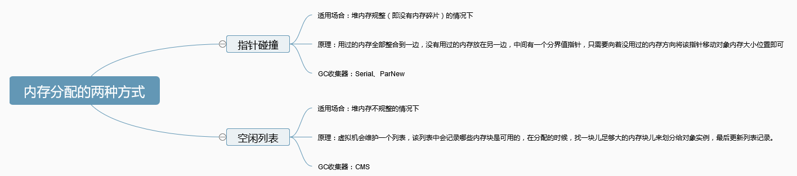
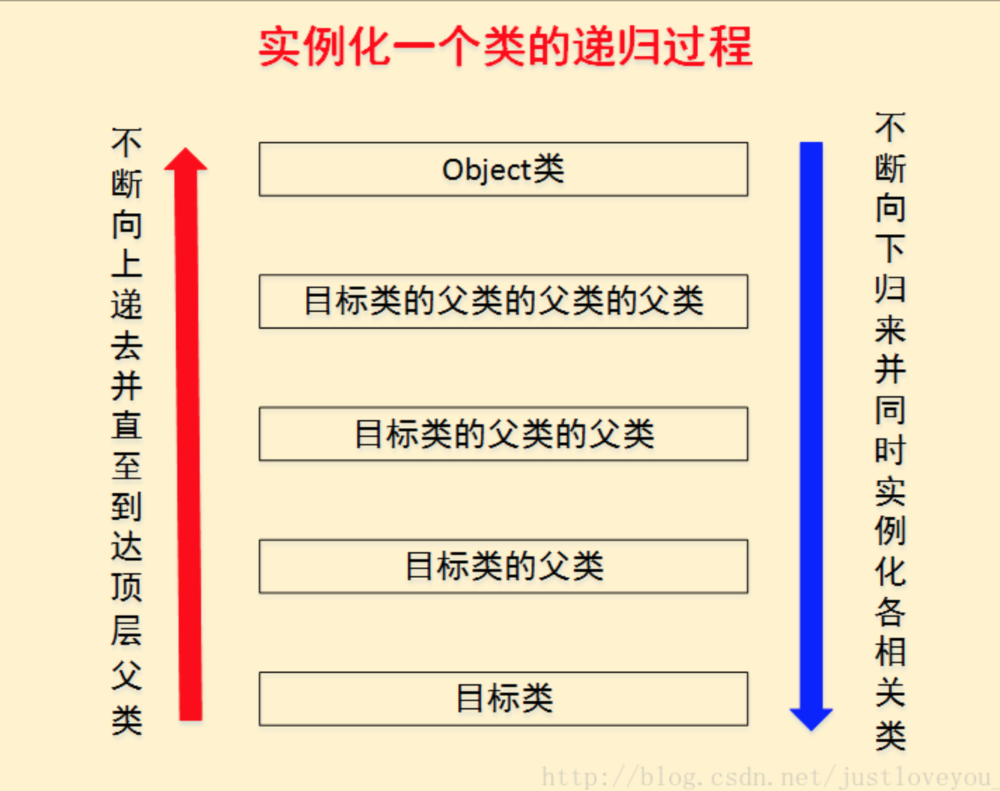
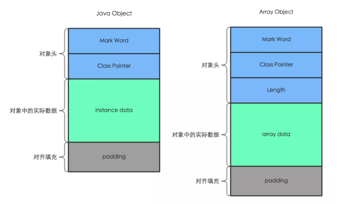
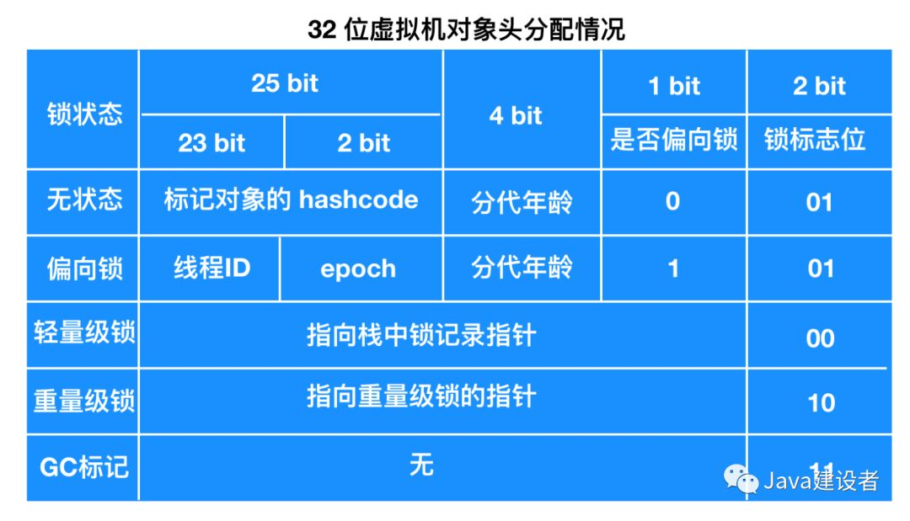
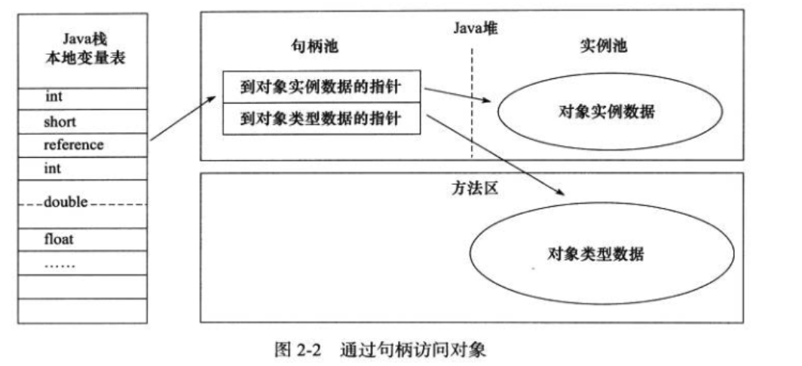
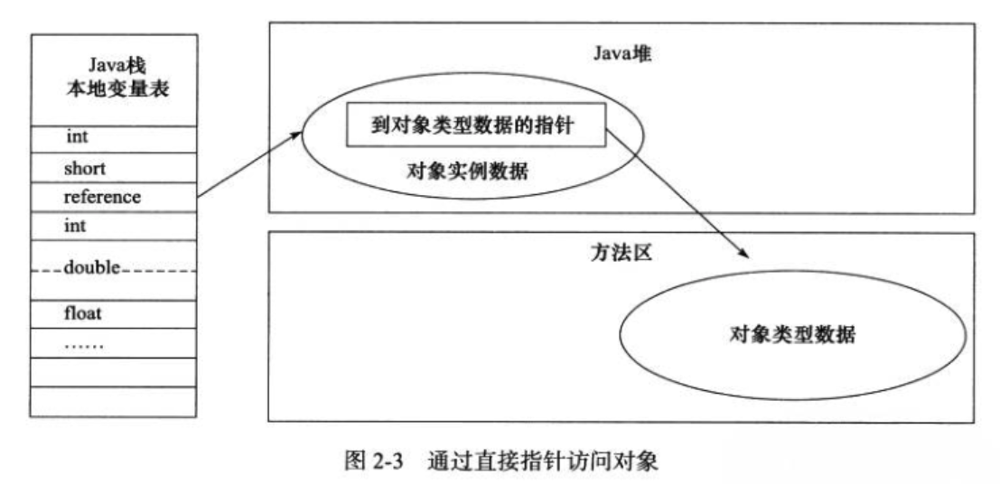

# Java对象的创建过程以及对象的内存布局

## new一个对象的过程中发生了什么？

参考：https://mp.weixin.qq.com/s/BPQKu5UcpnoT3vVLmhCDRg


## 1、Java对象创建过程


------

### &sect; 类加载检查

> **<font color='red'>若该类未加载则先执行类的加载过程</font>**
>
> **<font color='red'>对象所需的内存大小在类加载完成后便可确定</font>**

------

### &sect; 内存分配

**<font color='blue'>分配的内存包括本类和父类的所有实例变量，但不包括任何静态变量</font>**


#### &sect; 内存分配的两种方式：




#### &sect; **内存分配并发问题(防止内存冲突)**

在创建对象的时候有一个很重要的问题，就是线程安全，因为在实际开发过程中，创建对象是很频繁的事情，作为虚拟机来说，必须要保证线程是安全的，通常来讲，虚拟机采用两种方式来保证线程安全：

- **CAS+失败重试：** CAS 是乐观锁的一种实现方式。所谓乐观锁就是，每次不加锁而是假设没有冲突而去完成某项操作，如果因为冲突失败就重试，直到成功为止。**虚拟机采用 CAS 配上失败重试的方式保证更新操作的原子性。**
- **TLAB：** 为==每一个线程预先在 Eden 区分配一块儿内存==，JVM 在给线程中的对象分配内存时，首先在 TLAB 分配，当对象大于 TLAB 中的剩余内存或 TLAB 的内存已用尽时，再采用上述的 CAS 进行内存分配


### &sect; 初始化零值

将方法区内对实例变量的定义拷贝一份到堆区，然后赋**默认值**

### &sect; 设置对象头

==初始化零值完成之后==，**虚拟机要对对象进行必要的设置**，例如这个对象是==哪个类的实例、如何才能找到类的元数据信息、对象的哈希码、对象的 GC 分代年龄等信息==。 **这些信息存放在对象头中。** 另外，根据虚拟机当前运行状态的不同，如==是否启用偏向锁==等，对象头会有不同的设置方式。

------


### &sect; 初始化(类的实例化)

类的初始化不在本文范畴

此部分对应上图的`调用对象的<init>()方法`。==`<init>()`又叫做实例构造器，与之类似的有`<clinit>()`称为类构造器（用来初始化类变量，具体见《JVM类的生命周期与类的加载过程》）。==

<font color='red'> 注意：在此之前，在虚拟机为对象分配内存后，已经进行过一次初始化了</font>

然后才真正按照程序员的意志进行初始化：

> 1. 实例变量初始化
> 2. 实例代码块初始化
> 3. 构造函数初始化


#### 1）实例变量初始化与实例代码块初始化

<font color='red'>二者地位相同，编译器会按照二者的相对顺序将其插入到类的构造函数中，位置在超类构造函数之后(如果显示调用了)，本构造函数体中的剩余代码之前。</font>

举例：

```java
public class InstanceVariableInitializer {  

    private int i = 1;  
    private int j = i + 1;  

    public InstanceVariableInitializer(int var){
        System.out.println(i);
        System.out.println(j);
        this.i = var;
        System.out.println(i);
        System.out.println(j);
    }

    {               // 实例代码块
        j += 3; 

    }

    public static void main(String[] args) {
        new InstanceVariableInitializer(8);
    }
}
/* Output: 
            1
            5
            8
            5
 *///:~
```

上例的构造函数等价于：

```java
public InstanceVariableInitializer(int var){
        // 这里隐含了super.InstanceVariableInitializer()
  			// 以下是实例变量与实例代码块等价整合到了构造函数中
				this.i = 1;
  			this.j = i + 1;
  			this.j = this.j + 3;
  			// 本构造函数的函数体
        System.out.println(i);
        System.out.println(j);
        this.i = var;
        System.out.println(i);
        System.out.println(j);
    }
```

==通过查看字节码也可以验证这种整合：==如2）中的第一个例子中的字节码就有体现。

==注意：不允许顺序靠前的实例代码块初始化在其后面定义的实例变量==，如：

编译不通过

```java
public class InstanceInitializer {  
    {  
        j = i;  
    }  

    private int i = 1;  
    private int j;  
}  

public class InstanceInitializer {  
    private int j = i;  
    private int i = 1;  
}  
```


取巧可以绕过上述问题：

```java
public class InstanceInitializer {  
    private int j = getI();  
    private int i = 1;  

    public InstanceInitializer() {  
        i = 2;  
    }  

    private int getI() {  
        return i;  
    }  

    public static void main(String[] args) {  
        InstanceInitializer ii = new InstanceInitializer();  
        System.out.println(ii.j);  
    }  
}  
```

<font color='red'>这种方式虽然编译器不报错，但j的结果为0，因为在初始化j时，还没有执行构造函数中的`i = 2`，因此 i 为==内存分配完统一初始化的0值(还没到`<init>`)==。</font>


#### 2）构造函数初始化

构造函数在编译生成的字节码中，会被命名成`<init>()`方法，参数列表与Java语言书写的构造函数的参数列表相同。如：

```java
private int id;
private String name;
private String address;

// 构造函数
public Student(int id, String name) {
    this.id = id;
    this.name = name;
}
{
  address = "kk";
}

// 对应字节码
// access flags 0x1
  public <init>(ILjava/lang/String;)V
   L0
    LINENUMBER 15 L0
    ALOAD 0
    INVOKESPECIAL java/lang/Object.<init> ()V  // 调用父类构造函数
   L1
    LINENUMBER 20 L1
    ALOAD 0
    LDC "kk"
    PUTFIELD Student.address : Ljava/lang/String; // 将实例代码块织入实例构造器<init>中
   L2
    LINENUMBER 16 L2
    ALOAD 0
    ILOAD 1
    PUTFIELD Student.id : I   // 构造函数中的语句对应
   L3
    LINENUMBER 17 L3
    ALOAD 0
    ALOAD 2
    PUTFIELD Student.name : Ljava/lang/String; // 构造函数中的语句对应
   L4
    LINENUMBER 18 L4
    RETURN
   L5
    LOCALVARIABLE this LStudent; L0 L5 0
    LOCALVARIABLE id I L0 L5 1
    LOCALVARIABLE name Ljava/lang/String; L0 L5 2
    MAXSTACK = 2
    MAXLOCALS = 3
```


------

特别地，如果我们在一个构造函数中调用另外一个构造函数，如下所示

```java
public class ConstructorExample {  
    private int i;  

    ConstructorExample() {  
        this(1);  // 调用下面的构造函数
        ....  
    }  

    ConstructorExample(int i) {  
        ....  
        this.i = i;  
        ....  
    }  
}  
```

对于这种情况，==Java只允许在`ConstructorExample(int i)`内调用超类的构造函数==，也就是说，下面两种情形的代码编译是无法通过的：

```java
public class ConstructorExample {  
    private int i;  

    // 1.
    ConstructorExample() {  
        super();  
        this(1);  // Error:Constructor call must be the first statement in a constructor
        ....  
    }  
   // 2.
  ConstructorExample() {  
        this(1);  
        super();  //Error: Constructor call must be the first statement in a constructor
        ....  
    } 

    ConstructorExample(int i) {  
        ....  
        this.i = i;  
        ....  
    }  
}  
```


------


总之，java对象的初始化（类的实例化）是一个==递归==的过程，如下图所示：




------


## 3、对象的内存布局

**<font color='red'>注意：对上除了有普通对象外，还会存放数组对象</font>**




> 1. 对象头
>    - 标记字段：**对象自身的自身运行时数据**（哈希码、==GC 分代年龄==、==锁状态==标志等等）
>    - 类型指针：确定该对象是哪个类的实例
>    - 
> 2. 实例数据：**对象真正存储的有效信息**，也是在程序中所定义的各种类型的==字段==内容。
> 3. 对齐填充：对象的大小必须是 8 字节的整数倍


## 4、对象的访问


**<font color='red' size=5>Java 程序通过==栈上的reference==数据来操作==堆==上的具体对象</font>**

### 1）句柄




### 2）直接指针




参考：https://blog.csdn.net/justloveyou_/article/details/72466416

https://www.jianshu.com/p/91e398d5d17c