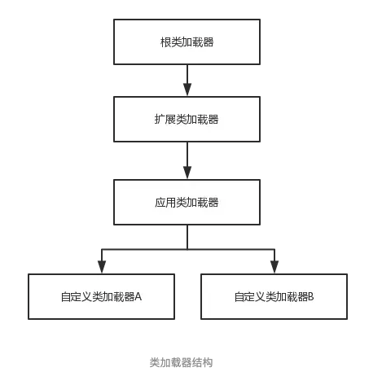
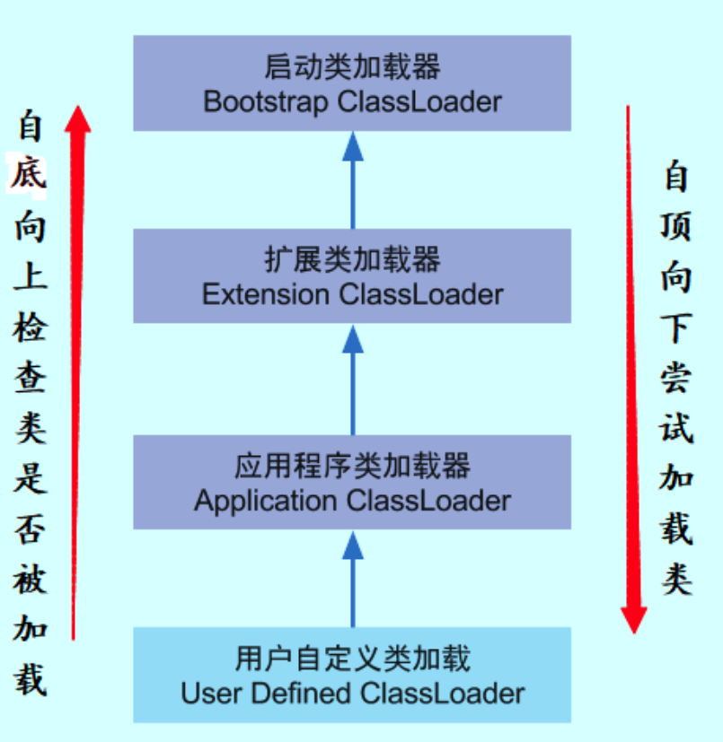

# Java类加载器与双亲委派模型

## 1、类加载器

==类加载阶段中通过类的全限定名获取定义此类的二进制字节流的动作代码。然后在堆上创建一个`java.lang.Class`对象==。

<font color='red'>对于任何一个类，都需要由加载它的类加载器和这个类来确立其在JVM中的唯一性。也就是说，两个类来源于同一个Class文件，并且被同一个类加载器加载，这两个类才相等。</font>

------

分类，常用三种：

> - 启动类加载器(Bootstrap ClassLoader): 加载目录 `<JAVA_HOME>\lib`
> - 扩展类加载器(Extension CLassLoader): `<JAVA_HOME>\lib\ext`
> - 应用程序类加载器(Application ClassLoader): `用户目录classpath`,==用户可以直接使用的类加载器，程序中若没有自定义的加载器则默认使用这个。==
>
> 
>
> 


## 2、双亲委派模型




------

​		

​	如果一个类加载器收到了类加载的请求，它首先不会自己去尝试加载这个类，而是把这个请求委派给父类加载器去完成，每一个层次的加载器都是如此，因此所有的类加载请求都会传给顶层的启动类加载器，只有当父加载器反馈自己无法完成该加载请求（该加载器的搜索范围中没有找到对应的类）时，子加载器才会尝试自己去加载。

> **<font color='red'>优点：</font>**
>
> 解决了各个类加载器的基础类统一问题，<font color='red'>***越基础的类由越上层的类加载器进行加载。***</font>
>
> ==例如`java.lang.Object`类，无论哪个类加载器去加载该类，最终都是由启动类加载器进行加载，因此Object类在程序的各种类加载器环境中都是同一个类==。否则的话，如果不使用该模型的话，如果用户自定义一个java.lang.Object类且存放在classpath中，那么系统中将会出现多个Object类，应用程序也会变得很混乱。
>
> **<font color='red'>缺点：</font>**
>
> 当基础类想要调用回下层的用户代码时无法委派子类加载器进行类加载。<font color='red'>解决方式：线程上下文类加载器</font>，这里不作介绍。

​		

​		如果我们自定义一个rt.jar中已有类的同名Java类，会发现JVM可以正常编译，但该类永远无法被加载运行。 在rt.jar包中的java.lang.ClassLoader类中，我们可以查看类加载实现过程的代码，具体源码如下：

```java
protected Class<?> loadClass(String name, boolean resolve)
        throws ClassNotFoundException
    {
        synchronized (getClassLoadingLock(name)) {
            // 首先检查该name指定的class是否有被加载 
            Class<?> c = findLoadedClass(name);
            if (c == null) {
                long t0 = System.nanoTime();
                try {
                    if (parent != null) {
                        // 如果parent不为null，则调用parent的loadClass进行加载 
                        c = parent.loadClass(name, false);
                    } else {
                        // parent为null，则调用BootstrapClassLoader进行加载  
                        c = findBootstrapClassOrNull(name);
                    }
                } catch (ClassNotFoundException e) {
                    // ClassNotFoundException thrown if class not found
                    // from the non-null parent class loader
                }

                if (c == null) {
                    // 如果仍然无法加载成功，则调用自身的findClass进行加载  
                    long t1 = System.nanoTime();
                    c = findClass(name);

                    // this is the defining class loader; record the stats
                    sun.misc.PerfCounter.getParentDelegationTime().addTime(t1 - t0);
                    sun.misc.PerfCounter.getFindClassTime().addElapsedTimeFrom(t1);
                    sun.misc.PerfCounter.getFindClasses().increment();
                }
            }
            if (resolve) {
                resolveClass(c);
            }
            return c;
        }
    }
```


**<font color='red'>可见，双亲之一为父类加载器，之二是启动类加载器</font>**

> 注意：
>
> 1. 因为启动类加载器无法被java程序直接引用（c++实现），所以代码中用null代表启动类加载器。
>
> 2. 注意到调用自身的`findClass()`方法，该方法是一个空方法：
>
>    ```java
>    protected Class<?> findClass(String name) throws ClassNotFoundException {
>            throw new ClassNotFoundException(name);
>        }
>    ```
>
>    ==***说明该方法需要开发者自己去实现，否则抛出异常，详情见下节“自定义类的加载器”***==


## 3、自定义类加载器

方式：

> 1. <font color='gree'>继承`java.lang.ClassLoader`类</font>
> 2. <font color='gree'>重写`findClass()`方法，返回值即为`java.lang.Class`类的实例，不建议重写`loadClass()`方法(破坏了双亲委派机制)。</font>

**<font color='red'>*java.lang.ClassLoader 类的基本职责就是根据一个指定的类的名称，找到或者生成其对应的==字节码==，然后从这些字节码中定义出一个 Java 类，即 java.lang.Class 类的一个实例。*</font>**

示例代码：

自定义的类加载器`MyClassLoader`

```java
import java.io.*;

/**
 * @description:
 * @Author: JachinDo
 * @Date: 2019/12/03 20:08
 */

public class MyClassLoader extends ClassLoader {

    // 加载器的名称
    private String name;

    // 类存放的路径,因为idea的缘故，所以路径后面为/out/production/jvm/
    private String path = "/Users/jc/IdeaProjects/jvm/out/production/jvm/";

    public MyClassLoader(ClassLoader parent, String name) {
        super(parent);
        this.name = name;
    }

    public MyClassLoader(String name) {
        this.name = name;
    }

    // 重写findClass方法
    @Override
    protected Class<?> findClass(String name) throws ClassNotFoundException {
        byte[] data = loadClassData(name);
        // 调用ClassLoader中的方法
        return this.defineClass(name, data, 0, data.length);
    }

    public byte[] loadClassData(String name) {
        // 将全限定类名转换为文件的路径
        name = name.replace(".", "/");
        try {
            FileInputStream fis = new FileInputStream(new File(path + name + ".class"));
            ByteArrayOutputStream bos = new ByteArrayOutputStream();
            int flag = 0;
            // 将类的.class文件读如到一个byte数组中
            while ((flag = fis.read()) != -1) {
                bos.write(flag);
            }
            return bos.toByteArray();
        } catch (FileNotFoundException e) {
            e.printStackTrace();
        } catch (IOException e) {
            e.printStackTrace();
        }
        return null;
    }
}

```


需要加载的类：

```java
import java.io.Serializable;

/**
 * @description:
 * @Author: JachinDo
 * @Date: 2019/11/28 13:47
 */
public class Student{
    private int id;
    private String name;

    public Student(int id, String name) {
        this.id = id;
        this.name = name;
    }

    public Student() {
    }

    public void shuchu() {
        System.out.println("kkkkkkkkk " + id);
    }
}
```


使用自定义类加载器加载`Student`类，（前提Student类已经编译为.class文件）

```java
/**
 * @description:
 * @Author: JachinDo
 * @Date: 2019/12/01 20:48
 */

public class Main {
    public static void main(String[] args) throws ClassNotFoundException, IllegalAccessException, InstantiationException {
        MyClassLoader mcl = new MyClassLoader("myClassLoader1");
        // 根据全限定名加载，注意，这里调用loadClass方法
        Class<?> clazz = mcl.loadClass("Student");
        Student student = (Student)clazz.newInstance();
        student.shuchu();
				System.out.println(student.getClass().getClassLoader());
    }
}
```

> 注意：第14行为查看加载该实例对象的类的类加载器，结果为：`sun.misc.Launcher$AppClassLoader@18b4aac2`


## 4、ClassLoader隔离

> 举例：
>
> <font color='red'>***如果两个”类”的全限定名相同，但不是由一个 ClassLoader 加载，==是无法将一个类的实例强转为另外一个类的==。这就是ClassLoader隔离。***</font>


## 5、如何避免双亲委派

由于系统自带的三个类加载器都加载特定目录下的类，==如果我们自己的类加载器放在一个特殊的目录，那么系统的加载器就无法加载，也就是最终还是由我们自己的加载器加载。==

或者重写`loadClass()`方法。


参考：https://juejin.im/post/5a810b0e5188257a5c606a85