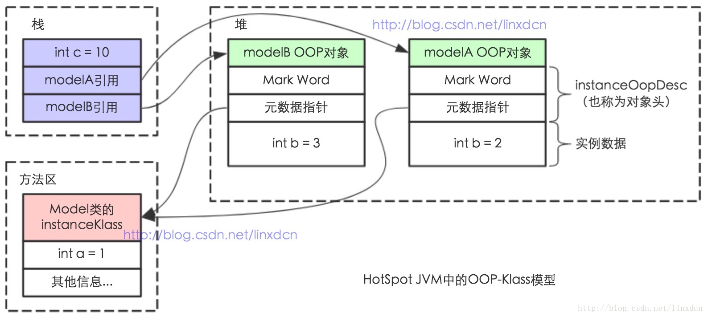

# Klass和Class

https://www.cnblogs.com/xy-nb/p/6773051.html

http://www.hollischuang.com/archives/1910

> - 每一个Java类，在被JVM加载的时候，**JVM会给这个类创建一个`instanceKlass`，保存在方法区，用来在JVM层表示该Java类。**
> - 当我们在Java代码中，**使用new创建一个对象的时候，JVM会创建一个`instanceOopDesc`对象，包含标记字段和类型指针。**
> - **其中类型指针指向的是对象所属的类的`instanceKlass`，而`instanceKlass`持有该类对应的Class对象（在堆上）的引用。并且堆上的`java.lang.Class`对象就是`instanceKlass`的一个镜像，用来暴露出来，因为HotSpot并不把instanceKlass暴露给Java。**

------

------

## 为什么要有个Klass又有一个Class？

> ***JachinDo个人认为，JVM是C++实现的，所以JVM层面得来一份类的元数据表示，而这个Klass就是一个JVM层面（C++）维护着的类的元数据。而Java运行时有时也需要类的元数据（如反射），这时避免其直接访问JVM层面的元数据，就搞了一个Klass的镜像Class放在堆中，供大家把玩。***

