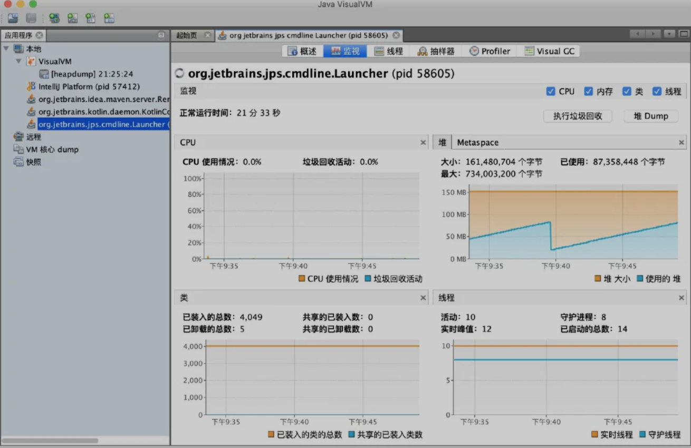
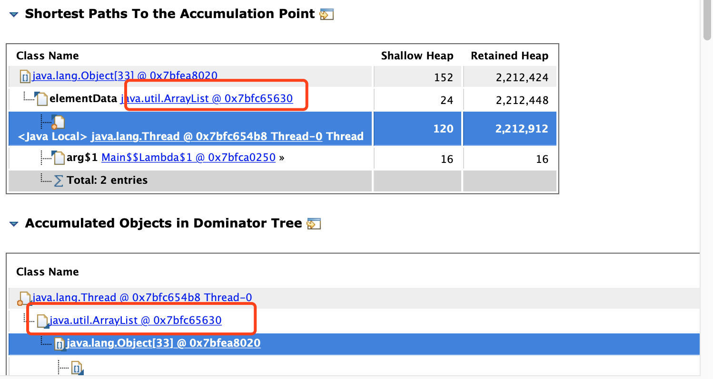

# cpu使用率高和内存泄漏排查

https://www.javazhiyin.com/34154.html

https://mp.weixin.qq.com/s/7XGD-Z3wrThv5HyoK3B8AQ

工具：

- **jvisualvm**：java自带，命令行输入即可打开，用于实施看到程序运行时jvm的情况。

  

- 分析dump文件：

  > - jvm参数设置：
  >
  >   ```java
  >   -Xmx4m // 调整堆最大值
  >   -Xms4m // 调整堆初始化值
  >   -XX:+HeapDumpOnOutOfMemoryError // oom时自动生成快照dump文件
  >   -XX:HeapDumpPath=/Users/jc/Desktop/hello.dump // 指定dump文件生成路径
  >   ```
  >
  > - 当程序出现oom后可拿dump文件利用MAT工具进行分析，定位问题。
  >
  > - 

