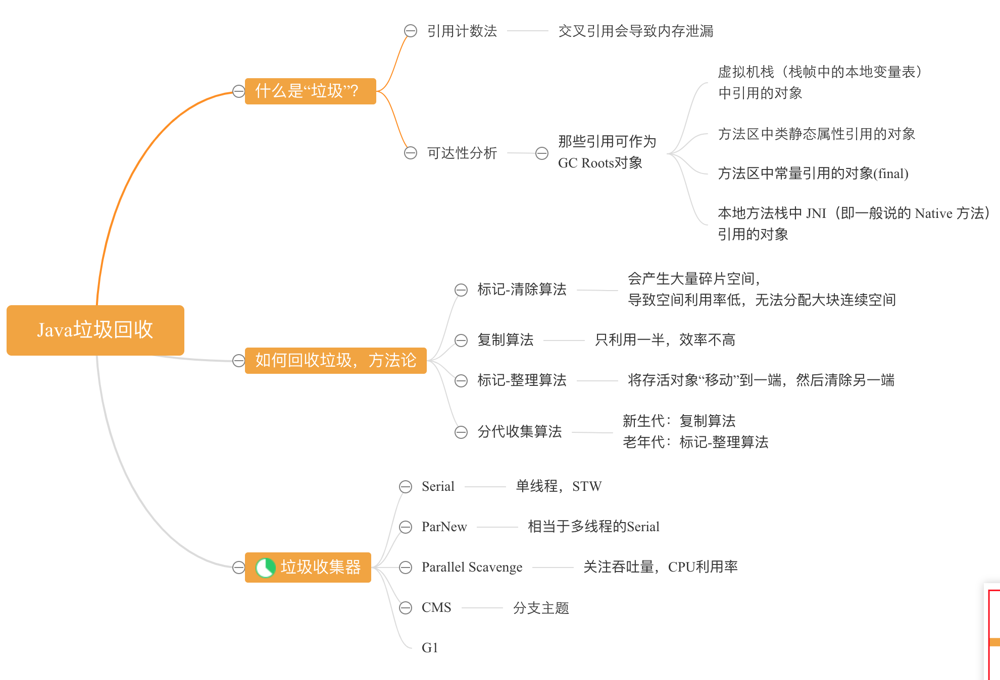
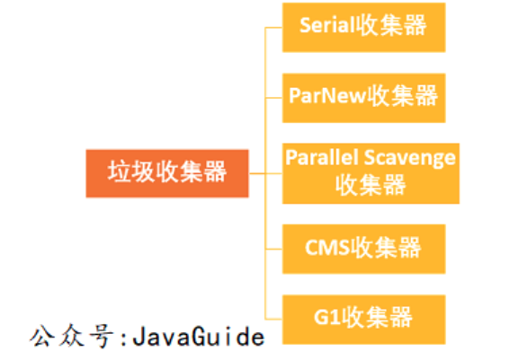
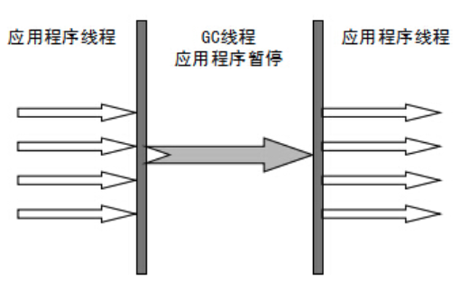
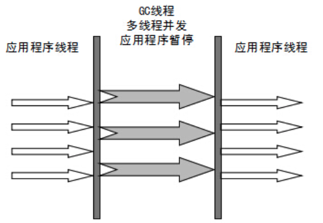
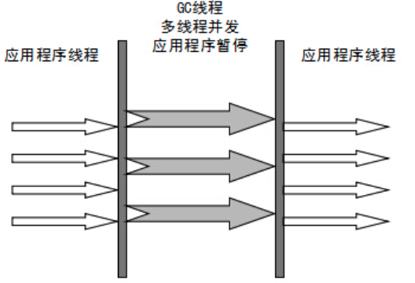
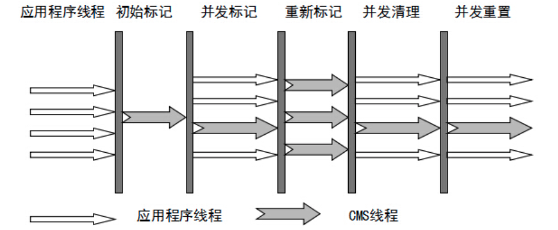

# 垃圾收集算法

------

参考：https://juejin.im/post/5b85ea54e51d4538dd08f601

https://juejin.im/post/5bade237e51d450ea401fd71

> 1. 标记-清除
> 2. 标记-整理
> 3. 复制
> 4. 分代收集

------

## 0、垃圾收集时机

> （1）程序调用==**System.gc**==时可以触发；
>
> （2）系统自身来决定GC触发的时机。系统判断GC触发的依据：***根据Eden区和From Space区的内存大小来决定。当内存大小不足时，则会启动GC线程并停止应用线程。***

------

## 1、为什么要分代？

**在==新生代==中，每次收集都会有大量对象死去，所以可以选择==复制算法==，只需要付出少量对象的复制成本就可以完成每次垃圾收集。而==老年代==的对象存活几率是比较高的，==而且没有额外的空间对它进行分配担保，所以我们必须选择“标记-清除”或“标记-整理”算法进行垃圾收集==。**

## 2、垃圾收集器

> 1. **Serial：==新生代--复制；老年代--标整==**
>
>    
>
> 2. **ParNew：同Serial，多线程**
>
>    
>
> 3. **Parallel Scavenge ：类似ParNew，==但注重吞吐量(CPU利用率)==**。**Parallel Scavenge收集器关注点是吞吐量（高效率的利用CPU）。CMS等垃圾收集器的关注点更多的是用户线程的停顿时间（提高用户体验）。所谓吞吐量就是CPU中用于运行用户代码的时间与CPU总消耗时间的比值。** 
>
>    
>
> 4. **Serial Old：Serial 收集器的老年代版本**
>
> 5. **Parallel Old：Parallel Scavenge 收集器的老年代版本**
>
> 6. **CMS：以获取==最短回收停顿时间==为目标的收集器。** **==标记-清除==**
>
>    **CMS（Concurrent Mark Sweep）收集器是 HotSpot 虚拟机第一款真正意义上的并发收集器，它第一次实现了让垃圾收集线程与用户线程（基本上）同时工作。**
>
>    
>
>    ------
>
>    - **初始标记：** ==暂停所有的其他线程==，并记录下==***直接与 root 相连***==的对象，速度很快 ；
>    - **并发标记：** 同时开启 GC 和用户线程，用一个闭包结构去记录可达对象。但在这个阶段结束，这个闭包结构并不能保证包含当前所有的可达对象。因为用户线程可能会不断的更新引用域，所以 GC 线程无法保证可达性分析的实时性。所以这个算法里会跟踪记录这些发生引用更新的地方。
>    - **重新标记：** 重新标记阶段就是为了==修正并发标记期间因为用户程序继续运行而导致标记产生变动==的那一部分对象的标记记录，这个阶段的停顿时间一般会比初始标记阶段的时间稍长，远远比并发标记阶段时间短
>    - **并发清除：** 开启用户线程，同时 GC 线程开始对为标记的区域做清扫。
>
>    **==缺点==：**
>
>    - **对 CPU 资源敏感；**
>    - **无法处理浮动垃圾；**
>    - **它使用的回收算法-“标记-清除”算法会导致收集结束时会有==大量空间碎片产生==。**
>
> 7. **G1收集器**：**==标整==**
>
>    **是一款面向服务器的垃圾收集器,主要针对配备==多颗处理器==及==大容量内存==的机器. 以极高概率==满足 GC 停顿时间==要求的同时,还具备高==吞吐量==性能特征.**
>
>    - **初始标记**
>    - **并发标记**
>    - **最终标记**
>    - **筛选回收**
>
>    **特点：**
>    
>    > - **并行与并发**：G1能充分利用CPU、多核环境下的硬件优势，使用多个CPU（CPU或者CPU核心）来缩短Stop-The-World停顿时间。部分其他收集器原本需要停顿Java线程执行的GC动作，G1收集器仍然可以通过并发的方式让java程序继续执行。
>    >
>    > - **分代收集**：虽然G1可以==不需要其他收集器配合就能独立管理整个GC堆==，但是还是保留了分代的概念。
>    >
>    > - **空间整合**：与CMS的“标记--清理”算法不同，G1从整体来看是基于“标记整理”算法实现的收集器；从局部上来看是基于“复制”算法实现的。
>    >
>    > - **可预测的停顿**：这是G1相对于CMS的另一个大优势，降低停顿时间是G1 和 CMS 共同的关注点，但G1 除了追求低停顿外，还能建立可预测的停顿时间模型，能让使用者明确指定在一个长度为M毫秒的时间片段内。

------

## 3、方法区也是会被回收的

> - ***所有实例被回收***
> - ***加载该类的ClassLoader被回收***
> - ***Class对象无法通过任何途径访问(包括反射)***