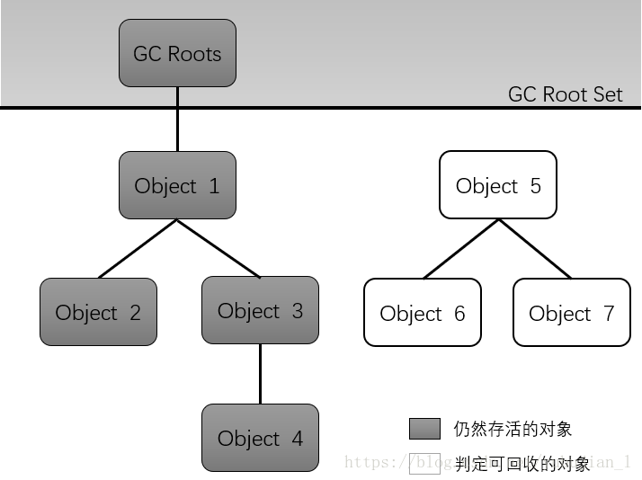

# 垃圾收集算法

------

## -2、可达性分析算法

原文：https://blog.csdn.net/luzhensmart/article/details/81431212

------

> 对象Object5 —Object7之间虽然彼此还有联系，但是它们到 GC Roots 是不可达的，因此它们会被判定为可回收对象。
>
> 在Java语言中，可作为GC Roots的对象包含以下几种：==**“引用“**==
>
> 1. ==**虚拟机栈(栈帧中的本地变量表)中引用的对象**==。(可以理解为:引用栈帧中的本地变量表的所有对象)
> 2. ==**方法区中静态属性引用的对象**==(可以理解为:引用方法区该静态属性的所有对象)
> 3. ==**方法区中常量引用的对象**==(可以理解为:引用方法区中常量的所有对象)
> 4. ==**本地方法栈中(Native方法)引用的对象**==(可以理解为:引用Native方法的所有对象)
>
> 可以理解为:
>
> (1) 首先第一种是虚拟机栈中的引用的对象，我们在程序中正常创建一个对象，对象会在堆上开辟一块空间，同时会将这块空间的地址作为引用保存到虚拟机栈中，如果对象生命周期结束了，那么引用就会从虚拟机栈中出栈，因此如果在虚拟机栈中有引用，就说明这个对象还是有用的，这种情况是最常见的。
>
> (2) 第二种是我们在类中定义了全局的静态的对象，也就是使用了static关键字，由于虚拟机栈是线程私有的，所以这种对象的引用会保存在共有的方法区中，显然将方法区中的静态引用作为GC Roots是必须的。
>
> (3) 第三种便是常量引用，就是使用了static final关键字，由于这种引用初始化之后不会修改，所以方法区常量池里的引用的对象也应该作为GC Roots。
>
> (4) 最后一种是在使用JNI技术时，有时候单纯的Java代码并不能满足我们的需求，我们可能需要在Java中调用C或C++的代码，因此会使用native方法，JVM内存中专门有一块本地方法栈，用来保存这些对象的引用，所以本地方法栈中引用的对象也会被作为GC Roots。

------

## -1、判定可回收过程

### **finalize()方法最终判定对象是否存活:**

 标记的前提是对象在进行可达性分析后发现没有与GC Roots相连接的引用链。

1. ==**第一次标记并进行一次筛选。**==
   筛选的条件是此对象是否有必要执行finalize()方法。**当对象没有覆写finalize方法，或者finzlize方法已经被虚拟机调用过，虚拟机将这两种情况都视为“没有必要执行”，对象被回收。**

2. ==**第二次标记**==
   如果这个对象被判定为有必要执行finalize（）方法，那么这个对象将会被放置在一个名为：***F-Queue的队列之中，并在稍后由一条虚拟机自动建立的、低优先级的Finalizer线程去执行。***这里所谓的==“***执行”是指虚拟机会触发这个方法，但并不承诺会等待它运行结束。这样做的原因是，如果一个对象finalize（）方法中执行缓慢，或者发生死循环（更极端的情况），将很可能会导致F-Queue队列中的其他对象永久处于等待状态，甚至导致整个内存回收系统崩溃。***==Finalize（）方法是对象脱逃死亡命运的最后一次机会，稍后GC将对F-Queue中的对象进行第二次小规模标记，如果对象要在finalize（）中成功拯救自己----只要重新与引用链上的任何的一个对象建立关联即可，譬如把自己赋值给某个类变量或对象的成员变量，那在第二次标记时它将移除出“即将回收”的集合。如果对象这时候还没逃脱，那基本上它就真的被回收了。
   流程图如下：

   

------

参考：[https://cyc2018.github.io/CS-Notes/#/notes/Java%20%E8%99%9A%E6%8B%9F%E6%9C%BA](https://cyc2018.github.io/CS-Notes/#/notes/Java 虚拟机)

------

> 1. 标记-清除
> 2. 标记-整理
> 3. 复制
> 4. 分代收集

------

## 0、垃圾收集时机

> （1）程序调用==**System.gc**==时可以触发；
>
> （2）系统自身来决定GC触发的时机。系统判断GC触发的依据：***根据Eden区和From Space区的内存大小来决定。当内存大小不足时，则会启动GC线程并停止应用线程。***

------

## 1、为什么要分代？

**在==新生代==中，每次收集都会有大量对象死去，所以可以选择==复制算法==，只需要付出少量对象的复制成本就可以完成每次垃圾收集。而==老年代==的对象存活几率是比较高的，==而且没有额外的空间对它进行分配担保，所以我们必须选择“标记-清除”或“标记-整理”算法进行垃圾收集==。**

## 2、垃圾收集器

------

> 1. Serial收集器
>
>    
>
>    它的优点是简单高效，在单个 CPU 环境下，==**由于没有线程交互的开销，因此拥有最高的单线程收集效率。缺点是stw**==
>
> 2. ParNew
>
>    
>
>    ==***它是 Serial 收集器的多线程（多GC线程，用户线程都停了，注意这里并没有并发）版本。老年代还是单线程。***==
>
>    它是 Server 场景下默认的新生代收集器，除了性能原因外，主要是因为除了 Serial 收集器，只有它能与 CMS 收集器配合使用。
>
> 3. Parallel Scavenge 收集器
>
>    
>
>    ==**与 ParNew 一样是多线程收集器。**==
>
>    ***其它收集器目标是尽可能缩短垃圾收集时用户线程的停顿时间，而它的目标是达到一个可控制的吞吐量，因此它被称为“吞吐量优先”收集器。这里的吞吐量指 CPU 用于运行用户程序的时间占总时间的比值。***
>
> 4. CMS收集器
>
>    标记-清除
>
>    
>
>      分为以下四个流程：
>
>    - **初始标记：仅仅只是标记一下 GC Roots 能==直接关联==到的对象，速度很快，==需要停顿==。**
>    - **并发标记：进行 GC Roots Tracing 的过程（跟踪标记引用链），它在整个回收过程中耗时最长，==不需要停顿。==**
>    - **重新标记：为了修正并发标记期间因用户程序继续运作而导致标记产生变动的那一部分对象的标记记录，==需要停顿。==**
>    - **并发清除：不需要停顿。**
>
>    ***在整个过程中耗时最长的并发标记和并发清除过程中，收集器线程都可以与用户线程一起工作，不需要进行停顿。***
>
>    具有以下缺点：
>
>    - ***吞吐量低：低停顿时间是以牺牲吞吐量（因为标记线程占用了部分cpu）为代价的，导致 CPU 利用率不够高。***
>    - ***==无法处理浮动垃圾==，可能出现 Concurrent Mode Failure。浮动垃圾是指并发清除阶段由于用户线程继续运行而产生的垃圾，这部分垃圾只能到下一次 GC 时才能进行回收。由于浮动垃圾的存在，因此需要预留出一部分内存，意味着 CMS 收集不能像其它收集器那样等待老年代快满的时候再回收。如果预留的内存不够存放浮动垃圾，就会出现 Concurrent Mode Failure，这时虚拟机将临时启用 Serial Old 来替代 CMS。***
>    - ***标记 - 清除算法导致的空间碎片，往往出现老年代空间剩余，但无法找到足够大连续空间来分配当前对象，不得不提前触发一次 Full GC。***
>
> 5. G1收集器
>
>    堆被分为新生代和老年代，其它收集器进行收集的范围都是整个新生代或者老年代，==**而 G1 可以直接对新生代和老年代一起回收。G1 把堆划分成多个大小相等的独立区域（Region），新生代和老年代不再物理隔离。**==
>
>    
>
>    ------
>
>    通过引入 Region 的概念，从而将原来的一整块内存空间划分成多个的小空间，使得每个小空间可以单独进行垃圾回收。这种划分方法带来了很大的灵活性，使得可预测的停顿时间模型成为可能。***通过记录每个 Region 垃圾回收时间以及回收所获得的空间（这两个值是通过过去回收的经验获得），并维护一个优先列表，每次根据允许的收集时间，优先回收价值最大的 Region。***
>
>    ***每个 Region 都有一个 Remembered Set，用来记录该 Region 对象的引用对象所在Region。通过使用 Remembered Set，在做可达性分析的时候就可以避免全堆扫描。***
>
>    
>
>    如果不计算维护 Remembered Set 的操作，G1 收集器的运作大致可划分为以下几个步骤：
>
>    - 初始标记
>    - 并发标记
>    - 最终标记：为了修正在并发标记期间因用户程序继续运作而导致标记产生变动的那一部分标记记录，虚拟机将这段时间对象变化记录在线程的 Remembered Set Logs 里面，最终标记阶段需要把 Remembered Set Logs 的数据合并到 Remembered Set 中。这**阶段需要停顿线程，但是可并行执行。**
>    - 筛选回收：***首先对各个 Region 中的回收价值和成本进行排序，根据用户所期望的 GC 停顿时间来制定回收计划。***此阶段其实也可以做到与用户程序一起并发执行，但是因为只回收一部分 Region，时间是用户可控制的，而且停顿用户线程将大幅度提高收集效率。
>
>    具备如下特点：
>
>    - ==**空间整合**==：整体来看是基于“标记 - 整理”算法实现的收集器，从局部（两个 Region 之间）上来看是基于“复制”算法实现的，这意味着运行期间不会产生内存空间碎片。
>    - ==**可预测的停顿**==：能让使用者明确指定在一个长度为 M 毫秒的时间片段内，消耗在 GC 上的时间不得超过 N 毫秒。

------

## 3、方法区也是会被回收的

> - ***所有实例被回收***
> - ***加载该类的ClassLoader被回收***
> - ***Class对象无法通过任何途径访问(如反射)***