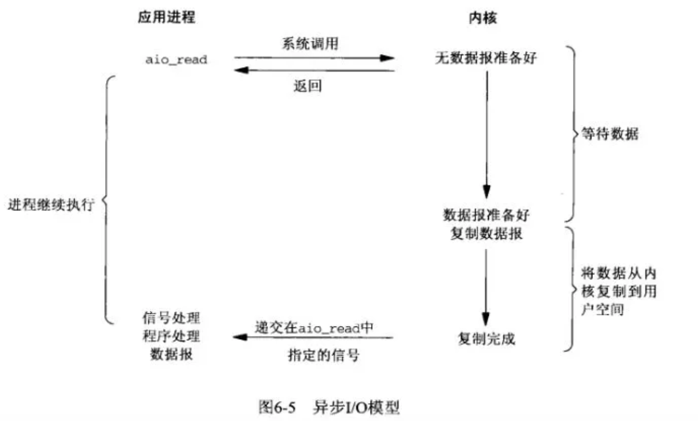

# Linux系统级IO

在Linux(UNIX)操作系统中，共有五种IO模型，分别是：**阻塞IO模型**、**非阻塞IO模型**、**IO复用模型**、**信号驱动IO模型**以及**异步IO模型**。

参考：https://mp.weixin.qq.com/s?__biz=Mzg3MjA4MTExMw==&mid=2247484746&idx=1&sn=c0a7f9129d780786cabfcac0a8aa6bb7&source=41#wechat_redirect

## 1、阻塞IO

阻塞 I/O 是最简单的 I/O 模型，一般表现为进程或线程等待某个条件，如果条件不满足，则一直等下去。条件满足，则进行下一步操作。

应用进程通过系统调用 `recvfrom` 接收数据，但由于内核还未准备好数据报，应用进程就会阻塞住，直到内核准备好数据报，`recvfrom` 完成数据报复制工作，应用进程才能结束阻塞状态。

## 2、非阻塞IO

**周期性的去看**

应用进程与内核交互，目的未达到之前，不再一味的等着，而是直接返回。然后通过轮询的方式，不停的去问内核数据准备有没有准备好。如果某一次轮询发现数据已经准备好了，那就把数据拷贝到用户空间中。

------

应用进程通过 `recvfrom` 调用不停的去和内核交互，直到内核准备好数据。如果没有准备好，内核会返回`error`，应用进程在得到`error`后，过一段时间再发送`recvfrom`请求。在两次发送请求的时间段，进程可以先做别的事情。

## 3、信号驱动IO

应用进程在读取文件时通知内核，**如果某个 socket 的某个事件发生时，请向我发一个信号。在收到信号后，信号对应的处理函数会进行后续处理。**

------

应用进程预先向内核注册一个信号处理函数，然后用户进程返回，并且不阻塞，当内核数据准备就绪时会发送一个信号给进程，用户进程便在信号处理函数中开始把数据拷贝的用户空间中。

## 4、IO复用

**多个进程的IO可以注册到同一个管道上，这个管道会统一和内核进行交互。当管道中的某一个请求需要的数据准备好之后，进程再把对应的数据拷贝到用户空间中。**

------

IO多路转接是多了一个`select`函数，**多个进程的IO可以注册到同一个`select`上，当用户进程调用该`select`，`select`会监听所有注册好的IO，如果所有被监听的IO需要的数据都没有准备好时，`select`调用进程会阻塞。当任意一个IO所需的数据准备好之后，`select`调用就会返回，然后进程在通过`recvfrom`来进行数据拷贝。**

**这里的IO复用模型，并没有向内核注册信号处理函数，所以，他并不是非阻塞的。**进程在发出`select`后，要等到`select`监听的所有IO操作中至少有一个需要的数据准备好，才会有返回，并且也需要再次发送请求去进行文件的拷贝。

------

>  我们说阻塞IO模型、非阻塞IO模型、IO复用模型和信号驱动IO模型都是同步的IO模型。原因是因为，无论以上那种模型，真正的数据拷贝过程，都是同步进行的。
>
> **信号驱动难道不是异步的么？** 信号驱动，内核是在数据准备好之后通知进程，然后进程再通过`recvfrom`操作进行数据拷贝。**==我们可以认为数据准备阶段是异步的，但是，数据拷贝操作是同步的。==**所以，整个IO过程也不能认为是异步的。

------

## 5、异步IO

应用进程把IO请求传给内核后，完全由内核去操作文件拷贝。内核完成相关操作后，会发信号告诉应用进程本次IO**==已经完成==**。** *（数据准备阶段与数据拷贝操作都完成了）***

------

------

## 6、五种IO对比

