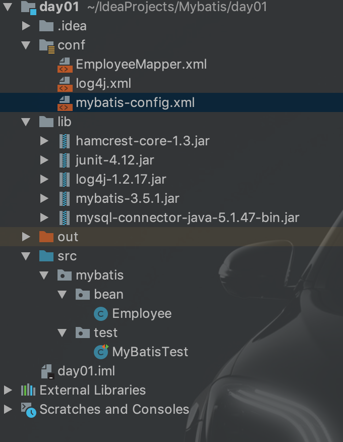

# MyBatis初探

【半自动】将sql定义交给开发者，比全自动的hibernate无法自定义sql有一些优势。

更多介绍见其他地方


## 1、demo

步骤


### **1）目录结构**



**<font color="red" size=5>注意：要将conf文件夹设置为Resoures Root或Sources Root，这样就相当于conf中的配置文件直接放在src下了（表面效果）</font>**


### 2）导包

从目录结构中可见，

<mark>注意，log4j.jar的使用需要有log4j.xml，因此需要下载该配置文件并放入conf中。</mark>


### **3) 全局配置文件：mybatis-config.xml**

可从官方文档中复制加以修改

```xml
<?xml version="1.0" encoding="UTF-8" ?>
<!DOCTYPE configuration
        PUBLIC "-//mybatis.org//DTD Config 3.0//EN"
        "http://mybatis.org/dtd/mybatis-3-config.dtd">
<configuration>
    <environments default="development">
        <environment id="development">
            <transactionManager type="JDBC"/>
            <dataSource type="POOLED">
                <property name="driver" value="com.mysql.jdbc.Driver"/>
                <property name="url" value="jdbc:mysql://localhost:3306/mybatis"/>
                <property name="username" value="root"/>
                <property name="password" value="5774857"/>
            </dataSource>
        </environment>
    </environments>

<!--    将写好的sql映射文件注册到全局配置文件中-->
    <mappers>
        <mapper resource="EmployeeMapper.xml"/>
    </mappers>
</configuration>
```

<mark>别忘了将写好的sql映射文件注册到全局配置文件中</mark>

<mark>在settings标签中加入：可以打印出所执行的sql语句，便于调试</mark>

```xml
<settings>
    <setting name="logImpl" value="STDOUT_LOGGING" />
</settings>
```

### 4）sql映射文件：EmployeeMapper.xml

<font color="Blue">**用来保存sql语句**</font>

可从官方文档中复制加以修改

```xml
<?xml version="1.0" encoding="UTF-8" ?>
<!DOCTYPE mapper
        PUBLIC "-//mybatis.org//DTD Mapper 3.0//EN"
        "http://mybatis.org/dtd/mybatis-3-mapper.dtd">
<!--namespace：名称空间，自定义
    id：唯一标识
    resultType：返回值类型（全限定类名）
    #{id}： 从传递过来的参数中取出id值-->
<mapper namespace="jiacheng.mybatis.EmployeeMapper">
    <select id="selectEmp" resultType="mybatis.bean.Employee">
    select * from tb_employee where id = #{id}
  </select>
</mapper>
```


### 5) 测试类

```java
package mybatis.test;

import mybatis.bean.Employee;
import org.apache.ibatis.io.Resources;
import org.apache.ibatis.session.SqlSession;
import org.apache.ibatis.session.SqlSessionFactory;
import org.apache.ibatis.session.SqlSessionFactoryBuilder;
import org.junit.Test;

import java.io.IOException;
import java.io.InputStream;

public class MyBatisTest {
    
    @Test
    public void test() throws IOException {
      /*
    	* 1.根据xml配置文件（全局配置文件）创建一个SqlSessionFactory对象
   		* */
        String resource = "mybatis-config.xml";
        InputStream inputStream = Resources.getResourceAsStream(resource);
        SqlSessionFactory sqlSessionFactory = new SqlSessionFactoryBuilder().build(inputStream);

        //2.获取SqlSession实例,嗯干直接执行已经映射的sql语句
        SqlSession openSession = sqlSessionFactory.openSession();
        //参数1：sql唯一标识（namespace+id)
        //参数2：执行sql要用的参数
        try {
            Employee employee = openSession.selectOne("jiacheng.mybatis.EmployeeMapper.selectEmp", 1);
            System.out.println(employee);
        } finally {
            openSession.close();
        }

    }
}
```