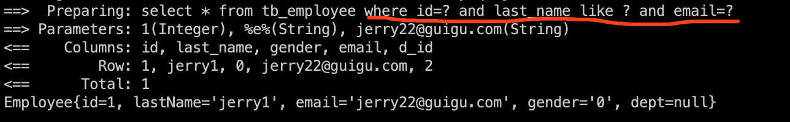
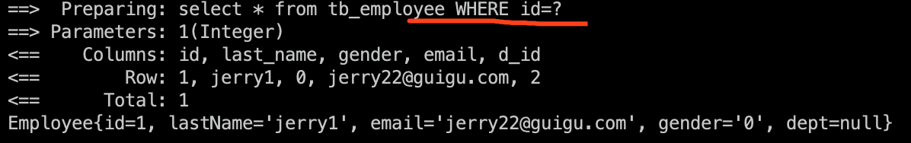

# 动态Sql


**<font color="red">动态拼装sql语句</font>**


```
动态sql标签
        if
        choose(when, otherwise)
        trim(where, set)
        foreach
```


## 1、if标签


接口：

```java
public interface EmployeeMapperDynamicSQL {
    //携带了哪个字段查询条件就带上这个字段的值
    public List<Employee> getEmpsByConditionIf(Employee employee);
}
```


EmployeeMapperDynamicSQL.xml:

```xml
<?xml version="1.0" encoding="UTF-8" ?>
<!DOCTYPE mapper
        PUBLIC "-//mybatis.org//DTD Mapper 3.0//EN"
        "http://mybatis.org/dtd/mybatis-3-mapper.dtd">
<mapper namespace="mybatis.dao.EmployeeMapperDynamicSQL">

<!--    查询员工，携带了哪个字段,查询条件就带上这个字段的值-->
<!--        public List<Employee> getEmpsByConditionIf(Employee employee);-->
    <select id="getEmpsByConditionIf" resultType="mybatis.bean.Employee">
        select * from tb_employee
        <!-- where标签会将后面多出来多and或or自动去掉-->
        <where>
            <!-- test:判断表达式(OGNL)参照官方文档，类似与el表达式
            从参数中取值进行判断-->
            <if test="id!=null">
                id=#{id}
            </if>
            <if test="lastName!=null and lastName!=''">
                and last_name like #{lastName}
            </if>
            <if test="email!=null and email.trim()!=''">
                and email=#{email}
            </if>
            <if test="gender==0 or gender==1">
                and gender=#{gender}
            </if>
        </where>
    </select>
</mapper>
```


测试：

```java
@Test
public void testDynamicSql() throws IOException {
    SqlSessionFactory sqlSessionFactory = getSqlSessionFactory();
    SqlSession openSession = sqlSessionFactory.openSession();
    EmployeeMapperDynamicSQL mapper = openSession.getMapper(EmployeeMapperDynamicSQL.class);
    Employee employee = new Employee(1, "%e%", "jerry22@guigu.com", null);
    List<Employee> emps = mapper.getEmpsByConditionIf(employee);
    for (Employee emp : emps) {
        System.out.println(emp);
    }
}
```

没有带gender字段

结果：



可见拼接sql语句时没有带gender字段作为查询条件。


## 2、trim标签


**<font color="Gree">用在if标签中，自定义sql截取规则</font>**

内部使用where：封装查询条件

​				set：封装修改条件

### 1): 结合where封装查询条件

```xml
<select id="getEmpsByConditionTrim" resultType="mybatis.bean.Employee">
            select * from tb_employee
            <!-- where无法解决后面多出的and或or
                    trim:属性
                    trim标签体中是整个字符串拼串后的结果。
                        prefix：前缀：给拼串后的整个字符串加一个前缀
                        prefixOverrides:前缀覆盖：去掉整个字符串前面多余的字符
                        suffix: 后缀：给拼串后的整个字符串加一个后缀
                        suffixOverrides:后缀覆盖：去掉整个字符串后面多余的字符-->
            <trim prefix="where" suffixOverrides="and">
                <!-- test:判断表达式(OGNL)参照官方文档，类似与el表达式
        从参数中取值进行判断-->
                <if test="id!=null">
                    id=#{id}
                </if>
                <if test="lastName!=null and lastName!=''">
                    and last_name like #{lastName}
                </if>
                <if test="email!=null and email.trim()!=''">
                    and email=#{email}
                </if>
                <if test="gender==0 or gender==1">
                    and gender=#{gender}
                </if>
            </trim>
</select>
```


### 2)结合set封装修改条件

```xml
<!--        public void updateEmp(Employee employee);-->
    <update id="updateEmp">
        update tb_employee
        <!-- 带了那个字段值就更新哪个字段值-->
        <set>
            <if test="lastName!=null">
                last_name=#{lastName}
            </if>
            <if test="email!=null">
                email=#{email}
            </if>
            <if test="gender!=null">
                gender=#{gender}
            </if>
        </set>
    </update>
```


## 3、choose标签


**<font color="Gree">类似switch语句的效果</font>**

```xml
<!--    public List<Employee> getEmpsByConditionChoose(Employee employee);-->
<select id="getEmpsByConditionChoose" resultType="mybatis.bean.Employee">
                    select * from tb_employee
                    <where>
                    <!--choose：带了哪个字段值就用哪个字段去查，只会进入其中一个。-->
                    <choose>
                        <when test="id!=null">
                            id=#{id}
                        </when>
                        <when test="lastName!=null">
                            last_name like #{lastName}
                        </when>
                        <when test="email!=null">
                            email=#{email}
                        </when>
                        <!--其他情况 -->
                        <otherwise>
                            gender=0
                        </otherwise>
                    </choose>
                    </where>
</select>
```


测试：

```java
@Test
public void testDynamicSql() throws IOException {
    SqlSessionFactory sqlSessionFactory = getSqlSessionFactory();
    SqlSession openSession = sqlSessionFactory.openSession();
    EmployeeMapperDynamicSQL mapper = openSession.getMapper(EmployeeMapperDynamicSQL.class);
    Employee employee = new Employee(1, "%e%", "null", null);
    List<Employee> emps = mapper.getEmpsByConditionChoose(employee);
    for (Employee emp : emps) {
        System.out.println(emp);
    }
}
```

同时携带了id和last_name，则进入id的情况后就不进入之后的了，所以结果是只拿id去查，如下：




## 4、foreach标签

### 1) 批量查询

Mapper:

```java
public List<Employee> getEmpsByConditionForeach(List<Integer> ids);
```


映射文件：

```xml
<!--        public List<Employee> getEmpsByConditionForeach(List<Integer> ids);-->
    <select id="getEmpsByConditionForeach" resultType="mybatis.bean.Employee">
        select * from tb_employee where id in
        <!-- collection：指定要遍历的集合
                        若Mapper中函数参数为List<>，则value为list
                                          int[], 则value为array
                                          Map,   则value为ids
             item：将遍历出的元素赋值给指定的变量
                    #{}就能取出变量值
             separator: 每个元素之间的分隔符
             open：遍历出所有结果拼接一个开始的字符
             close：遍历出所有结果拼接一个结束的字符
             index:索引：遍历list时是索引，item是值
                        遍历map时表示key，item是值-->
        <foreach collection="list" item="item_id" separator=","
        open="(" close=")">
            #{item_id}
        </foreach>
    </select>
```

- <font color="red">注意collection属性值</font>
- <font color="red">select * from tb_employee where id in(x,x,x)是sql批量查询的固定语法，所有要foreach中拼上"()"</font>


### 2) 批量保存（插入）

Mapper：

```java
public void addEmps(@Param("emps") List<Employee> emps);
```


映射文件：

<mark>因为Mapper中给参数起了别名"emps"，因此collection的值可以不写list写emps。</mark>

```xml
<!--    批量保存(插入)-->
<!--        public void addEmps(@Param("emps") List<Employee> emps);-->
    <insert id="addEmps">
        insert into tb_employee(last_name, email, gender, d_id)
        values 
        <foreach collection="emps" item="emp" separator=",">
            (#{emp.lastName},#{emp.email},#{emp.gender},#{emp.dept.id})
        </foreach>
    </insert>
```


测试：

```java
@Test
public void testBatchSave() throws IOException {
    SqlSessionFactory sqlSessionFactory = getSqlSessionFactory();
    SqlSession openSession = sqlSessionFactory.openSession();
    EmployeeMapperDynamicSQL mapper = openSession.getMapper(EmployeeMapperDynamicSQL.class);
    List<Employee> emps = new ArrayList<>();
    emps.add(new Employee(null, "smith", "smith@guigu.com", "1", new Department(1)));
    emps.add(new Employee(null, "alan", "alan@guigu.com", "0", new Department(1)));

    mapper.addEmps(emps);
    openSession.commit();
    openSession.close();
}
```

**<font color="red">注意Employee和Department的构造方法: 添加有参构造方法之前一定要先显式添加无参构造方法</font>**


## 5、sql标签

**<font color="Gree">抽取可重用dql片段，方便引用</font>**

与select，update，insert等同级

```xml
<sql id="dddd">
  <!--要重用的sql片段-->
</sql>


<!-- 使用-->
<include refid="dddd"></include>
```

