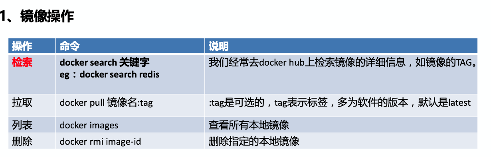
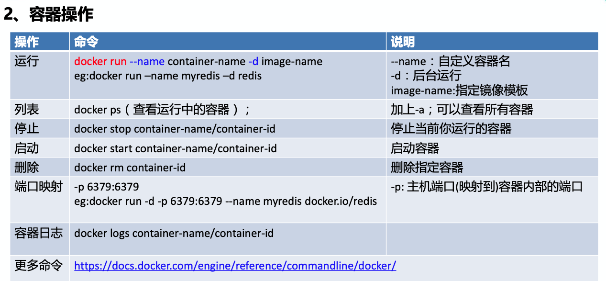

# Docker安装配置及使用

> 参考博客https://yeasy.gitbooks.io/docker_practice/install/ubuntu.html

## 1、卸载旧版本

```bash
$ sudo apt-get remove docker \
               docker-engine \
               docker.io
```


## 2、使用apt安装

由于 `apt` 源使用 HTTPS 以确保软件下载过程中不被篡改。因此，我们首先需要添加使用 HTTPS 传输的软件包以及 CA 证书。

```bash
$ sudo apt-get update

$ sudo apt-get install \
    apt-transport-https \
    ca-certificates \
    curl \
    software-properties-common
```

鉴于国内网络问题，强烈建议使用国内源，官方源请在注释中查看。

为了确认所下载软件包的合法性，需要添加软件源的 `GPG` 密钥。

```bash
$ curl -fsSL https://mirrors.ustc.edu.cn/docker-ce/linux/ubuntu/gpg | sudo apt-key add -


# 官方源
# $ curl -fsSL https://download.docker.com/linux/ubuntu/gpg | sudo apt-key add -
```


然后，我们需要向 `source.list` 中添加 Docker 软件源

```bash
$ sudo add-apt-repository \
    "deb [arch=amd64] https://mirrors.ustc.edu.cn/docker-ce/linux/ubuntu \
    $(lsb_release -cs) \
    stable"


# 官方源
# $ sudo add-apt-repository \
#    "deb [arch=amd64] https://download.docker.com/linux/ubuntu \
#    $(lsb_release -cs) \
#    stable"
```


## 3、安装docker

```bash
$ sudo apt-get update

$ sudo apt-get install docker-ce
```


## 4、启动docker

```bash
$ sudo systemctl enable docker
$ sudo systemctl start docker
```


## 5、国内镜像加速

对于使用 [systemd](https://www.freedesktop.org/wiki/Software/systemd/) 的系统，请在 `/etc/docker/daemon.json` 中写入如下内容（如果文件不存在请新建该文件）

```json
{
  "registry-mirrors": [
    "https://dockerhub.azk8s.cn",
    "https://reg-mirror.qiniu.com"
  ]
}
```

> 注意，一定要保证该文件符合 json 规范，否则 Docker 将不能启动。


重启服务：

```bash
$ sudo systemctl daemon-reload
$ sudo systemctl restart docker
```


## 6、使用

关于使用相关，可看springboot学习的尚硅谷ppt中有常用命令等。

<font color='red'>注：进入容器内部bash命令：`docker exec -it 运行容器时指定的name bash`</font>

如：https://blog.csdn.net/m0_37904728/article/details/78621191







如，运行mysql：

```shell
docker run -d -p 3306:3306 --name jc_mysql -e MYSQL_ROOT_PASSWORD=5774857 ed1ffcb5eff3
```

注意加上密码