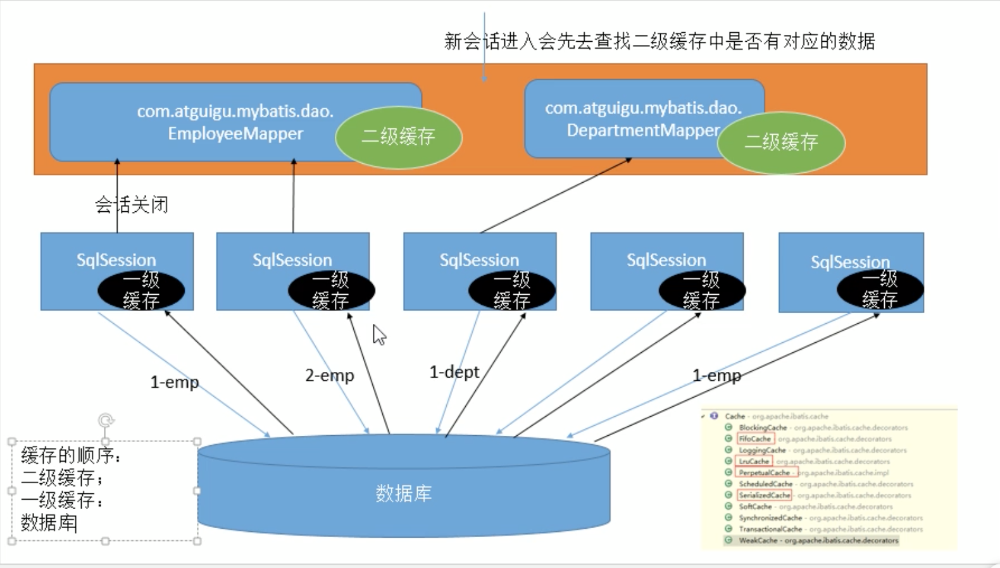

# 缓存

MyBatis提供两级缓存

##  1、一级缓存（本地缓存）：

- <mark>sqlSession级别的缓存，实则是一个Map</mark>，一直开启的，无法关闭。
- 与数据库同一次会话期间查询到的数据会放在本地缓存中。以后如果需要获取相同的数据，直接从缓存中拿，不用再查询数据库。
- 四种失效情况：还需要发送sql语句才行
  - sqlSession不同，一级缓存失效
  - sqlSession相同，但查询条件不同
  - sqlSession相同，两次查询之间执行了增删改（任意）
  - sqlSession相同，手动清除了一级缓存 `openSession.clearCache();` 


## 2、二级缓存（全局缓存）：

- 基于namespace级别的缓存

- 工作机制：
  - 一个会话，查询一条数据，这个数据会被放在当前会话的一级缓存中；
  - <mark>如果会话关闭；一级缓存中的数据会被保存到二级缓存中；<font color="red">**不关闭不会存到二级中**</font></mark>
  - <mark>不同namespace查出的数据会放在自己对应的缓存(map)中；</mark>


## 3、一级缓存举例：

```java
/*
 * 一级缓存
 * */
@Test
public void testFirstLevelCache() throws IOException {
    SqlSessionFactory sqlSessionFactory = getSqlSessionFactory();
    SqlSession openSession = sqlSessionFactory.openSession();

    EmployeeMapper mapper = openSession.getMapper(EmployeeMapper.class);
    Employee emp1 = mapper.getEmpById(1);
    System.out.println(emp1);

    Employee emp2 = mapper.getEmpById(1);
    System.out.println(emp2);

    openSession.close();
}
```


结果：


只发送了一次sql语句，说明两次查询返回的是同一个对象。


## 4、二级缓存举例【重要】

1）开启全局二级缓存:（默认已开启）

全局配置文件：

```xml
<setting name="cacheEnabled" value="true"/>
```


2）mapper.xml中配置使用二级缓存：

```xml
<mapper namespace="mybatis.dao.EmployeeMapper">
<!--   eviction:缓存回收策略：LRU(默认),FIFO等
       flushInterval: 缓存刷新间隔（单位ms）
                        缓存多长时间清空一次，默认不清空
       readOnly:是否只读
                true: 只读：mybatis认为所有操作均为只读，不会修改数据
                           因此，为了加快获取速度，直接将数据在缓存中的引用交给用户
                false:非只读（默认）：mybatis认为被获取的数据可能会被修改
                             因此，利用序列化&反序列化技术克隆一份新的数据给用户
        size: 缓存存放多少元素
        type: 指定自定义缓存的全类名
                实现Cache接口-->
    <cache eviction="FIFO" flushInterval="60000" readOnly="false" size="1024"></cache>
</mapper>
```


3）POJO(实体类)需要实现序列化接口:

```java
public class Employee implements Serializable 
```


4) 测试：

```java
/*
 * 二级缓存
 * */
@Test
public void testSecondLevelCache() throws IOException {
    SqlSessionFactory sqlSessionFactory = getSqlSessionFactory();
    SqlSession openSession = sqlSessionFactory.openSession();
    SqlSession openSession2 = sqlSessionFactory.openSession();


    EmployeeMapper mapper = openSession.getMapper(EmployeeMapper.class);
    EmployeeMapper mapper2 = openSession2.getMapper(EmployeeMapper.class);

    Employee employee1 = mapper.getEmpById(1);
    System.out.println(employee1);
    openSession.close();

  //第二次查询
    Employee employee2 = mapper2.getEmpById(1);
    System.out.println(employee1);
    openSession2.close();
}
```


**<font color="red">切记，只有先关掉第一个sqlSession，才会将其一级缓存中的数据存到二级缓存中，这样第二次查询才不用再发送sql语句，而是直接从二级缓存中取。</font>**


5）结果：


黄色框意思是从二级缓存中取到的


## 5、缓存相关设置

1）cacheEnabled=false：关闭缓存（二级，不会关掉一级）

2）每个select标签都有useCache="true"属性，

​										false：（不使用2级，但1级依然使用）

<mark>3）每个增删改标签都有flushCache=""</mark>

​										<mark>（默认）true: 增删改执行完后就会清除缓存（1、2级都清）</mark>

​	  <mark> select标签其实也有flushCache，默认为false，如果改为true，每次查询都会清空两级缓存；</mark>

4）sqlSession.clearCache()，只清除一级缓存。

5）localCachescope: 本地缓存作用域：

​				SESSION：一级缓存

​				STATEMENT: 禁用一级缓存

​										


## 6、两级缓存原理图


