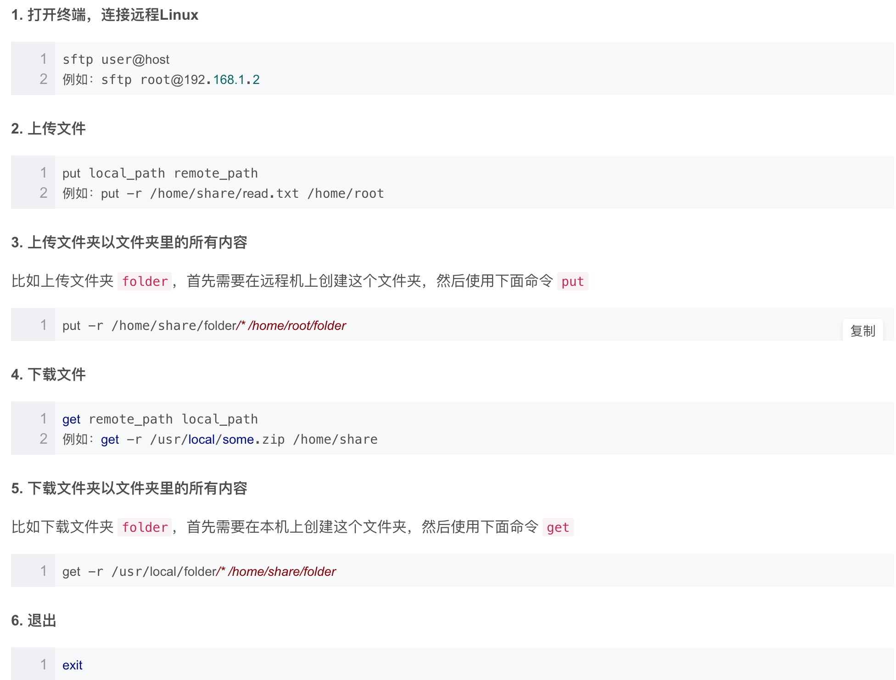

# Springboot 部署


#### 1、打包jar包

#### 2、将jar包上传到云

使用sftp：





#### 3、在云服务器运行

```
# --server.port=8090指定端口
nohup java -jar xxx.jar --server.port=8090 &
```

参考：https://blog.csdn.net/qq_34975710/article/details/83989642