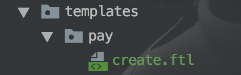

# FreeMarker模版引擎

**<font color='yellow'>用来生成html等web页面</font>**


## 1、使用入门

==1）引入freemarker依赖==

```xml
<dependency>
    <groupId>org.springframework.boot</groupId>
    <artifactId>spring-boot-starter-freemarker</artifactId>
</dependency>
```


==2）创建ftl文件（页面）==

- 目录：

  

- 文件内容：

  ```ftl
  <h1>这里是模版的标题</h1>
  ```


==3）controller方法返回ModelAndView==

```java
package com.jachin.sell.controller;
/**
 * @description: 支付
 * @Author: JachinDo
 * @Date: 2019/08/10 10:11
 */
@Controller
@RequestMapping("/pay")
public class PayController {

    @Autowired
    private OrderService orderService;

    @GetMapping("/create")
    public ModelAndView create(@RequestParam("orderId") String orderId,
                               @RequestParam("returnUrl") String returnUrl) {


        // 1. 查询订单
        OrderDTO orderDTO = orderService.findOne(orderId);
        if (orderDTO == null) {
            throw new SellException(ResultEnum.ORDER_NOT_EXIST);
        }
        System.out.println("orderId: "+ orderId + "returnUrl: "+returnUrl   );
        // 2. 发起支付
        return new ModelAndView("pay/create");
    }
}
```


重点是38行，返回ModelAndView，==路径是上一步中ftl文件的路径==

==返回ModelAndView中可携带map类型参数用于在模版中获取，具体见《前端页面跳转技巧》==

