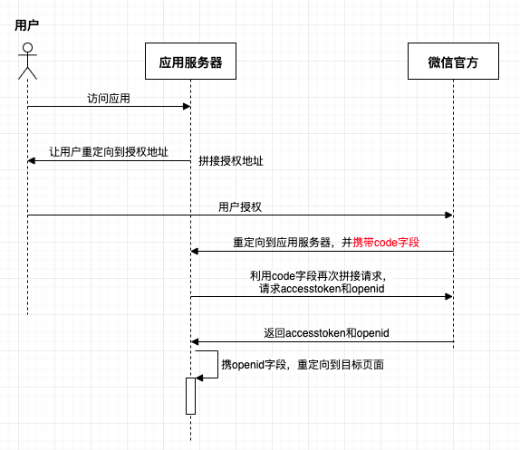

# 微信网页授权

## 1、流程

以下流程为微信官方提供的请求流程，现实中可使用第三方sdk：

> 1. 首先微信客户端请求应用某地址
>
> 2. 应用服务器拼接==授权地址==，并重定向用户请求到该授权地址。
>
>    授权地址包含：
>
>    - `appid`：公众号ID
>    - ``redirect_url`: 服务器希望用户最终登陆上来的页面地址
>    - ***Scope: 应用授权作用域，snsapi_base （不弹出授权页面，直接跳转，只能获取用户openid），snsapi_userinfo （弹出授权页面，可通过openid拿到昵称、性别、所在地。并且， 即使在未关注的情况下，只要用户授权，也能获取其信息 ）***
>
> 3. 微信官方将用户的请求重定向到``redirect_url`，并携带==code字段==。
>
> 4. 服务器根据code字段再拼接==请求地址==，去向微信官方获取accesstoken和openid。
>
> ==注意：一共有两次地址的拼接。==

