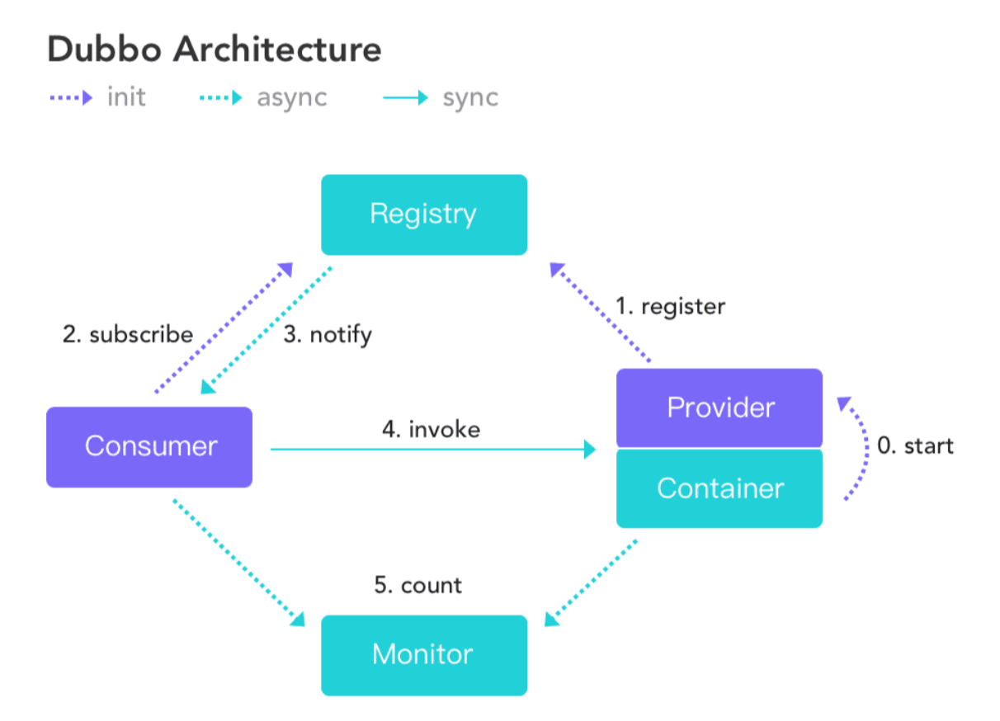
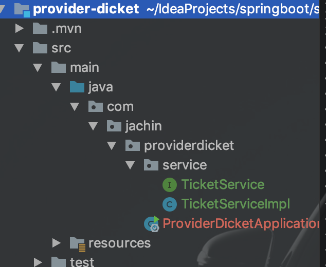
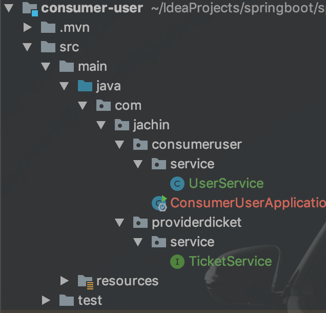

# dubbo + zookeeper demo





> <font color='red'>zookeeper为注册中心</font>
>
> <font color='red'>服务提供者将服务注册到zookeeper/消费者从zookeeper中订阅服务</font>
>
> <font color='red'>消费者通过dubbo调用服务（4.invoke）</font>


#### **1、服务器docker部署zookeeper**


#### **2、idea创建一个空工程，然后建两个springboot的module，一个为服务提供者，一个为消费者**


#### **3、两个module都要手动引入如下依赖**

事实证明，少了如下依赖会有各种错误

==另外，可查看pom的 diagram来看有没有重复zookeeper但版本不同，需要排除其一==

```xml
<!-- 引入Dubbo Spring Boot Starter -->
      <dependency>
         <groupId>org.apache.dubbo</groupId>
         <artifactId>dubbo-spring-boot-starter</artifactId>
         <version>2.7.1</version>
      </dependency>

<!--      引入dubbo-->
      <dependency>
         <groupId>org.apache.dubbo</groupId>
         <artifactId>dubbo</artifactId>
         <version>2.7.1</version>
      </dependency>


<!--      引入zookeeper客户端工具-->
      <!-- https://mvnrepository.com/artifact/com.github.sgroschupf/zkclient -->
      <dependency>
         <groupId>com.github.sgroschupf</groupId>
         <artifactId>zkclient</artifactId>
         <version>0.1</version>
         <exclusions>
            <exclusion>
               <artifactId>zookeeper</artifactId>
               <groupId>org.apache.zookeeper</groupId>
            </exclusion>
         </exclusions>
      </dependency>

      <dependency>
         <groupId>org.apache.curator</groupId>
         <artifactId>curator-framework</artifactId>
         <version>4.0.1</version>
      </dependency>

      <dependency>
         <groupId>org.apache.curator</groupId>
         <artifactId>curator-recipes</artifactId>
         <version>2.13.0</version>
      </dependency>
```


#### **4、服务提供者配置**





​	接口：

```java
package com.jachin.providerdicket.service;
public interface TicketService {
    String getTicket();
}
```


 Impl:

```java
package com.jachin.providerdicket.service;
@Component
//必须引入dubbo才有该注解（不仅要引入starter）
@Service //org.apache.dubbo.config.annotation.Service下的注解
public class TicketServiceImpl implements TicketService {
    @Override
    public String getTicket() {
        return "《厉害了，我的国》";
    }
}
```


配置文件：

```properties
dubbo.application.name=provider-ticket

dubbo.registry.address=zookeeper://47.106.201.54:2181

#项目启动后扫描该包，将该包中，加了@Service的类作为服务注册到zookeeper
dubbo.scan.base-packages=com.jachin.providerdicket.service
```


#### 5、消费者配置





<font color="red" size=5>必须将服务提供者的包含service的包拷贝来，并去除实现类</font>


配置文件：

```properties
dubbo.application.name=consumer-user

dubbo.registry.address=zookeeper://47.106.201.54:2181
```


UserService:

```java
package com.jachin.consumeruser.service;
@Service  //这是Spring的service
public class UserService {

    @Reference
    TicketService ticketService;

    public void hello() {
        String ticket = ticketService.getTicket();
        System.out.println("买到票了！"+ticket);
    }

}
```

==11行的注解实现远程注入（调用）==


测试：

```java
package com.jachin.consumeruser;
@RunWith(SpringRunner.class)
@SpringBootTest
public class ConsumerUserApplicationTests {
    @Autowired
    UserService userService;

    @Test
    public void contextLoads() {
        userService.hello();
    }

}
```


结果：


