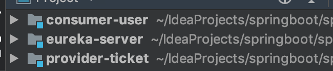
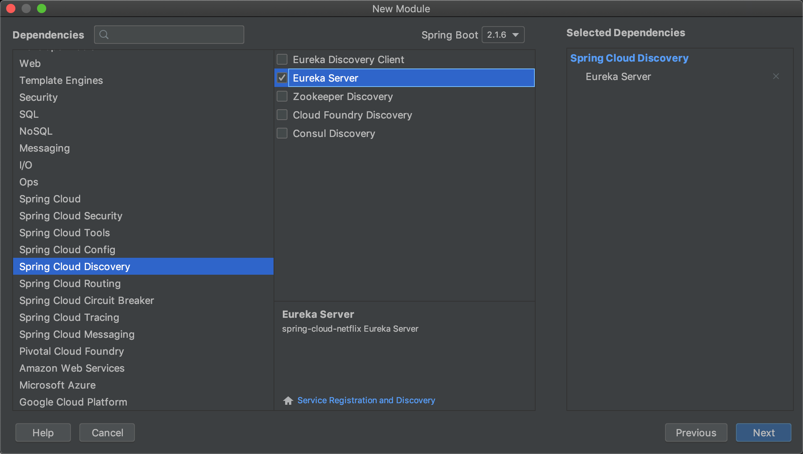
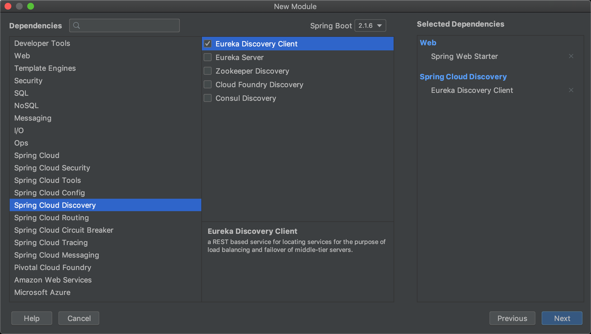
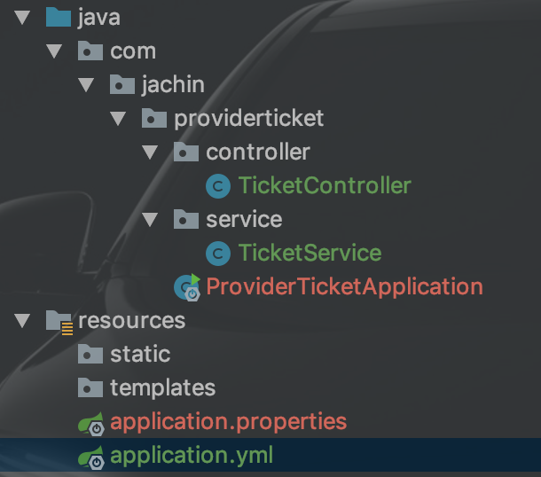
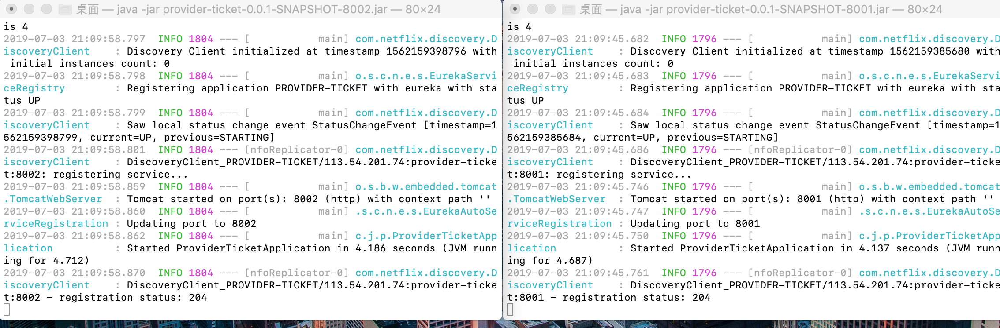
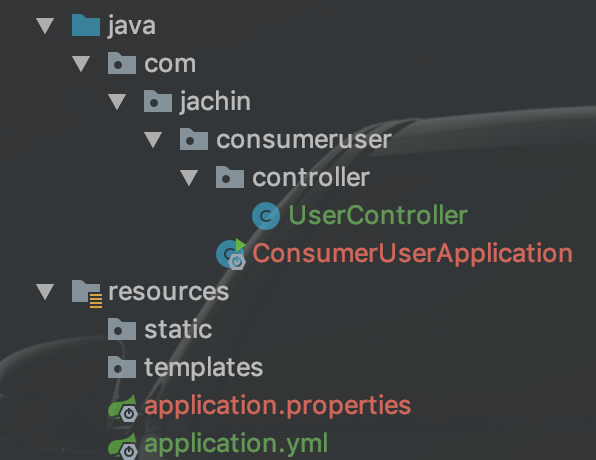
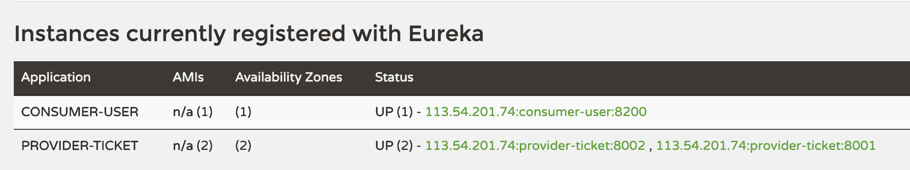
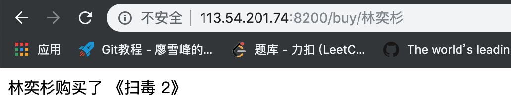

# Springcloud


相当于dubbo+zookeeper，集管理注册中心、消费者、服务提供者于一体

==注册中心用eureka==


#### 1、创建一个空工程，创建三个module分别对应注册中心、服务提供者和服务消费者





注册中心：




消费者和服务提供者：（要选web）




#### 2、注册中心配置

11行注解配置启用注册中心

```java
package com.jachin.eurekaserver;

import org.springframework.boot.SpringApplication;
import org.springframework.boot.autoconfigure.SpringBootApplication;
import org.springframework.cloud.netflix.eureka.server.EnableEurekaServer;


/*
* 注册中心
* */
@EnableEurekaServer
@SpringBootApplication
public class EurekaServerApplication {

    public static void main(String[] args) {
        SpringApplication.run(EurekaServerApplication.class, args);
    }

}
```


配置文件：

```yml
server:
  port: 8761
eureka:
  instance:
    hostname: eureka-server  #定向链接url名
 spring:
  application:
    name: server  # 注册应用名称
  client:
    register-with-eureka: false  #不把eureka本身注册进注册中心中
    fetch-registry: false   #不从eureka上获取服务的注册信息
    service-url:
      defaultZone: http://localhost:8761/eureka/  #注册中心地址
```


#### 3、服务提供者配置





TicketService:

```java
package com.jachin.providerticket.service;

import org.springframework.stereotype.Service;

@Service
public class TicketService {

    public String getTicket() {
        return "《扫毒 2》";
    }
}
```


TicketController:

```java
package com.jachin.providerticket.controller;

import com.jachin.providerticket.service.TicketService;
import org.springframework.beans.factory.annotation.Autowired;
import org.springframework.web.bind.annotation.GetMapping;
import org.springframework.web.bind.annotation.RestController;

@RestController
public class TicketController {

    @Autowired
    TicketService ticketService;

    @GetMapping("/ticket")
    public String getTicket() {
        return ticketService.getTicket();
    }
}
```

==因为RestController注解，所以return的值可直接以json形式返回到页面==


配置文件：

```yml
server:
  port: 8002
spring:
  application:
    name: provider-ticket    #该名字会显示在注册中心

eureka:
  instance:
    prefer-ip-address: true   #注册服务时使用服务的ip地址
  client:
    service-url:
      defaultZone: http://localhost:8761/eureka/  #注册中心地址
```


**<font color='red'>分别使用8001和8002，并打包为两个jar，表示同一应用的不同提供实例</font>**

命令行运行两个实例：




http://localhost:8761/：


#### 4、消费者配置





Application.yml:

```yml
spring:
  application:
    name: consumer-user  #该名字会显示在注册中心

server:
  port: 8200

eureka:
  instance:
    prefer-ip-address: true   #消费者也要注册到注册中心
  client:
    service-url:
      defaultZone: http://localhost:8761/eureka/  #注册中心地址
```


启动类：

```java
package com.jachin.consumeruser;

import org.springframework.boot.SpringApplication;
import org.springframework.boot.autoconfigure.SpringBootApplication;
import org.springframework.cloud.client.discovery.EnableDiscoveryClient;
import org.springframework.cloud.client.loadbalancer.LoadBalanced;
import org.springframework.context.annotation.Bean;
import org.springframework.web.client.RestTemplate;

@EnableDiscoveryClient   //开启发现服务功能
@SpringBootApplication
public class ConsumerUserApplication {

   public static void main(String[] args) {
      SpringApplication.run(ConsumerUserApplication.class, args);
   }

   @LoadBalanced  //使用负载均衡机制
   @Bean   //RestTemplate用来发送http请求
   public RestTemplate restTemplate() {
      return new RestTemplate();
   }

}
```


UserController:

```java
package com.jachin.consumeruser.controller;

import org.springframework.beans.factory.annotation.Autowired;
import org.springframework.web.bind.annotation.GetMapping;
import org.springframework.web.bind.annotation.PathVariable;
import org.springframework.web.bind.annotation.RestController;
import org.springframework.web.client.RestTemplate;

@RestController
public class UserController {

    @Autowired
    RestTemplate restTemplate;

    @GetMapping("/buy/{name}")
    public String buyTicket(@PathVariable("name") String name) {
        String s = restTemplate.getForObject("http://PROVIDER-TICKET/ticket",String.class); //返回类型的class
        return name + "购买了 " + s;
    }
}
```

==核心时第17行==


运行消费者：


http://localhost:8761/：

消费者和服务提供者都注册到了注册中心eureka中




消费者买票行为及结果：

