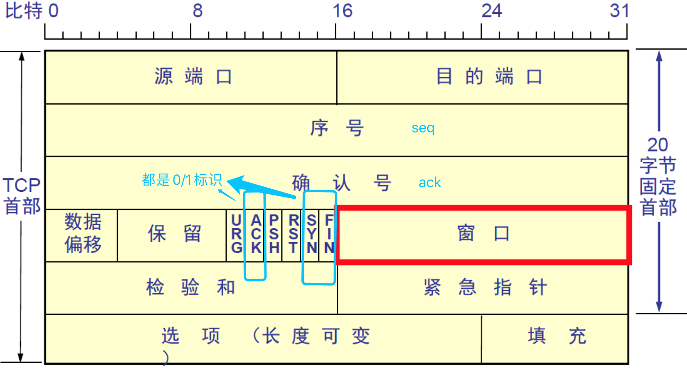
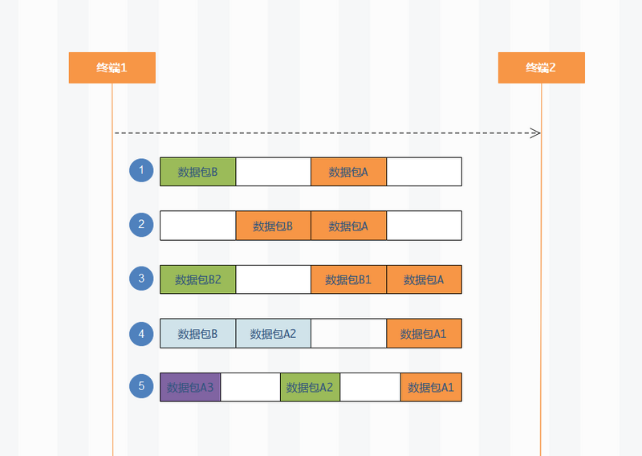

# TCP与UDP的可靠传输

https://blog.csdn.net/gettogetto/article/details/76736365

https://zhuanlan.zhihu.com/p/68466363

## tcp报文结构

------

## 1、TCP的可靠传输

> ==**应用数据被分割成TCP认为最适合发送的数据块。这和UDP完全不同，应用程序产生的数据长度将保持不变。由TCP传递给IP的信息单位称为报文段或段（segment）。**==

### &sect; 确认重传机制

TCP协议用于控制数据段是否需要重传的依据是设立重发定时器。在发送一个数据段的同时启动一个重传，如果在重传超时前收到确认(Acknowlegement)就关闭该重传，如果重传超时前没有收到确认，则重传该数据段。<mark>在选择重发时间的过程中，TCP必须具有自适应性。它需要根据互联网当时的通信情况，给出合适的重发时间。</mark>

这种重传策略的关键是对定时器初值的设定。采用较多的[算法](http://lib.csdn.net/base/datastructure)是Jacobson于1988年提出的一种不断调整超时时间间隔的动态算法。其工作原理是：对每条连接TCP都保持一个变量RTT（Round Trip Time），用于存放当前到目的端往返所需要时间最接近的估计值。当发送一个数据段时，同时启动连接的定时器，如果在定时器超时前确认到达，则记录所需要的时间（M），并修正[2] RTT的值，如果定时器超时前没有收到确认，则将RTT的值增加1倍。通过测量一系列的RTT（往返时间）值，TCP协议可以估算数据包重发前需要等待的时间。在估计该连接所需的当前延迟时通常利用一些统计学的原理和算法（如Karn算法），从而得到TCP重发之前需要等待的时间值。

------

### &sect; 滑动窗口

> 滑动窗口是一种流量控制技术，接收方可以通过反馈来指示发送方调节数据发送的速度。TCP中使用滑动窗口协议来控制发送的数据量，达到理想的传输速度。
>
> 使用滑动窗口协议实现流量控制。防止发送方发送速率太快，接收方缓存区不够导致溢出。接收方会维护一个接收窗口 receiver window（窗口大小单位是字节），接受窗口的大小是根据自己的资源情况动态调整的，在返回ACK时将接受窗口大小放在TCP报文中的窗口字段告知发送方。发送窗口的大小不能超过接受窗口的大小，只有当发送方发送并收到确认之后，才能将发送窗口右移。
>
> 发送窗口的上限为接受窗口和拥塞窗口中的较小值。接受窗口表明了接收方的接收能力，拥塞窗口表明了网络的传送能力。
>
> - 零窗口：
>
>   如果接收方没有能力接收数据，就会将接收窗口设置为0，这时发送方必须暂停发送数据，但是会启动一个持续计时器(persistence timer)，到期后发送一个大小为1字节的探测数据包，以查看接收窗口状态。如果接收方能够接收数据，就会在返回的报文中更新接收窗口大小，恢复数据传送。

------

### &sect; 拥塞控制

------

> - 慢启动
>
>   刚开始发送数据时，先把拥塞窗口（congestion window）设置为一个最大报文段MSS的数值，每收到一个新的确认报文之后，就把拥塞窗口加1个MSS。这样每经过一个传输轮次（或者说是每经过一个往返时间RTT），拥塞窗口的大小就会==加倍==。在连接刚建立时接收==窗口以指数方式增加==，直到达到==慢启动的阀值（slow start threshold），或者是遇到丢包==，开始进入拥塞回避阶段。
>
>   
>
>   ------
>
>   
>
> - 拥塞回避
>
>   当拥塞窗口的大小达到慢开始门限(slow start threshold)时，开始执行拥塞避免算法，拥塞窗口大小不再指数增加，==而是线性增加，即每经过一个传输轮次只增加1MSS.==
>
>   无论在慢开始阶段还是在拥塞避免阶段，**只要发送方判断网络出现拥塞（其根据就是没有收到确认），就要把慢开始门限ssthresh设置为出现拥塞时的发送方窗口值的一半（但不能小于2）。然后把拥塞窗口cwnd重新设置为1，执行慢开始算法。****（这是不使用快重传的情况）**
>
> - 快重传
>
>   快重传要求接收方在收到一个==失序的报文==段后就立即发出**重复确认**（为的是使发送方及早知道有报文段没有到达对方）==而不要等到自己发送数据时捎带确认==。快重传算法规定，发送方只要一连收到三个重复确认就应当立即重传对方尚未收到的报文段，而不必继续等待设置的重传计时器时间到期。
>
>   
>
>   
>
> - 快恢复
>
>   当发送方连续收到三个重复确认时，==***就把慢开始门限减半，然后执行拥塞避免算法***==。不执行慢开始算法的原因：**因为如果网络出现拥塞的话就不会收到好几个重复的确认，所以发送方认为现在网络可能没有出现拥塞。**

------

## 2、UDP可可靠传输

> ***通过应用层来实现,实现的方式可以参照tcp可靠性传输的方式，只是实现不在传输层，实现转移到了应用层。***
>
> 实现确认机制、重传机制、窗口确认机制。
>
> 如：***UDT***

------

## 3、TCP、UDP对比

> 1. TCP是面向连接的，UDP是无连接的；
>
>    UDP发送数据之前不需要建立连接
>
> 2. TCP是可靠的，UDP不可靠；
>
>    ==**UDP接收方收到报文后，不需要给出任何确认**==
>
> 3. TCP只支持点对点通信，UDP支持一对一、一对多、多对一、多对多；
>
> 4. TCP是面向字节流的，UDP是面向报文的；
>
>    ***面向字节流是指发送数据时以字节为单位，==一个数据包可以拆分成若干组进行发送，而UDP一个报文只能一次发完。==***
>
> 5. TCP有拥塞控制机制，UDP没有。==网络出现的拥塞不会使源主机的发送速率降低，这对某些实时应用是很重要的，比如媒体通信，游戏；==
>
> 6. TCP首部开销（20字节）比UDP首部开销（8字节）要大
>
> 7. UDP 的主机不需要维持复杂的连接状态表

> 对某些实时性要求比较高的情况，选择UDP，比如游戏，媒体通信，实时视频流（直播），即使出现传输错误也可以容忍；其它大部分情况下，HTTP都是用TCP，因为要求传输的内容可靠，不出现丢失

------

## 4、TCP粘包/拆包问题

> **TCP以流方式传输，是没有界限的一串数据，并没有消息边界。**
>
> - TCP传输数据时，会根据底层的TCP缓存区实际情况进行数据包划分：
>   - **业务上定义的完整数据(比方说一个完整的json串)，可能会被TCP拆分成多个数据包进行发送(拆包)。**
>
>   - **业务上特殊含义的独立数据，也有可能因为大小或者缓冲区原因，被TCP封装成一个大数据包发送(粘包)。**
>
>     1）**发送方原因**
>
>     **TCP默认使用Nagle算法（主要作用：减少网络中报文段的数量）**，而Nagle算法主要做两件事：
>
>     - 只有上一个分组得到确认，才会发送下一个分组
>     - 收集多个小分组，在一个确认到来时一起发送
>       **Nagle算法造成了发送方可能会出现粘包问题**
>
>     （2）**接收方原因**
>
>     TCP接收到数据包时，并不会马上交到应用层进行处理，或者说应用层并不会立即处理。实际上，TCP将接收到的数据包保存在接收缓存里，然后应用程序主动从缓存读取收到的分组。这样一来，***如果TCP接收数据包到缓存的速度大于应用程序从缓存中读取数据包的速度，多个包就会被缓存，应用程序就有可能读取到多个首尾相接粘到一起的包。***
>     

------

> 通过图我们可以发现，数据包接收有很多情况：
> 1、没有粘包拆包，终端2收到了完整的数据包A和数据包B。
> 2、终端2一次性读取到数据包A和数据包B，这就是粘包。
> 3、终端2读取到完整的数据包A和部分数据包B1,第二次才读取到数据包B剩余部分(数据包B2),这就是拆包。
> 4、类似第三点，数据包A也有可能分成两部分(A1、A2), 被前后读取。
> 5、假设数据包很大，那么可能产生多次拆包，如数据包A分N次被读取。