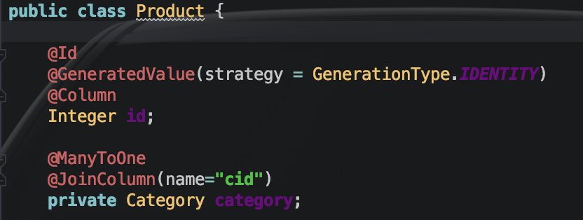

# JPA瞬时属性应用及避免外键关联导致的无限循环


#### 一、瞬时属性@Transient

<font color='red'>在pojo类的某个属性上加上该注解，意为在与数据库交互时，与该属性无关。要将该属性封装入对象中必须自己通过其他方法提供属性值并手动封装（因为无法从数据库获取并封装的嘛）</font>


#### 二、JPA外键关联导致无限循环

使用jpa进行外键关联通常的做法如下：




即产品和分类建立多对一的外键关联。

但是，当Category类中有Product属性的时候就会产生如下问题：

【问题】

​	在json序列化时双向关联的死循环问题，即“你中有我，我中有你”。

【解决】

1、加==@JsonBackReference==注解在关联的对象属性上，如上例中，加给category属性。

2、service中手动增加一个方法removeCategoryFromProduct （自定义）

​	【注意】<font color="red">要确定在Product类中确实用不到Category这个属性（除了进行查询等数据库操作时用做外键约束）</font>

```java
public void removeCategoryFromProduct(Category category) {
        List<Product> products =category.getProducts();
        if(null!=products) {
            for (Product product : products) {
                product.setCategory(null);
            }
        }
```

在对应的controller中调用即可。

