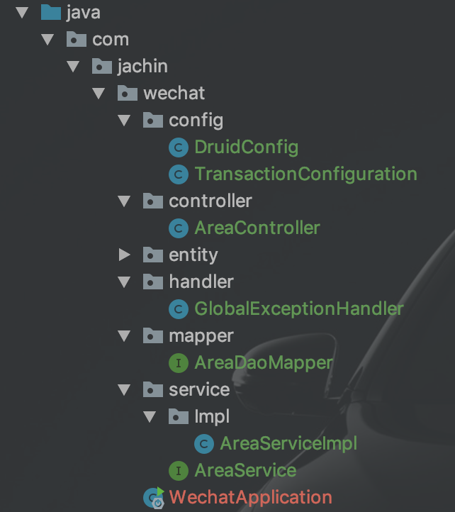
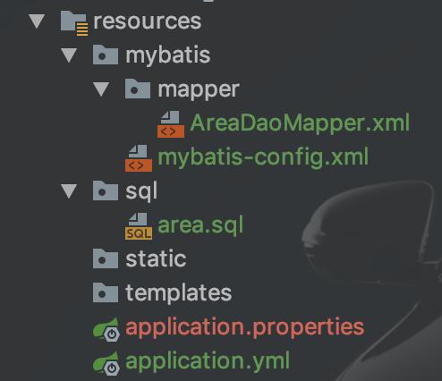

# SpringBoot+Mybatis项目开发流程总结


#### 1、目录结构








#### 2、首先配置数据源，选择druid，需要引入相关依赖并编写相关配置类

注意slf4j-log4j12也要有

```xml
<dependency>
    <groupId>mysql</groupId>
    <artifactId>mysql-connector-java</artifactId>
    <scope>runtime</scope>
</dependency>

<dependency>
    <groupId>org.slf4j</groupId>
    <artifactId>slf4j-log4j12</artifactId>
</dependency>

<!--        引入自定义数据源-->
<!-- https://mvnrepository.com/artifact/com.alibaba/druid -->
<dependency>
    <groupId>com.alibaba</groupId>
    <artifactId>druid</artifactId>
    <version>1.1.17</version>
</dependency>
```


DruidConfig:

```java
package com.jachin.wechat.config;
@Configuration
public class DruidConfig {


    //配置druid数据源
    @ConfigurationProperties(prefix = "spring.datasource") //将application.yml中对应前缀的属性配置进去（那些属性在配置文件中一部分不生效，所以要自己配置）
    @Bean(name = "dataSource")
    public DataSource druid() {
        return new DruidDataSource();
    }


    //配置druid监控
    //1、配置一个管理后台的servlet
    @Bean
    public ServletRegistrationBean statViewServlet() {
        ServletRegistrationBean bean = new ServletRegistrationBean<>(new StatViewServlet(), "/druid/*");

        Map<String,String> initParams = new HashMap<>();
        initParams.put("loginUsername", "admin");
        initParams.put("loginPassword","5774857");
        initParams.put("allow", "");//默认允许所有
        initParams.put("deny", "192.168.1.108");

        bean.setInitParameters(initParams);

        return bean;
    }

    //2、配置一个web监控的filter
    @Bean
    public FilterRegistrationBean webStatFilter() {
        FilterRegistrationBean<Filter> bean = new FilterRegistrationBean<>();
        bean.setFilter(new WebStatFilter());

        Map<String,String> initParams = new HashMap<>();
        initParams.put("exclusions", "*.js,*.css,/druid/*");

        bean.setInitParameters(initParams);

        bean.setUrlPatterns(Arrays.asList("/*"));
        return bean;
    }
}
```


#### 3、建表，单独写一个sql文件，利用yml配置启动项目时自动建表（注意建表后注释）


#### 4、实体类编写


#### 5、mybatis全局配置文件编写,在yml相应配置

```yml
mybatis:
  config-location: classpath:mybatis/mybatis-config.xml
  mapper-locations: classpath:mybatis/mapper/*.xml
```


#### 6、dao层实现，因为整合了mybatis，dao层及mapper接口层

​		mapper接口层+mapper映射文件

​	==目前为止，可以单元测试一下了==


#### 7、service层实现，接口+实现类（==事务在这里加==）


事务配置：

```java
package com.jachin.wechat.config;
@Configuration
@EnableTransactionManagement   //开启事务管理
public class TransactionConfiguration implements TransactionManagementConfigurer {

    @Autowired
    private DataSource dataSource;  //DruidConfig类中有该bean

    @Override
    public PlatformTransactionManager annotationDrivenTransactionManager() {
        return new DataSourceTransactionManager(dataSource);
    }
}
```

------

==业务逻辑和事务在service层添加，有异常应分类抛出（这里简化为同种异常）==

​	实现类：

```java
package com.jachin.wechat.service.Impl;
@Service
public class AreaServiceImpl implements AreaService {

    @Autowired
    private AreaDaoMapper areaDaoMapper;

    @Override
    public List<Area> queryArea() {
        return areaDaoMapper.queryArea();
    }

    @Override
    public Area queryAreaById(int areaId) {

//        int i = 1/0;
        return areaDaoMapper.queryAreaById(areaId);
    }

    @Transactional //加上事务
    //默认只对RuntimeException回滚
    //可通过@Transactional(rollbackFor = Exception.class)指明具体异常
    @Override
    public boolean insertArea(Area area) {
        if (area.getAreaName() != null && !"".equals(area.getAreaName())) {
            area.setCreateTime(new Date());
            area.setLastEditTime(new Date());

            try {
                int num = areaDaoMapper.insertArea(area);
                if (num > 0) {
                    return true;
                } else {
                    throw new RuntimeException("插入区域信息失败！");
                }
            } catch (Exception e) {
                throw new RuntimeException("插入区域信息失败！" + e.toString());
            }
        } else {
            throw new RuntimeException("区域信息不能为空！");
        }
    }

    @Override
    public boolean updateArea(Area area) {
        if (area.getAreaId() != null && area.getAreaId() > 0) {
            area.setLastEditTime(new Date());

            try {
                int num = areaDaoMapper.updateArea(area);
                if (num > 0) {
                    return true;
                } else {
                    throw new RuntimeException("更新区域信息失败！");
                }
            } catch (Exception e) {
                throw new RuntimeException("更新区域信息失败！" + e.toString());
            }
        } else {
            throw new RuntimeException("区域信息不能为空！");
        }
    }

    @Override
    public boolean deleteArea(int areaId) {
        if (areaId > 0) {
            try {
                int num = areaDaoMapper.deleteArea(areaId);
                if (num > 0) {
                    return true;
                } else {
                    throw new RuntimeException("删除区域信息失败！");
                }
            } catch (Exception e) {
                throw new RuntimeException("删除区域信息失败！" + e.toString());
            }
        } else {
            throw new RuntimeException("区域id不能为空！");
        }
    }
}
```


#### 8、Controller层实现，返回值用Map有好处

```java
package com.jachin.wechat.controller;


import com.jachin.wechat.entity.Area;
import com.jachin.wechat.service.AreaService;
import org.springframework.beans.factory.annotation.Autowired;
import org.springframework.web.bind.annotation.*;

import java.util.HashMap;
import java.util.List;
import java.util.Map;

@RestController  // RestController = Controller + ResponseBody
@RequestMapping("/superadmin")
public class AreaController {

    @Autowired
    private AreaService areaService;


    /*
    * 多值返回，用Map kv形式
    * */
    @GetMapping("/listarea")
    public Map<String, Object> listArea() {
        Map<String, Object> map = new HashMap<>();
        List<Area> list = areaService.queryArea();
        map.put("areaList", list);
        return map;
    }

    @GetMapping("/getareabyid/{areaId}")
    public Map<String, Object> getAreaById(@PathVariable("areaId") Integer areaId) {
        Map<String, Object> map = new HashMap<>();
        Area area = areaService.queryAreaById(areaId);
        map.put("area", area);
        return map;

    }

    @PostMapping("/insert")
    public Map<String, Object> insertArea(Area area) {
        Map<String, Object> map = new HashMap<>();
        map.put("success", areaService.insertArea(area));
        return map;
    }
    @PostMapping("/update")
    public Map<String, Object> updateArea(Area area) {
        Map<String, Object> map = new HashMap<>();
        map.put("success", areaService.updateArea(area));
        return map;
    }

    @GetMapping("/delete/{id}")
    public Map<String,Object> deleteArea(@PathVariable("id") Integer id) {
        Map<String, Object> map = new HashMap<>();
        map.put("success", areaService.deleteArea(id));
        return map;
    }

}
```


#### 9、异常处理，在controller层接收异常（@ControllerAdvice)


这里可以按不同类异常处理，使用 instanceof 判断类型，分类处理，这里简化成统一处理

异常处理类：

```java
package com.jachin.wechat.handler;


import org.springframework.web.bind.annotation.ControllerAdvice;
import org.springframework.web.bind.annotation.ExceptionHandler;
import org.springframework.web.bind.annotation.ResponseBody;

import javax.servlet.http.HttpServletRequest;
import java.util.HashMap;
import java.util.Map;

@ControllerAdvice //这是一个异常处理类
public class GlobalExceptionHandler {


    @ExceptionHandler(value = Exception.class)  // 指明处理到异常类
    @ResponseBody  // return到页面
    private Map<String, Object> exceptionHandler(HttpServletRequest request, Exception e) {
        Map<String, Object> map = new HashMap<>();
        map.put("success", false);
        map.put("errMsg", e.getMessage());
        return map;
    }
}
```


<font color="Blue" size=6>**至此，springboot+mybatis的后台系统完整搭建步骤结束**</font>