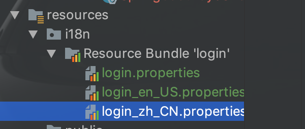
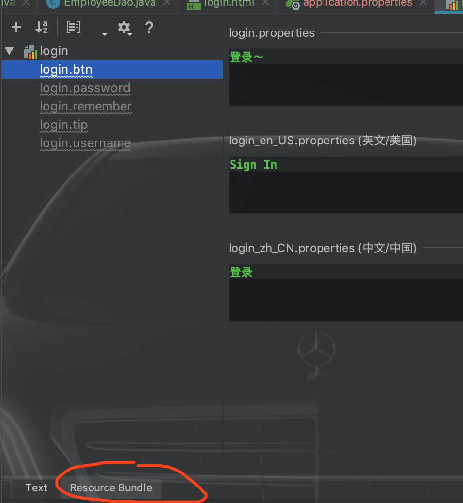

# SpringBoot案例


## 1、引入一系列需要的文件


## 2、国际化

1）配置国际化配置文件：

一共需要三个（默认，英文，中文）



任意打开一个，



使用这样配置即可。


2）让springboot自动管理国际化

​	在application.properties配置文件中加入：

```properties
spring.messages.basename=i18n.login
```


3）在页面获取国际化的值

```html

<h1 class="h3 mb-3 font-weight-normal" th:text="#{login.tip}">Please sign in</h1>
<label class="sr-only" th:text="#{login.username}">Username</label>
<input type="text" class="form-control" placeholder="Username" th:placeholder="#{login.username}" required="" autofocus="">
<label class="sr-only" th:text="#{login.password}">Password</label>
<input type="password" class="form-control" placeholder="Password" th:placeholder="#{login.password}" required="">
<div class="checkbox mb-3">
   <label>
       <input type="checkbox" value="remember-me"> [[#{login.remember}]]
     </label>
```

==使用th:text等，用来指定标签文本信息==

==但input框除外，