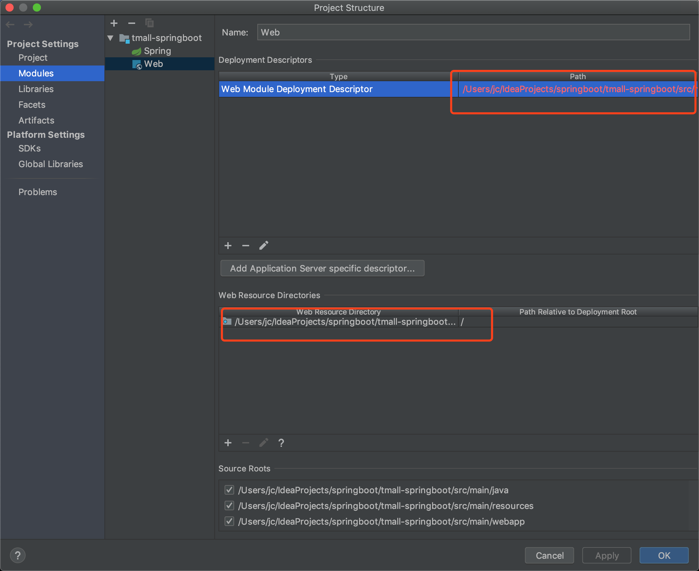
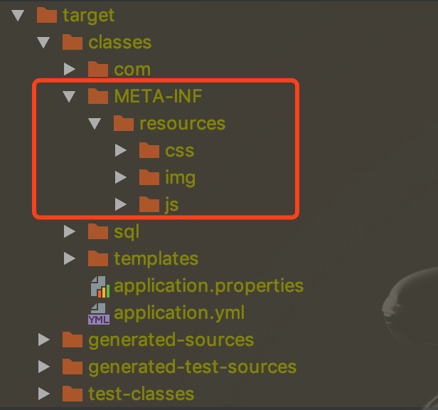
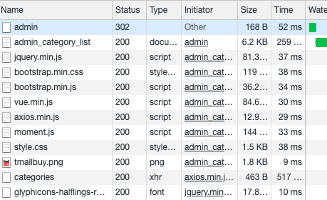

# springboot访问静态资源如webapp下的js、css等)


springboot对静态资源的默认扫描路径是：

```yml
classpath:/static
classpath:/public
classpath:/resources
classpath:/META-INF/resources
```


首先，springboot默认建立是没有webapp文件夹的，需要自己创建：




主要是配置两个路径，webapp放在和java，resource统一目录下，如下：


如何访问到webapp下的这些css、img、js中的静态资源呢？


#### 1、pom.xml


```xml
<resources>
    <resource>
        <directory>src/main/webapp</directory>
        <targetPath>META-INF/resources</targetPath>
        <includes>
            <include>**/**</include>
        </includes>
    </resource>
```

这样，springboot才会将对应资源编译到target目录中，如下图：




#### 2、配置

写一个配置类：

```java
package com.tmall.tmallspringboot.config;
@EnableWebMvc
@Configuration
public class CORSConfiguration implements WebMvcConfigurer {

    @Override
    public void addResourceHandlers(ResourceHandlerRegistry registry) {
        registry.addResourceHandler("/**").addResourceLocations("classpath:/META-INF/resources/");
    }
}
```

17行为将"/**" 映射到target中的"classpath:/META-INF/resources/"。

==注意"classpath:/META-INF/resources/"中最后的/不能丢==

综上，就可以找到了！


