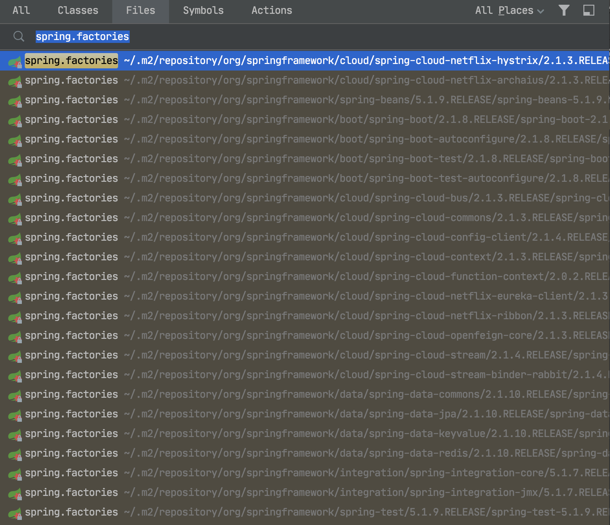
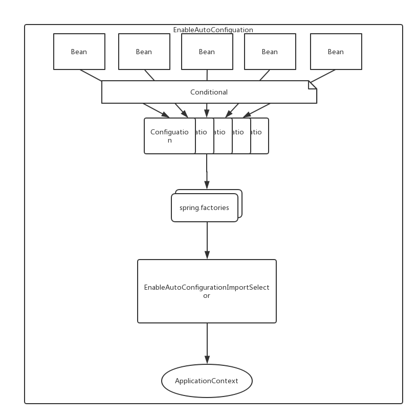

# Spring Boot自动化配置

## &sect; Spring Boot的显著优势

> - <font color='#02C874' size = 5>**使用starter简化依赖配置**</font>
> - <font color='#02C874' size = 5>**Spring的自动配置**</font>

------

## &sect; starter简化依赖的配置

>  Spring提供了一系列starter来简化Maven配置。<font color='#02C874'>**当我们在我们的pom文件中增加对某个starter的依赖时，该==starter的依赖==也会自动的传递性被依赖进来。**</font>

------

## &sect; 自动配置

> Spring Boot会根据==**类路径中的jar包、类，为jar包里的类自动配置**==，这样可以极大的减少配置的数量。简单点说就是它会根据定义在classpath下的类，<font color='#02C874'>**自动的给你生成一些Bean，并加载到Spring的Context中。**</font>

------

### &sect; 自动配置流程

#### &sect; @SpringBootApplication

> ```java
> @Target({ElementType.TYPE})
> @Retention(RetentionPolicy.RUNTIME)
> @Documented
> @Inherited
> @SpringBootConfiguration
> @EnableAutoConfiguration
> @ComponentScan(
>     excludeFilters = {@Filter(
>     type = FilterType.CUSTOM,
>     classes = {TypeExcludeFilter.class}
> ), @Filter(
>     type = FilterType.CUSTOM,
>     classes = {AutoConfigurationExcludeFilter.class}
> )}
> )
> // .....
> ```

------


#### &sect; @EnableAutoConfiguration注解

> <font color='red' size = 4>**借助`@Import`的帮助，将所有符合自动配置条件的bean定义加载到IoC容器。**</font>

```java
@Target({ElementType.TYPE})
@Retention(RetentionPolicy.RUNTIME)
@Documented
@Inherited
@AutoConfigurationPackage
@Import({AutoConfigurationImportSelector.class})
public @interface EnableAutoConfiguration {
    String ENABLED_OVERRIDE_PROPERTY = "spring.boot.enableautoconfiguration";

    Class<?>[] exclude() default {};

    String[] excludeName() default {};
}

```

其中最重要的是第6行：

```java
@Import({AutoConfigurationImportSelector.class})
```

------

#### &sect; AutoConfigurationImportSelector

> - 该类读取了ClassPath下面的`META-INF/spring.factories`文件，该文件的配置格式为“Key=Value”。（搜索一下就可以看到各种依赖的spring.factories文件）
>
>   
>
> - <font color='red' size = 4>***该类读取`spring.factories`文件中以`org.springframework.boot.autoconfigure.EnableAutoConfiguration`为key的值，这些值都对应着`XXXAutoConfiguration`类，然后这些类用来配置生成Bean。***</font>
>
> - 任意选取一个spring.factories文件来看：这里选了一个hystrix相关的
>
>   ```properties
>   org.springframework.boot.autoconfigure.EnableAutoConfiguration=\
>   org.springframework.cloud.netflix.hystrix.HystrixAutoConfiguration,\
>   org.springframework.cloud.netflix.hystrix.security.HystrixSecurityAutoConfiguration
>   
>   org.springframework.cloud.client.circuitbreaker.EnableCircuitBreaker=\
>   org.springframework.cloud.netflix.hystrix.HystrixCircuitBreakerConfiguration
>   ```
>
>   ***可以看到key `org.springframework.boot.autoconfigure.EnableAutoConfiguration`的值有两个，分别是`HystrixAutoConfiguration`类和`HystrixSecurityAutoConfiguration`***
>
> - 再选择`HystrixAutoConfiguration`类进去看一下：
>
>   ```java
>   @Configuration
>   @ConditionalOnClass({Hystrix.class, HealthIndicator.class, HealthIndicatorAutoConfiguration.class})
>   @AutoConfigureAfter({HealthIndicatorAutoConfiguration.class})
>   public class HystrixAutoConfiguration {
>       public HystrixAutoConfiguration() {
>       }
>   
>       @Bean
>       @ConditionalOnEnabledHealthIndicator("hystrix")
>       public HystrixHealthIndicator hystrixHealthIndicator() {
>           return new HystrixHealthIndicator();
>       }
>     // .......
>   }
>   ```
>
>   这里就走了@Configuration和@Bean去进行Bean的配置了。
>
>   > <font color='red'>***还有一点，条件配置，如类中的`@ConditionalOnClass`和`@ConditionalOnEnabledHealthIndicator("hystrix")`注解，这些都是用来筛选是否装配该Bean用的。***</font>

------

#### &sect; 附上流程图

图片来源于：http://www.hollischuang.com/archives/1791



------


## &sect; @Configuration和@Component注解区别

> - @Configuration标注在类上，相当于把该类作为spring的xml配置文件中的\<bean>，作用为：==配置spring容器(应用上下文)==，内部可以使用@Bean注解定义一些bean，<font color='red' size = 5>***无需扫描！！！***</font>
>
>   Bean类：
>
>   ```java
>   public class TestBean {
>   
>       public void sayHello(){
>           System.out.println("TestBean sayHello...");
>       }
>   
>       public String toString(){
>           return "username:"+this.username+",url:"+this.url+",password:"+this.password;
>       }
>   
>       public void start(){
>           System.out.println("TestBean 初始化。。。");
>       }
>   
>       public void cleanUp(){
>           System.out.println("TestBean 销毁。。。");
>       }
>   }
>   ```
>
>   配置类：
>
>   ```java
>   @Configuration
>   public class TestConfiguration {
>           public TestConfiguration(){
>               System.out.println("spring容器启动初始化。。。");
>           }
>   
>   //@Bean注解注册bean,同时可以指定初始化和销毁方法    //@Bean(name="testNean",initMethod="start",destroyMethod="cleanUp")
>       @Bean
>       @Scope("prototype")
>       public TestBean testBean() {
>         	// 这里调用Bean类的构造函数
>           return new TestBean();
>       }
>   }
>   ```
>
>   
>
> - @Component：标注在类上，<font color='red'>**需在@Configuration所在类加上@ComponentScan，即可自动将其添加为bean**</font>，不用在内部使用@Bean添加。
>
>   Bean类：
>
>   ```java
>   //添加注册bean的注解
>   @Component
>   public class TestBean {
>   
>       public void sayHello(){
>           System.out.println("TestBean sayHello...");
>       }
>   
>       public String toString(){
>           return "username:"+this.username+",url:"+this.url+",password:"+this.password;
>       }
>   }
>   ```
>
>   配置类：
>
>   ```java
>   @Configuration
>   //添加自动扫描注解，basePackages为TestBean包路径
>   @ComponentScan(basePackages = "com.test.spring.support.configuration")
>   public class TestConfiguration {
>     // 已经自动将@Component标注的添加为bean了
>       public TestConfiguration(){
>           System.out.println("spring容器启动初始化。。。");
>       }
>   }
>   ```

------


## &sect; @Bean和@Component

> - <font color='red'>***@Bean是作用于方法，方法定义在@Configuration标注的类中，将方法的返回值作为bean添加到容器中，并且可设置多种参数。***</font>
> - @Component作用于类，需要配合@ComponentScan扫描才能添加到容器

