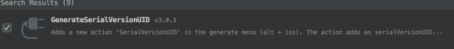
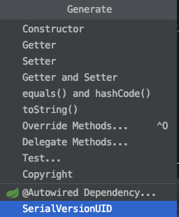
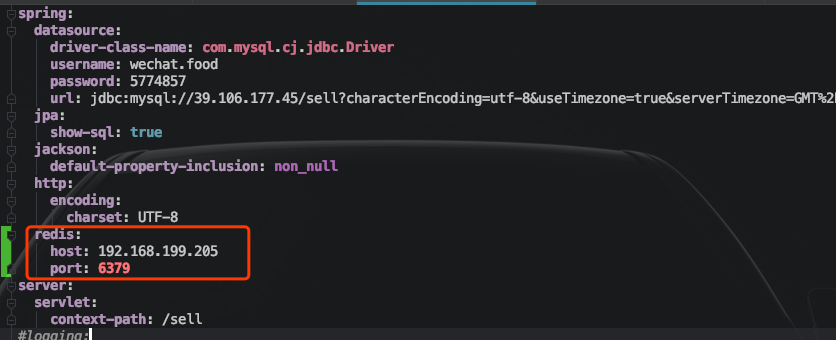

# SpringBoot + Redis缓存实现


## 1、<font color='red'>缓存对象必须实现==序列化==</font>

如：

```java
package com.jachin.sell.VO;
/**
 * @description: http请求返回的最外层对象
 * @Author: JachinDo
 * @Date: 2019/07/17 22:32
 */

@Data
public class ResultVO<T> implements Serializable {
    // 利用插件保证序列化时唯一id
    private static final long serialVersionUID = -1712970983658219564L;

    // 错误码
    private Integer code;
    // 提示信息
    private String msg;
    // 返回的具体内容
    private T data;
}
```


==其中18行使用插件生成唯一id：==



使用方法：

快捷键==`command+o`==：




------


## 2、缓存配置

引入如下依赖时，Spring Boot就会自动配置相关的bean：

```xml
<dependency>
    <groupId>org.springframework.boot</groupId>
    <artifactId>spring-boot-starter-data-redis</artifactId>
    <version>2.1.6.RELEASE</version>
</dependency>
```


yml配置文件：

==有密码的话还需要配置密码==



------


***<font color='red' size=6>启动类加`@EnableCaching`注解：</font>***

```java
package com.jachin.sell;
@SpringBootApplication
@EnableCaching
public class SellApplication {

    public static void main(String[] args) {
        SpringApplication.run(SellApplication.class, args);
    }

}
```

------


## 3、缓存使用举例


必要代码块截取：

```java
package com.jachin.sell.service.impl;
@Service
@CacheConfig(cacheNames = "product")
public class ProductServiceImpl implements ProductService {
    @Autowired
    private ProductInfoDao dao;
  
    @Override
    @Cacheable(key = "#productId")
    public ProductInfo findById(String productId) {
        return dao.findById(productId).get();
    }
  
    @Override
    @CachePut(key = "#productInfo.getProductId()")
    public ProductInfo save(ProductInfo productInfo) {
        return dao.save(productInfo);
    }
}
```


> 1. @Cacheable：第一次进入会执行其标注的方法，执行后，将==返回值类型的数据==进行缓存，之后则不会执行方法，直接从缓存中获取数据。
>
> 2. @CachePut：**<font color='#02C874'>每一次都会执行其标注的方法，每一次都将执行后的新返回值用于更新缓存。</font>**
>
> 3. <font color='red' size=4>**注意：上述两个注解标注的方法的返回值必须相同才行。**</font>
>
> 4. @CacheEvict：主要是为了移除缓存中对应的键值对，主要对于那些删除的操作，==在方法执行完成后移除对应的缓存。==
>
> 5. @CacheConfig：用来配置一些作用域相关的东西，简化上述注解中相同属性的编写。
>
> 6. **<font color='red' size=4>key：key值必须要写，cacheNames + key 唯一标示缓存，而==key默认值是函数入参==，所以防止不统一，建议必须给出该属性值。可以使用spel表达式动态注入key值，如上述两方法的key值设置相匹配，可保证操作的是同一缓存对象</font>**
>
> 7. 更丰富的语法：
>
>    ```java
>    @GetMapping("/list")
>    @Cacheable(cacheNames = "product", key = "#sellerId", condition = "#sellerId.length() > 3", unless = "#result.getCode() != 0")
>    public ResultVO list(@RequestParam(value = "sellerId", required = false) String sellerId) {}
>    ```
>
>    用到了<font color='red' size=4>==spel表达式==。condition和unless都表示缓存条件，满足才缓存。</font>


**<font color='#02C874' size = 5>注意：三个缓存注解是将方法的==“返回值”==作为value存入redis，所以，通常注解不加在Controller层的方法上，因为Controller层的方法通常返回ModelAndView，通常加在Service层。总之，我们通常是要缓存自己定义的数据对象吧。</font>**

