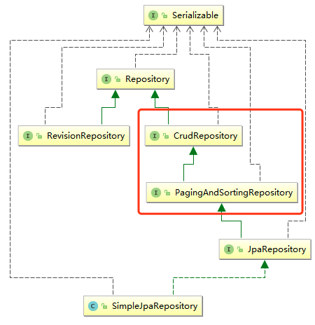

# SpringData JPA与分页

在Spring Boot中使用JPA，需要引入如下依赖：

```xml
<dependency>
	<groupId>org.springframework.boot</groupId>
	<artifactId>spring-boot-starter-data-jpa</artifactId>
</dependency>
```


## 1、JpaRepository

拿项目中一个dao层举例：

```java
public interface ProductCategoryRepository extends JpaRepository<ProductCategory,Integer> {

    List<ProductCategory> findByCategoryTypeIn(List<Integer> categoryTypeList);
}
```

所有dao层都会继承***<font color='red' size=5>`JpaRepository<实体类,主键类型>`</font>***接口。

------

**`JpaRepository`接口的继承关系图：**




<font color='red' size=5>***其中重要的就是继承`CrudRepository`和`PagingAndSortingRepository`接口***</font>

------


### 1）CrudRepository接口

它定义了一些CRUD方法，所以==继承它的类可以直接获得这些对数据库操作的CRUD方法。==

```java
public interface CrudRepository<T, ID> extends Repository<T, ID> {
    <S extends T> S save(S var1);

    <S extends T> Iterable<S> saveAll(Iterable<S> var1);

    Optional<T> findById(ID var1);

    boolean existsById(ID var1);

    Iterable<T> findAll();

    Iterable<T> findAllById(Iterable<ID> var1);

    long count();

    void deleteById(ID var1);

    void delete(T var1);

    void deleteAll(Iterable<? extends T> var1);

    void deleteAll();
}
```


### 2）PagingAndSortingRepository接口

**<font color='red' size=5>这是用来实现分页接口</font>**

```java
public interface PagingAndSortingRepository<T, ID> extends CrudRepository<T, ID> {
    Iterable<T> findAll(Sort var1);

    Page<T> findAll(Pageable var1);
}
```

> ***<font color='red' size=5>`Page<T> findAll(Pageable var1);`</font>***

------


#### **分页操作：**

a）Controller层：

```java
@GetMapping("/list")
    public ModelAndView list(@RequestParam(value = "page" ,defaultValue="1") Integer page,
                             @RequestParam(value = "size",defaultValue = "10") Integer size,
                             Map<String,Object> map){
        Pageable pageable = PageRequest.of(page-1, size);
        Page<ProductInfo> productInfoPage=productService.findAll(request);
        map.put("productInfoPage",productInfoPage);
        map.put("currentPage",page);
        map.put("size",size);
        return new ModelAndView("product/list",map);
    }
```

> - <font color='red' size = 4>***其中：PageRequest类继承于AbstractPageRequest类，该类实现了Pageable接口，故可以有上面5、6行***</font>
>
> - <font color='red' size = 4>***而且还要把page参数（从几页开始）和size参数（一页几个）传给模版引擎中***</font>
>
>   ```html
>   <div class="col-md-12 column">
>       <ul class="pagination pull-right">
>   
>           <#if currentPage lte 1>
>               <li class="disabled"><a href="#">上一页</a></li>
>           <#else>
>               <li><a href="/sell/buyer/product/list?page=${currentPage-1}&size=${size}">上一页</a></li>
>           </#if>
>   
>           <#list 1..productInfoList.getTotalPages() as index>
>               <#if currentPage == index>
>                   <li class="disabled"><a href="#">${index}</a> </li>
>               <#else>
>                   <li><a href="/sell/buyer/product/list?page=${index}&size=${size}">${index}</a></li>
>               </#if>
>           </#list>
>   
>           <#if currentPage gte productInfoList.getTotalPages()>
>               <li class="disabled"><a href="#">下一页</a></li>
>           <#else>
>               <li><a href="/sell/buyer/product/list?page=${currentPage+1}&size=${size}">下一页</a></li>
>           </#if>
>   
>       </ul>
>   </div>
>   ```

------

b）Service层：

```java
@Override
public Page<ProductInfo> findAll(Pageable pageable) {
    return repository.findAll(pageable);
}
```


c）Dao层：

```java
public interface ProductInfoRepository extends JpaRepository<ProductInfo,String>{

}
```