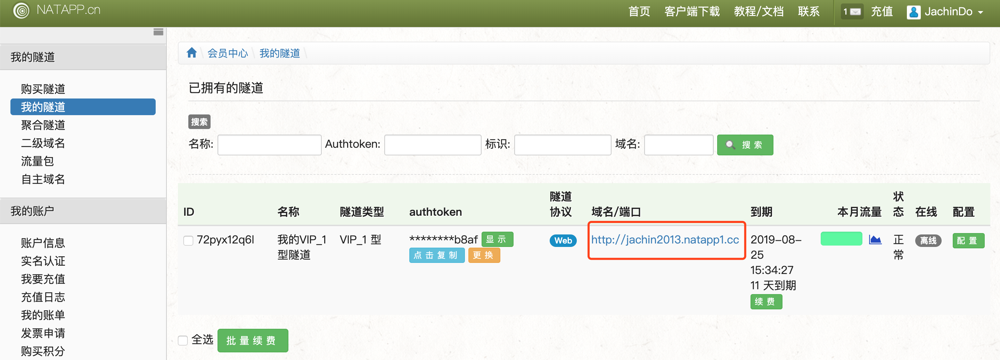
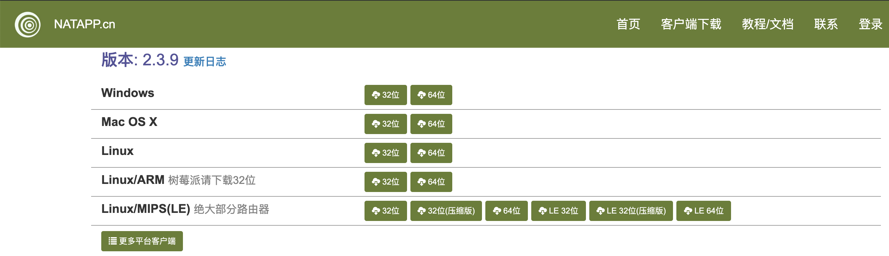
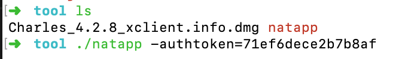
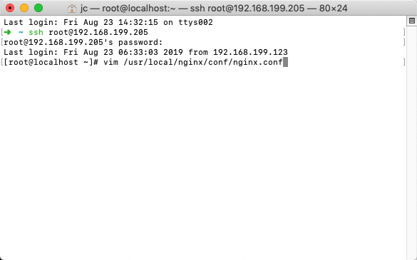
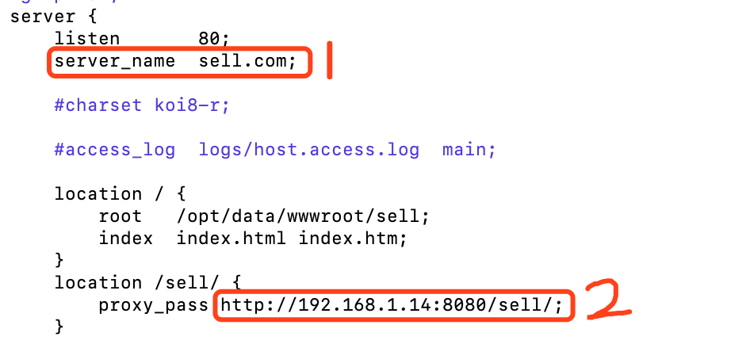
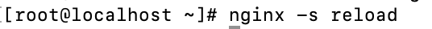
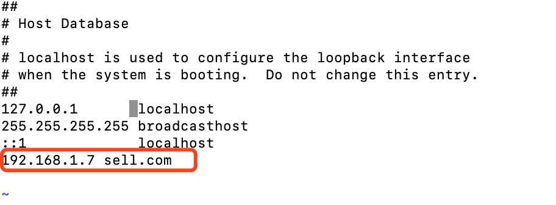
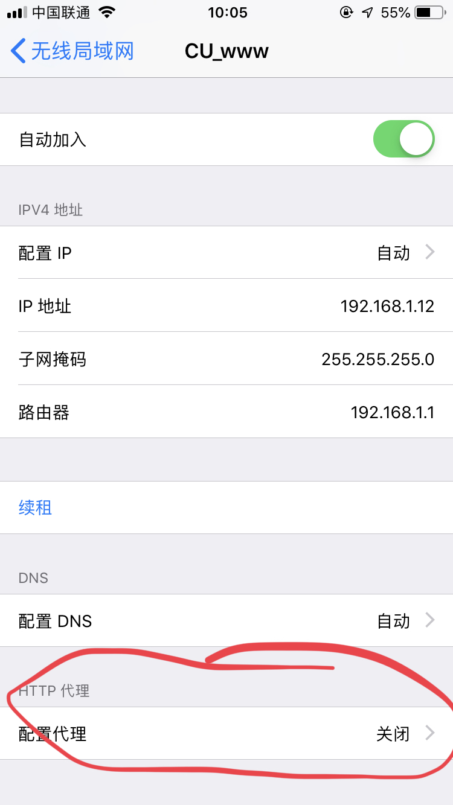
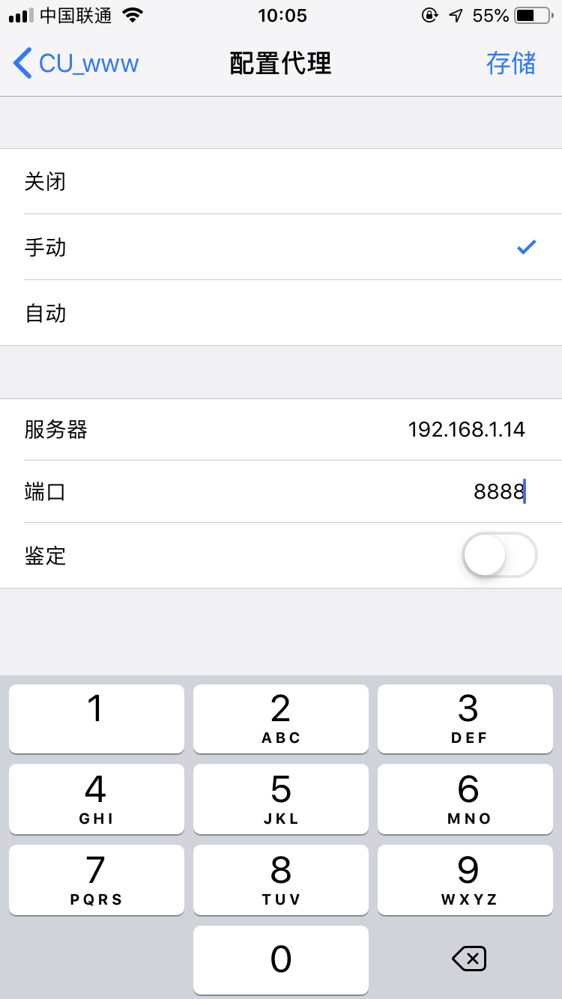

#  使用主机做服务器（内网穿透）

通常我们需要将自己的应用被互联网上所有用户访问，就要有一个可以被外网访问的服务器，可通过两种方式实现：

> 1. 租用云服务器
> 2. 使用内网穿透技术将自己的闲置主机或虚拟机部署为服务器

这里我们着重介绍第二种方法。

## 1、购买隧道&下载客户端

natapp.cn

## 2、运行natapp客户端

## 3、pc端与服务器请求转发代理设置

==实现pc端对服务端的访问==

> 1. 在虚拟机配置服务器端
>
> 
>
> 
>
> 注意：
>
> ​	1处的域名可以替代ip地址访问，即pc端通过该域名即可被解析为其ip
>
> ​	2处ip为pc端ip地址，该配置旨在让虚拟机能访问到pc端
>
> 2. 重启nginx
>
> 
>
> 3. pc端配置
>
> 
>
> 
>
> 
>
> 
>
> ==在pc端通过访问sell.com即可转到虚拟机ip地址==
>
> 

## 4、手机端与服务器请求转发代理设置

==实现手机端访问服务端==

==使用charles，必须要打开charles==

> 1. 配置手机端http代理
>
>    
>
>    
>
> 
>
> 
>
> ​	
>
> ​	==charles默认监听端口8888==
>
> **相当于手机的请求先转到3中配置好的同一网段的pc端，由pc端再转发到虚拟机服务器，pc端相当于一个代理**

