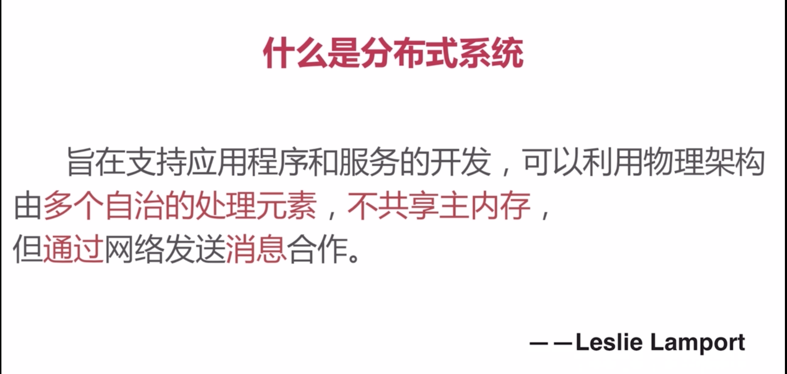
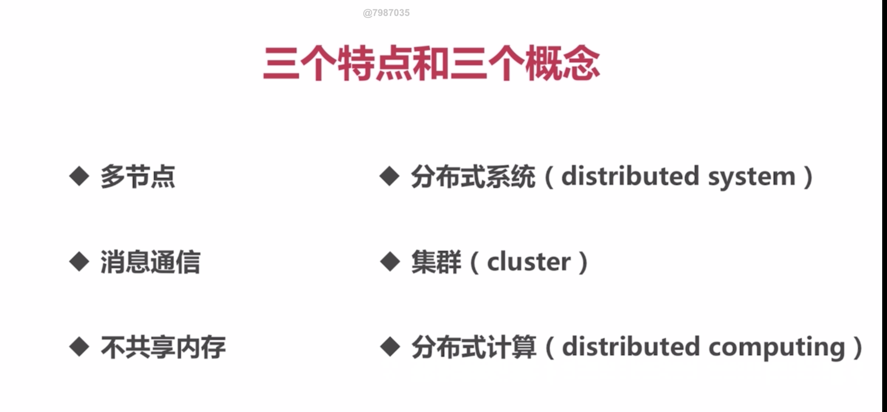
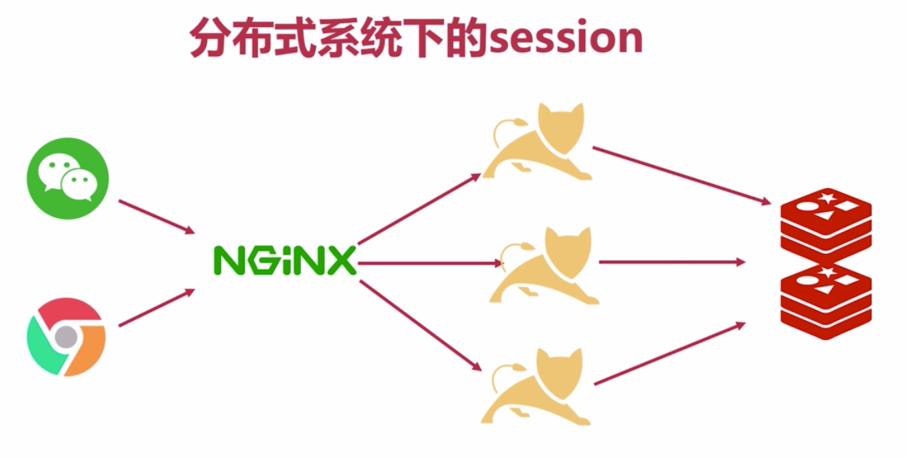

# 分布式系统下的Session管理问题


## 1、分布式系统简介




------




------


### 水平扩展

**<font color='red'>相当于集群，每台服务器是一样的。</font>**

### 垂直扩展

**<font color='red'>相当于服务拆分，不同服务器上运行大应用的几个子模块。</font>**


## 2、分布式Session管理方法


### 1、Session Stick

在单机情况，session保存在单机上，请求也是到这台单机上，不会有问题。变成多台后，如果能保障每次请求都到同一台服务，那就和单机一样了。**<font color='red'> 这需要在负载均衡设备上修改（通常利用一个反向代理服务器，如nginx。用hash算法来将同一个请求的IP的落在同一台服务器上，所以这种方法又称为==反向代理hash一致法==）。</font>**
这种方式会有一下问题：

> 1. 如果某一台服务器==宕机或重启==，那么这台服务器上的session数据就丢失了，如果session数据中还有登录状态信息，那么用户需要重新登录。
> 2. ==负载均衡要处理具体的session到服务器的映射==。


### 2、Session复制

Session复制顾名思义，就是每台应用服务，都保存会话session数据，一般的应用容器都支持。与Session Stick相比，sessioon复制对负载均衡 没有太多的要求。
不过这个方案还是有缺点：

> 1. 同步session数据带来都==网络开销==。只要session数据变化，就需要同步到所有机器上，机器越多，网络开销越大。
> 2. 由于每台服务器都保存session数据，如果集群的session数据很多，比如90万人在访问网站，每台机器用于==保存session数据的内容占用很严重==。

这个方案是靠应用容器来完成，并不依赖应用，如果应用服务数量并不是很多，可以考虑。


### 3、Session集中管理*

这个也很好理解，**<font color='red'> 再加一台服务，专门来管理session数据，每台应用服务都从专门的session管理服务中取会话session数据。</font>**可以使用数据库，NOSQL数据库等。和Session复制相比，减少了每台应用服务的内存使用，同步session带来的网络开销问题。
但还是有缺点：

> 1. 读写session引入了网络操作，==相对于本机读写session，带来了延时和不稳定性==。
> 2. 如果Session集中服务有问题，会影响应用。


### 4、基于Cookie管理

最后一个是基于Cookie管理，我们把session数据存放在cookie中，然后请求过来后，从cookie中获取session数据。与集中管理相比，这个方案==并不依赖外部 的存储系统==，不会有读写session数据带来的网络操作延时和不稳定性。 但依然有缺点：

> 1. Cookie有长度限制，这会影响session数据的长度。
> 2. ==安全性==。session数据本来存储在服务端的，而这个方案是让session数据转到外部网络或客户端中，所以会有安全性问题。不过可以对写入Cookie的session 数据做加密。
> 3. ==带宽消耗==。由于每次Http请求都携带了session数据，带宽当然也会增加一点。
> 4. ==性能消耗==。每次Http请求和响应都带有Session数据，对于Web服务器来说，在同样的处理情况下，响应的结果输出越少，支持的并发请求越多。

**<font color='red'> 现在常见的解决方式就是Session集中管理。</font>**


## 3、本项目中基于集中管理的分布式Session





实现水平和垂直扩展**<font color='red'> redis也可扩展</font>**

==将登陆信息session缓存到redis，多台服务应用需要session时从redis中获取，用户登出时从redis中删除session。==


### 代码举例：

```java
package com.jachin.sell.controller;

/**
 * @description: 卖家用户
 * @Author: JachinDo
 * @Date: 2019/08/27 15:21
 */
@Controller
@RequestMapping("/seller")
public class SellerUserController {

    @Autowired
    private SellerService sellerService;

    @Autowired
    private StringRedisTemplate redisTemplate;

    @GetMapping("/login")
    public ModelAndView login(@RequestParam("openid") String openid,
                              HttpServletResponse response,
                              Map<String,Object> map) {

        // 1. openid和数据库里的数据匹配
        SellerInfo sellerInfo = sellerService.findSellerInfoByOpenid(openid);
        if (sellerInfo == null) {
            map.put("msg", ResultEnum.LOGIN_FAIL.getMessage());
            map.put("url", "/sell/seller/order/list");
            return new ModelAndView("common/error",map);
        }

        // 2. 设置token至redis
        String token = UUID.randomUUID().toString();
        Integer expire = RedisConstant.EXPIRE;
        redisTemplate.opsForValue().set(String.format(RedisConstant.TOKEN_PREFIX,token),openid,expire, TimeUnit.SECONDS);


        // 3. 设置token至cookie
        CookieUtil.set(response,CookieConstant.TOKEN, token, expire);
        return new ModelAndView("redirect:http://jachin2013.natapp1.cc/sell/seller/order/list");
    }

    @GetMapping("/logout")
    public ModelAndView logout(HttpServletRequest request,
                       HttpServletResponse response,
                       Map<String, Object> map) {

        // 1. 从cookie中查询
        Cookie cookie = CookieUtil.get(request, CookieConstant.TOKEN);
        if (cookie != null) {

            // 2. 清除redis
            redisTemplate.opsForValue().getOperations().delete(String.format(RedisConstant.TOKEN_PREFIX, cookie.getValue()));

            // 3. 清除cookie
            CookieUtil.set(response, CookieConstant.TOKEN, null, 0);
        }

        map.put("msg", ResultEnum.LOGOUT_SUCCESS.getMessage());
        map.put("url", "/sell/seller/order/list");
        return new ModelAndView("common/success", map);

    }
}
```

其中`CookieUtil`如下：

```java
package com.jachin.sell.utils;

/**
 * @description: cookie工具类
 * @Author: JachinDo
 * @Date: 2019/08/27 16:07
 */

public class CookieUtil {


    /**
     * 设置cookie
     * @param response
     * @param name
     * @param value
     * @param maxAge
     */
    public static void set(HttpServletResponse response,
                           String name,
                           String value,
                           int maxAge) {

        Cookie cookie = new Cookie(name, value);
        cookie.setPath("/");  // 可解决一定程度的cookie跨域问题
        cookie.setMaxAge(7200);
        response.addCookie(cookie);
    }


    /**
     * 获取指定名称cookie
     * @param request
     * @param name
     * @return
     */
    public static Cookie get(HttpServletRequest request,
                           String name) {
        Map<String, Cookie> cookieMap = readCookieMap(request);
        if (cookieMap.containsKey(name)) {
            return cookieMap.get(name);
        } else {
            return null;
        }
    }


    // 将获取到到所有cookie(数组形式)转化为map，便于找到我们所需到cookie
    private static Map<String, Cookie> readCookieMap(HttpServletRequest request) {

        Map<String, Cookie> cookieMap = new HashMap<>();

        Cookie[] cookies = request.getCookies();
        if (cookies != null) {
            for (Cookie cookie : cookies) {
                cookieMap.put(cookie.getName(), cookie);
            }
        }
        return cookieMap;
    }
}
```

参考：[https://github.com/sqmax/springboot-project/wiki/%E5%88%86%E5%B8%83%E5%BC%8F%E7%B3%BB%E7%BB%9F%E4%B8%8BSession%E7%AE%A1%E7%90%86](https://github.com/sqmax/springboot-project/wiki/分布式系统下Session管理)