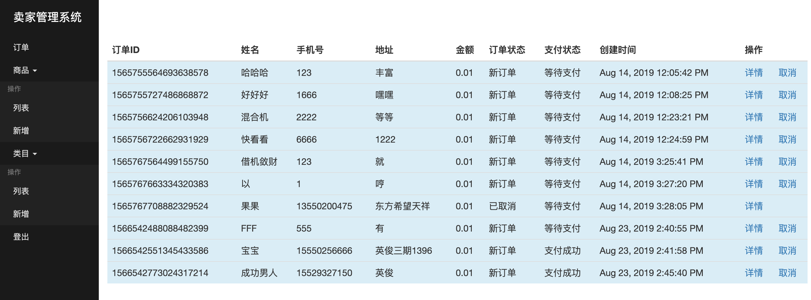
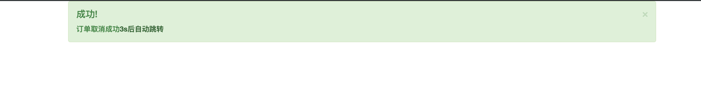
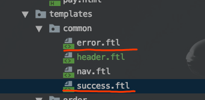

# 前端页面跳转技巧

通常在前端某一页面点击相应按钮后会执行后端的逻辑代码，此时需要一个提示页面来告知用户执行是否成功，以及提示后应当适时（3s后）跳转到指定页面。

如：在后台订单管理页对某订单点击取消后，需要返回一个取消是否成功的页面，以及3s后跳转到订单列表管理页面




点击“取消”后：3s后自动跳转回列表页




## 实现方法

==使用freemaker模版引擎==

### 1、先建立两个页面，分别为成功和失败的：



以失败为例：

```html
<html>
<head>
    <meta charset="utf-8">
    <title>错误提示</title>
    <link href="https://cdn.bootcss.com/twitter-bootstrap/3.0.1/css/bootstrap.min.css" rel="stylesheet">    </head>
<body>
<div class="container">
    <div class="row clearfix">
        <div class="col-md-12 column">
            <div class="alert alert-dismissable alert-danger">
                <button type="button" class="close" data-dismiss="alert" aria-hidden="true">×</button>
                <h4>
                    错误!
                </h4> <strong>${msg}</strong><a href="${url}" class="alert-link">3s后自动跳转</a>
            </div>
        </div>
    </div>
</div>
</body>

<script>
    setTimeout('location.href="${url}"', 3000);
</script>

</html>
```

==重点在第14行==


### 2、controller返回modelandview

- try catch中得到该业务逻辑是否执行成功（不成功会抛出异常）；
- 将成功或不成功的对应信息以“msg”为键存入map，url也存入map；
- 最后根据成功与否返回不同的页面，如第一步中的success.ftl或error.ftl

```java
@GetMapping("/cancel")
public ModelAndView cancel(@RequestParam("orderId") String orderId,
                           Map<String,Object> map) {
    try {
        OrderDTO orderDTO = orderService.findOne(orderId);
        orderService.cancel(orderDTO);
    } catch (SellException e) {
        log.error("【卖家端取消订单】发生异常{}",e);
        map.put("msg", e.getMessage());
        map.put("url", "/sell/seller/order/list");
        return new ModelAndView("common/error",map);
    }

    map.put("msg", ResultEnum.ORDER_CANCEL_SUCCESS.getMessage());
    map.put("url", "/sell/seller/order/list");

    return new ModelAndView("common/success");
}
```

