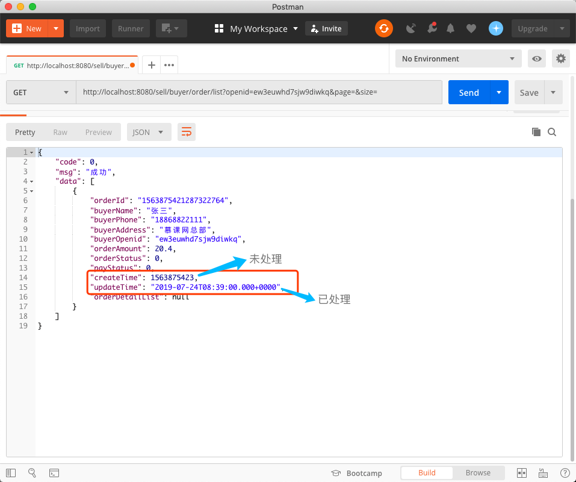
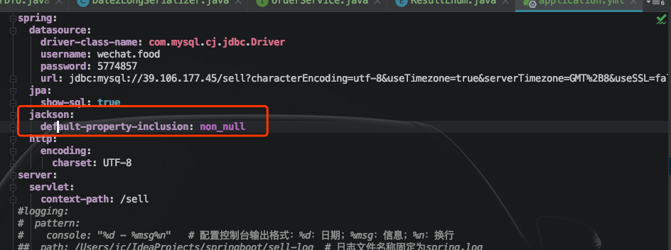

# 开发过程中问题及技巧总结

## 1、返回给前端的Date类型数据处理


未处理：不处理对象内的Date属性，直接将对象返回给前端，后面会多出一些0，而且通常可能我们需要的是毫秒数，所以还是要处理一下。




**【处理方式】：**

1. 创建一个Date —> Long的转换器：

   ```java
   package com.jachin.sell.utils.serializer;
   
   import com.fasterxml.jackson.core.JsonGenerator;
   import com.fasterxml.jackson.databind.JsonSerializer;
   import com.fasterxml.jackson.databind.SerializerProvider;
   
   import java.io.IOException;
   import java.util.Date;
   
   /**
    * @description: 返回前段时将Date类型数据转换为Long
    * @Author: JachinDo
    * @Date: 2019/07/24 16:43
    */
   
   public class Date2LongSerializer extends JsonSerializer<Date> {
       @Override
       public void serialize(Date value, JsonGenerator gen, SerializerProvider serializers) throws IOException {
           // 直接返回Date类型给前端，前端显示会在末尾多3个0
           gen.writeNumber(value.getTime() / 1000);
       }
   }
   ```


2. 在要返回给前端的实体类的对应属性加注解：

   ```java
   package com.jachin.sell.dto;
   
   import com.fasterxml.jackson.databind.annotation.JsonSerialize;
   import com.jachin.sell.entity.OrderDetail;
   import com.jachin.sell.enums.OrderStatusEnum;
   import com.jachin.sell.enums.PayStatusEnum;
   import com.jachin.sell.utils.serializer.Date2LongSerializer;
   import lombok.Data;
   
   import java.math.BigDecimal;
   import java.util.Date;
   import java.util.List;
   
   /**
    * @description: 与前端订单交互的对象
    * @Author: JachinDo
    * @Date: 2019/07/20 14:39
    */
   @Data
   public class OrderDTO {
   
       // 与orderMaster相同
       private String orderId;
       private String buyerName;
       private String buyerPhone;
       private String buyerAddress;
       private String buyerOpenid;
       private BigDecimal orderAmount;
       // 默认为新订单 0
       private Integer orderStatus;
       // 默认为未支付 0
       private Integer payStatus;
   
       @JsonSerialize(using = Date2LongSerializer.class)
       private Date createTime;
       @JsonSerialize(using = Date2LongSerializer.class)
       private Date updateTime;
   
       // 比OrderMaster多了一个订单详情列表项的属性
       List<OrderDetail> orderDetailList;
   }
   ```


## 2、返回给前端的对象中为null的属性不返回

可在对应实体的类上加注解

```java
@JsonInclude(JsonInclude.Include.NON_NULL)  // 返会给前端时，为null的属性值不返回
```


【全局配置】：




==如果想让属性必须返回，但又不能返回null，则指定初始值即可，如空串“” ，new ArrayList<>()==


## 3、使用RestTemplate模拟http请求

详见博客：http://www.54tianzhisheng.cn/2017/12/03/RestTemplate/


## 4、ConfigurationProperties注解

用于配置信息的加载注入，这篇文章很好：https://xuexiyuan.cn/article/detail/214.html

【项目中举例】

yml配置：

```yml
wechat:
  myAppId: wxdb8xxxxxx80cfc463xxx
  myAppSecret: f509e4c3d0exxxxxx66cbf12d3xxx
```


```java
@Data
@Component
@ConfigurationProperties(prefix = "wechat")
public class WechatAccountConfig {

    private String mpAppId;
    private String mpAppSecret;
}
```


第5行注入WechatAccountConfig，即可使用配置文件中的对应属性（18，19行）

```java
@Component
public class WechatMpConfig {

    @Autowired
    private WechatAccountConfig accountConfig;


    @Bean
    public WxMpService wxMpService() {
        WxMpService wxMpService = new WxMpServiceImpl();
        wxMpService.setWxMpConfigStorage(wxMpConfigStorage());
        return wxMpService;
    }

    @Bean
    public WxMpConfigStorage wxMpConfigStorage() {
        WxMpInMemoryConfigStorage wxMpConfigStorage = new WxMpInMemoryConfigStorage();
        wxMpConfigStorage.setAppId(accountConfig.getMpAppId());
        wxMpConfigStorage.setSecret(accountConfig.getMpAppSecret());
        return wxMpConfigStorage;
    }
}
```

==同样在controller中，直接注入WxMpService即可使用==

------


## 5、@RequestParam默认值、非必传参数

> - 默认值：若请求未携带参数，则使用默认值

```java
public ModelAndView list(@RequestParam(value = "page", defaultValue = "1") Integer page,
                         @RequestParam(value = "size", defaultValue = "10") Integer size,
                         Map<String,Object> map) {
```


> - 非必传参数：若请求未携带指定参数，则不会报错，

***<font color='red' size=5>可在函数内部根据是否有参数值来制定不同逻辑</font>***

```java
 @GetMapping("/index")
    public void index(@RequestParam(value = "productId",required = false) String productId, Map<String,Object> map) {
        if (!StringUtils.isEmpty(productId)) {
				// 。。。。。
        }
    }
```

