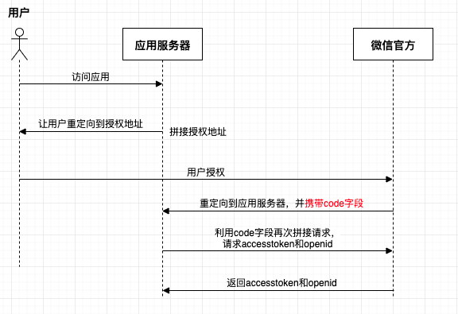

# 微信开发相关

==参考微信开发文档==

## 1、授权流程图



## 1、网页授权


使用第三方sdk，api文档见：[https://github.com/Wechat-Group/WxJava/wiki/MP_OAuth2%E7%BD%91%E9%A1%B5%E6%8E%88%E6%9D%83](https://github.com/Wechat-Group/WxJava/wiki/MP_OAuth2网页授权)


==整体流程==

> 1. 访问"/authorize"（带上目标网址tartgetUrl）;
> 2. 21行基于20行的url建立请求重定向路径，生成21行入参code, state;
> 3. 请求由"/authorize"重定向到了"/userInfo";
> 4. "/userInfo"使用入参code获取openid，并使用state重定向到tartgetUrl。
>
> 

```java

/**
 * @description:
 * @Author: JachinDo
 * @Date: 2019/07/25 17:04
 */
@Controller
@RequestMapping("/wechat")
@Slf4j
public class WechatController {

    @Autowired
    private WxMpService wxMpService;

    @GetMapping("/authorize")
    public String authorize(@RequestParam("returnUrl") String returnUrl) {

        // 1. 配置(在配置类中配置了WxMpService)
        // 2. 调用方法
        String url = "http://jachin2013.natapp1.cc/sell/wechat/userInfo";
        String redirectUrl = wxMpService.oauth2buildAuthorizationUrl(url, WxConsts.OAuth2Scope.SNSAPI_USERINFO, URLEncoder.encode(returnUrl));
//        log.info("【微信网页授权】获取code, result={}",redirectUrl);
        return "redirect:" + redirectUrl;

    }

    @GetMapping("/userInfo")
    public String userInfo(@RequestParam("code") String code,
                         @RequestParam("state") String returnUrl) {

        WxMpOAuth2AccessToken wxMpOAuth2AccessToken = new WxMpOAuth2AccessToken();
        try {
            wxMpOAuth2AccessToken = wxMpService.oauth2getAccessToken(code);
        } catch (WxErrorException e) {
            log.error("【微信网页授权】{}",e);
            throw new SellException(ResultEnum.WX_MP_ERROR.getCode(), e.getError().getErrorMsg());
        }

        String openId = wxMpOAuth2AccessToken.getOpenId();
        return "redirect:" + returnUrl + "?openid=" + openId;
    }
}
```