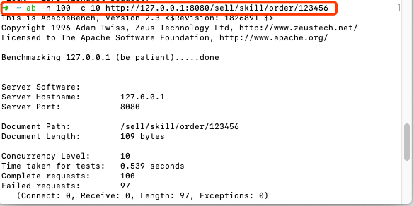

# 秒杀接口--压测与基于Redis的分布式锁


## 0、使用 apache ab压测工具

命令举例：




测压工具：==Apache ab==

- 命令：`ab -n 100 -c 100 http://www.XXXX.com`

> 这里-n表示发出100个请求，-c模拟100个线程并发，相当于100个人同时访问，最后是我们要测试的url； 也可以这样写: `ab -t 60 -c 100 http://www.XXX.com/`
> -t表示60秒，-c表示100个并发，它会在连续60秒内不停地发请求。
> 更详细的命令说明，见[官方文档](http://httpd.apache.org/docs/2.0/programs/ab.html)

------


## 1、高并发带来的“超卖”现象

> 即：**<font color='red'>订单数 > 库存减少数</font>**
>
> 如：“国庆活动，皮蛋粥特价，限量份100000 还剩：99992 份 该商品成功下单用户数目：1000 人”
>
> 解决方法见下文。

------


## 2、synchronized关键字实现锁

在秒杀业务方法上加`synchronized`关键字。

如：

```java
@Override
public synchronized void orderProductMockDiffUser(String productId)
{
   
    //1.查询该商品库存，为0则活动结束。
    int stockNum = stock.get(productId);
    if(stockNum == 0) {
        throw new SellException(100,"活动结束");
    }else {
        //2.下单(模拟不同用户openid不同)
        orders.put(KeyUtil.genUniqueKey(),productId);
        //3.减库存
        stockNum =stockNum-1;
        try {
            Thread.sleep(100);
        } catch (InterruptedException e) {
            e.printStackTrace();
        }
        stock.put(productId,stockNum);
    }
}
```


> 缺点：
>
> - **<font color='red'>无法做到细粒度控制。</font>**当有许多商品时，每个商品id不同，但这里对每个商品的抢购都会加锁，假如秒杀A商品的人很多，秒杀B商品的人很少，一旦进入这个方法都会造成一样的慢，这就是说无法做到细粒度的控制。
> - 只适合单点的情况。只能跑在单机上。***<font color='red' size=4.5>因为`synchronized`锁基于jvm，当应用集群化后，相当于有多个jvm，这种锁自然就失效了。</font>***

------


## 3、分布式锁

### &sect; **特点：**

> - 互斥性: 和我们本地锁一样互斥性是最基本，但是分布式锁需要保证在**<font color='red'>不同节点的不同线程的互斥。</font>**
>
> - 可重入性: 同一个节点上的同一个线程如果获取了锁之后那么也可以再次获取这个锁。
>
> - 锁超时: 和本地锁一样支持锁超时，防止死锁。
>
> - 高效，高可用: 加锁和解锁需要高效，同时也需要保证高可用防止分布式锁失效，可以增加降级。
>
> - 支持阻塞和非阻塞: 和ReentrantLock一样支持lock和trylock以及tryLock(long timeOut)。
>
> - 支持公平锁和非公平锁(可选): 公平锁的意思是按照请求加锁的顺序获得锁，非公平锁就相反是无序的。这个一般来说实现的比较少。

------

### &sect; 实现方式：

> - MySql
> - Zookeeper
> - **<font color='red'>Redis（自己手动实现(如下)、redission、redLock）</font>**
> - 自研分布式锁:如谷歌的Chubby。

------


## 4、Redis实现分布式锁


**<font color='red' size=5>需要手动加锁/解锁</font>**

引入依赖：

```xml
<dependency>
    <groupId>org.springframework.boot</groupId>
    <artifactId>spring-boot-starter-data-redis</artifactId>
    <version>2.1.6.RELEASE</version>
</dependency>
```


> 重点基于：redis的两个命令，具体见http://www.redis.cn/commands.html
>
>  1. <font color='#02C874'>redis的 [**SETNX key value**] 对应java代码中的 `setIfAbsent`</font>
>
> 2. <font color='#02C874'>[**GETSET key value**] 对应java代码中的 `getAndSet`</font>
>

------


### 实现：

```java
package com.jachin.sell.service;
@Component
@Slf4j
public class RedisLock {

    @Autowired
    private StringRedisTemplate redisTemplate;

    /**
     * 加锁
     * @param key ：productID
     * @param value ：当前时间+超时时间
     * @return
     */
    public boolean lock(String key, String value) {
      
        // setIfAbsent，如果key不存在，则set成功，否则失败
        if(redisTemplate.opsForValue().setIfAbsent(key, value)) {
            return true;
        }
				
        // 重点：以下代码加入过期判断防止死锁(忘记手动解锁）！！！！
        // currentValue是旧值
        String currentValue = redisTemplate.opsForValue().get(key);
        //如果锁过期
        if (!StringUtils.isEmpty(currentValue)
                && Long.parseLong(currentValue) < System.currentTimeMillis()) {
            
            //获取旧值并将新值写入
            String oldValue = redisTemplate.opsForValue().getAndSet(key, value);
            if (!StringUtils.isEmpty(oldValue) && oldValue.equals(currentValue)) {
                return true;
            }
        }

        return false;
    }

    /**
     * 解锁
     * @param key
     * @param value
     */
    public void unlock(String key, String value) {
        try {
            String currentValue = redisTemplate.opsForValue().get(key);
            if (!StringUtils.isEmpty(currentValue) && currentValue.equals(value)) {
                redisTemplate.opsForValue().getOperations().delete(key);
            }
        }catch (Exception e) {
            log.error("【redis分布式锁】解锁异常, {}", e);
        }
    }

}
```

> **<font color='red'>上面的32行由于，getAndSet相当于原子操作，同时只能有一个线程执行。所以，就算当前锁过期后，有多个线程同时到达30行，也只有一个线程能成功获取锁。</font>**

------


### 使用：

Service层代码截取

**<font color='#02C874'>用商品id作为key，可以更细粒度控制代码</font>**

```java
@Override
public void orderProductMockDiffUser(String productId)
{
    //加锁
    long time = System.currentTimeMillis() + TIMEOUT;
    // 用商品id作为key，可以更细粒度控制代码
    if (!redisLock.lock(productId, String.valueOf(time))) {
        throw new SellException(101, "诶呦喂，人也太多了，换个姿势再试试～～");
    }

    //1.查询该商品库存，为0则活动结束。
    int stockNum = stock.get(productId);
    if(stockNum == 0) {
        throw new SellException(100,"活动结束");
    }else {
        //2.下单(模拟不同用户openid不同)
        orders.put(KeyUtil.genUniqueKey(),productId);
        //3.减库存
        stockNum =stockNum-1;
        try {
            Thread.sleep(100);
        } catch (InterruptedException e) {
            e.printStackTrace();
        }
        stock.put(productId,stockNum);
    }

    //解锁
    redisLock.unlock(productId, String.valueOf(time));
}
```

==速度也比synchronized快==


**关于分布式锁的更多讨论，mysql分布式锁、zookeeper分布式锁、redission、redlock等详见：**

https://juejin.im/post/5bbb0d8df265da0abd3533a5

其中讲到的redis分布式锁存在的问题：

> - <font color='#02C874' size=4>***设置了超时（注意，这里的超时是一个属性，而不是value值），但服务运行时间大于超时时间，这样时间一到，锁相当于释放了，这就尴尬了。通过将value字段当作一个版本号，再释放锁前先判断版本号是否一致，这里版本号采用随机数实现。***</font>

------


## 5、易错点难点

> 切记，***<font color='red'>redis和 mq是无法通过springboot中的实务机制回滚的，所以一旦出了异常，try catch中要手动将数据改回去（手动回滚）。</font>***