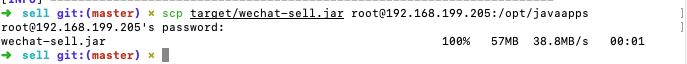
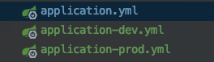

# 部署相关

## 1、与虚拟机的交互

`ssh root@192.168.199.205`进入虚拟机

`scp target/wechat-sell.jar root@192.168.199.205:/opt/javaapps`将打包后的jar传到虚拟机指定目录




## 2、运行问题


> 端口占用：
>
> ​				使用`netstat -alnp | grep 8080` 或` lsof -i:8080`查看对应占用该端口的进程
>
> ​				使用kill -9 进程id  杀掉该进程即可
>
> 后台运行：
>
> ​				将后台运行命令写入shell脚本中：`vim start.sh`
>
> 写入命令
>
> ```shell
> 
> #!/bin/sh
> nohup java -jar -Dspring.profiles.active=prod wechat-sell.jar > /dev/null 2>&1 &
> 
> ```
>
> 执行：`bash start.sh `即可后台运行
>
> 查看后台运行情况：`ps -ef |grep wechat-sell.jar `
>
> 
>
> 其中命令使用了多环境：`-Dspring.profiles.active=prod`，在工程中配置如下：
>
> 
>
> Application.yml: 默认dev环境
>
> ```yml
> spring:
>   profiles:
>     active: dev
> ```


