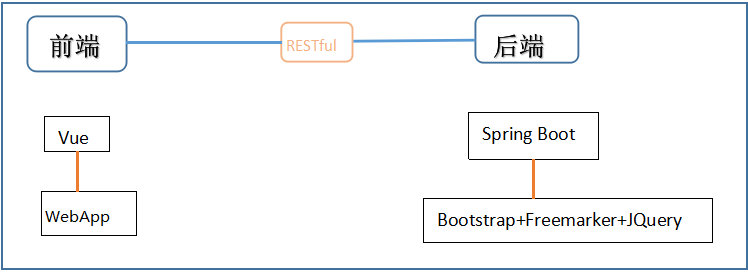
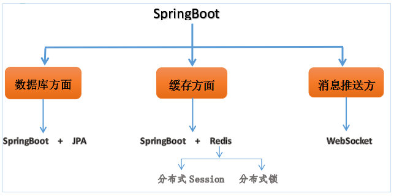
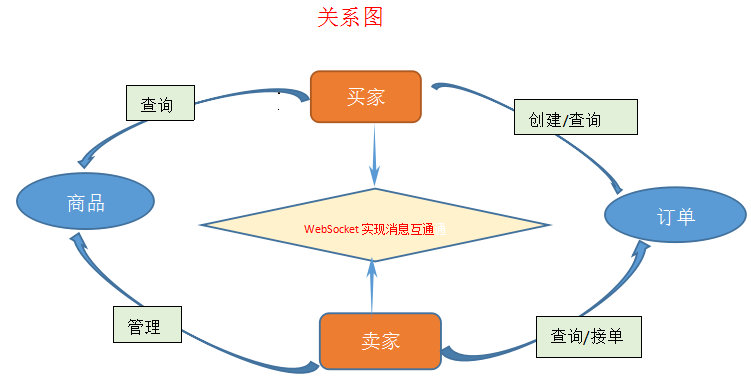
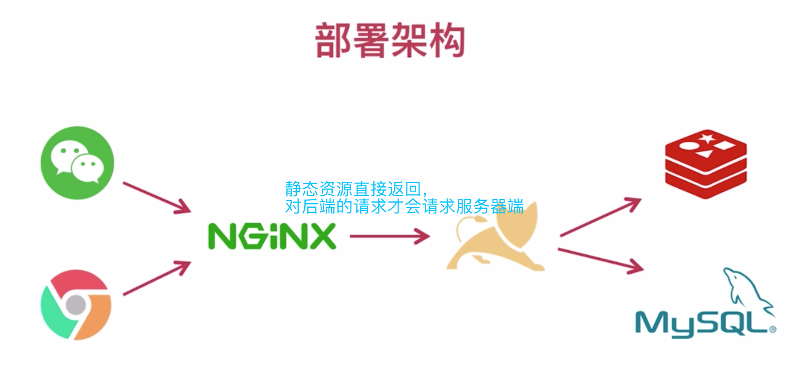
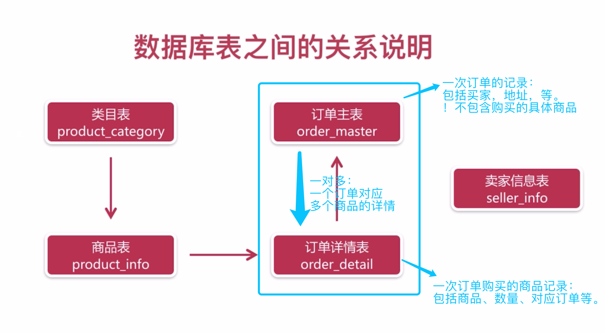
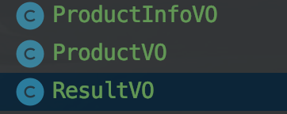
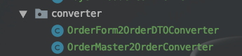
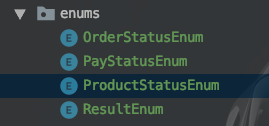
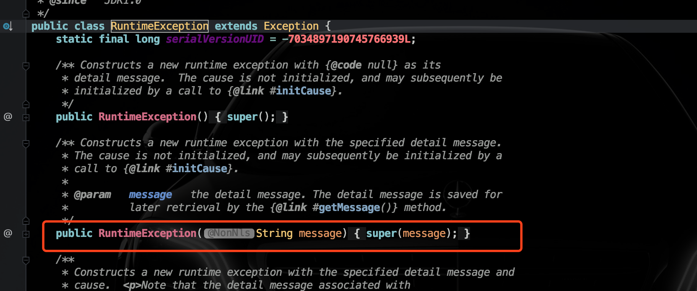
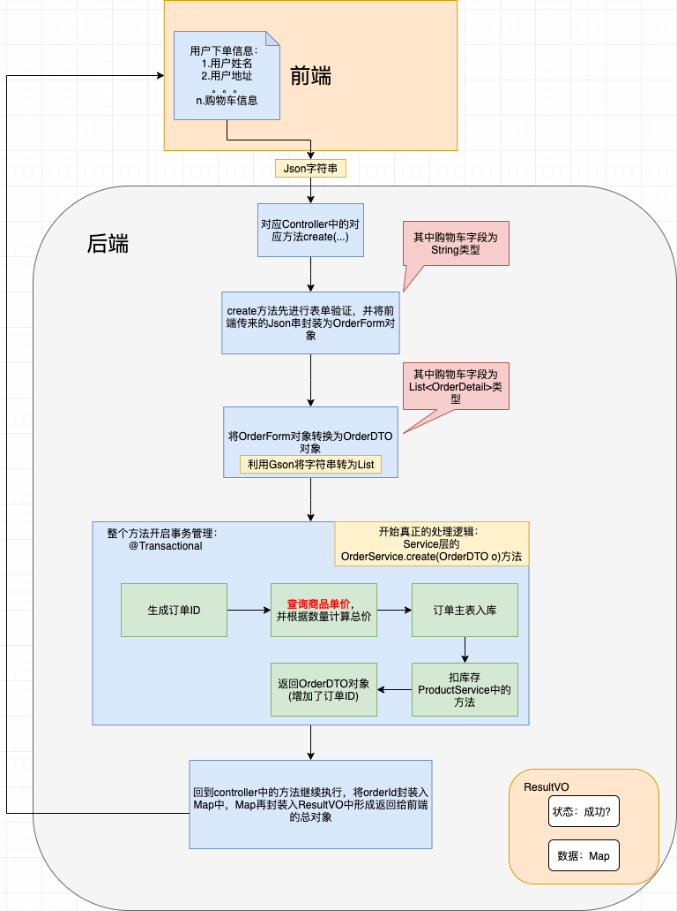

# 项目整体设计与总结


## 1、项目架构及技术选型介绍

### 1）前后端分离架构

前端是由Vue.js构建的WebApp，后端由Spring Boot打造，后端的前台页面使`用Bootstrap+Freemarker+JQuery`构建,**<font color='red'>后端和前端通过==RESTful==风格的接口相连。</font>**




------

### 2）技术架构




------


### 3）买卖家关系图




------


### 4）部署架构




### 5）技术栈

- Spring Boot的相关特性
  - ==Spring Boot+JPA==
  - ==Spring Boot+Redis==
  - Spring Boot+WebSocket
- 微信相关特征
  - 微信支付、退款
  - ==微信授权登陆==
  - 微信模板消息推送
  - ==使用微信相关的开源SDK==
- 利用Redis应用分布式Session和锁
  - 对用户的登陆信息使用分布式Session存储
  - 利用一个抢购商品的例子，来对Redis分布式锁进行详细的说明


### 6）开发环境与工具

- IDEA
- Maven
- Git
- MySQL
- Nginx
- Redis
- ==Postman模拟微信订单创建订单==
- Fiddler对手机请求抓包
- Natapp内网穿透
- ==Apache ab模拟高并发，抢购一个商品==


------


## 2、数据库表设计


### 1）表之间关系说明




==重点掌握订单主表和订单详情表各自的功能==


### 2）表设计

- <font color='red'>养成在表项后面加comment的习惯</font>

- ***==若预测表项较多则， id不自增，通常企业级的表项id值都设为varchar，这样可以避免自增主键溢出。==***

- 涉及==金额的属性用`decimal`==类型，精度更高，误差更小：decimal(8,2)代表一共八位数，其中有两位小数。

- 该字段的on update表示在表项更新时自动将该字段值更新为current_timestamp ，而不用程序员再管这事

- ```sql
  `update_time` timestamp not null default current_timestamp on update current_timestamp comment '更新时间',
  ```

- 类目编号应当唯一

- ```sql
  unique key `uqe_category_type` (`category_type`)
  ```

- 除主键，唯一键，外键以外，如果**==频繁的使用某字段查询，可以加上一个普通索引来加快查询速度==：**

  ```sql
  key `idx_buyer_openid` (`buyer_openid`)
  ```

- 具体建表脚本见工程内

------


## 3、<font color='red'>实体对象设计</font>

实体设计主要分为：

> - 数据库**==持久化层数据实体==**（这就是我们与数据库挂钩的实体）
>
>   - 数据库中保存的实体类，包含<font color='red'>前端/后端</font>所需的所有字段属性
>
> - **==数据传输实体(DTO)==**
>
>   - 数据在后端和前端的交互中在<font color='red'>service层中传输</font>的实体，比如一些<font color='red'>状态判断</font>的属性或者新增一些属性：
>
>     - 例如：订单主表实体中包含：
>     
>       ```java
>       private String orderId;
>       private String buyerName;
>       private String buyerPhone;
>       private String buyerAddress;
>       private String buyerOpenid;
>       private BigDecimal orderAmount;
>       // 默认为新订单 0
>       private Integer orderStatus;
>       // 默认为未支付 0
>       private Integer payStatus;
>       
>       private Date createTime;
>       private Date updateTime;
>       ```
>     
>       订单详情表实体中包含：
>     
>       ```java
>       private String detailId;
>       private String orderId;
>       private String productId;
>       private String productName;
>       private BigDecimal productPrice;
>       private Integer productQuantity;
>       private String productIcon;
>       ```
>     
>       
>     
>     <font color='red'>可见，第2行为订单主表id，所以一个订单对应着多个订单详情，所以很显然前端在获取订单主表的对象时也需要这个订单包括的所有订单详情。 因此，建立DTO传输实体：在OrderMaster基础上新增了一个所有订单详情的List的属性以在service中做处理</font>
>     
>     ```java
>     public class OrderDTO {
>         private String orderId;
>         private String buyerName;
>         private String buyerPhone;
>         private String buyerAddress;
>         private String buyerOpenid;
>         private BigDecimal orderAmount;
>         // 默认为新订单 0
>         private Integer orderStatus;
>         // 默认为未支付 0
>         private Integer payStatus;
>     
>         private Date createTime;
>         private Date updateTime;
>     
>         // 比OrderMaster多了一个订单详情列表项的属性
>         List<OrderDetail> orderDetailList;
>     }
>     ```
>     
>     
>   
> - **==视图展示实体==(<font color='red'>给前端提供的总实体中的一部分</font>)**
>
>   - 数据库持久化层的实体中的所有属性并不一定都要展示给前端，这里是其中的一部分。
>
> - **==反馈给前端的总实体==**（包括视图展示实体和其他状态信息）
>
>   - ***<font color='red'>后端组装好返回给前端的总实体</font>***
>
> - **==用于表单(Form)验证的实体==：**
>
>   接收前端表单提交的参数封装成“表单”验证对象。

例如：




```java
@Data
public class ProductInfoVO implements Serializable {
    private static final long serialVersionUID = 7936051002128398869L;
    @JsonProperty("id")
    private String productId;
    @JsonProperty("name")
    private String productName;
    @JsonProperty("price")
    private BigDecimal productPrice;
    @JsonProperty("description")
    private String productDescription;
    @JsonProperty("icon")
    private String productIcon;
}

@Data
public class ProductVO implements Serializable {
    private static final long serialVersionUID = -8546545908391231046L;
    @JsonProperty("name")
    private String categoryName;
    // 对象中要写详细名称以免混淆
    // 利用JsonProperty注解可以返回给指定名字供前端使用
    @JsonProperty("type")
    private Integer categoryType;

    @JsonProperty("foods")
    private List<ProductInfoVO> productInfoVOList;

}
```

`ProductInfoVO`是视图展示实体，包含真正数据实体`ProductInfo`的部分属性。

`ProductVO`是组合后要展示给前端的实体，是对`ProductInfoVO`的包装

==`ResultVO`是最终封装==，是对`ProductVO`的封装（包括一些是否成功的状态信息）


### 3.1 返回给前端的总对象

即上面的ResultVO:  

==使用泛型满足前端所需的不同类型的对象数据：==

```java
package com.jachin.sell.VO;

import lombok.Data;

/**
 * @description: http请求返回的最外层对象
 * @Author: JachinDo
 * @Date: 2019/07/17 22:32
 */
@Data
public class ResultVO<T> {

    // 错误码
    private Integer code;
    // 提示信息
    private String msg;
    // 返回的具体内容
    private T data;
}
```


前端返回时通常使用该对象结合Map，如：

***==`ResultVO<Map<String, String>>`==***

map中按key-value的形式保存返回给前端的数据。

==还可以使用@Transient注解为实体类添加瞬时属性，以此包装实体类作为传输给前端的对象，但这样不如新建专门用于传输的对象DTO好一些。==


### 3.2 Springboot表单验证（实体及使用）


==这里就是要结合前端所给的参数，所以要根据前端api文档编写==

服务器对前端提交的表单进行验证	

表单验证实体：

```java
package com.jachin.sell.form;
/**
 * @description: Order相关表单验证
 * @Author: JachinDo
 * @Date: 2019/07/22 18:08
 */
@Data
public class OrderForm {

    // 买家姓名，message属性为违反注解后返回的信息
    @NotEmpty(message = "姓名必填")
    private String name;

    @NotEmpty(message = "手机号码必填")
    private String phone;

    @NotEmpty(message = "地址必填")
    private String address;

    @NotEmpty(message = "openid必填")
    private String openid;

    // 购物车信息(String)
    @NotEmpty(message = "购物车不能为空")
    private String items;

}
```


==在controller层使用==：

<font color='red' size = 4>***`@Valid` ：进行验证***</font>

==`BindingResult`:用于绑定验证结果==

```java
public ResultVO<Map<String, String>> create(@Valid OrderForm orderForm, BindingResult bindingResult) {
	if (bindingResult.hasErrors()) {
            log.error("【创建订单】参数不正确，orderForm={}", orderForm);
            throw new SellException(ResultEnum.PARAM_ERROR.getCode(),
                    bindingResult.getFieldError().getDefaultMessage());// 这里返回定义实体的@NotEmpty中的message属性值
        }

}
```


### 3.3 自定义转换器用于多种相近实体类的转换





***<font color='red'>`BeanUtils.copyProperties`</font>***

```java
package com.jachin.sell.converter;

import com.jachin.sell.dto.OrderDTO;
import com.jachin.sell.entity.OrderMaster;
import org.springframework.beans.BeanUtils;

import java.util.List;
import java.util.stream.Collectors;

/**
 * @description:
 * @Author: JachinDo
 * @Date: 2019/07/22 15:05
 */

public class OrderMaster2OrderConverter {

    public static OrderDTO convert(OrderMaster orderMaster) {
        OrderDTO orderDTO = new OrderDTO();
        BeanUtils.copyProperties(orderMaster,orderDTO);
        return orderDTO;
    }

    public static List<OrderDTO> convert(List<OrderMaster> orderMasters) {
        return orderMasters.stream().map(e ->
                convert(e)
        ).collect(Collectors.toList());
    }

    
}
```

------


### **==3.4 使用Gson实现对象与Json互转==**

```java
package com.jachin.sell.converter;

@Slf4j
public class OrderForm2OrderDTOConverter {

    public static OrderDTO convert(OrderForm orderForm) {

        Gson gson = new Gson();

        OrderDTO orderDTO = new OrderDTO();

        // 这里不用BeanUtils进行属性拷贝是因为两个实体类的对应字段名称不同，无法拷贝
        orderDTO.setBuyerName(orderForm.getName());
        orderDTO.setBuyerPhone(orderForm.getPhone());
        orderDTO.setBuyerAddress(orderForm.getAddress());
        orderDTO.setBuyerOpenid(orderForm.getOpenid());

        List<OrderDetail> orderDetailList = new ArrayList<>();

        try {

            // 利用Gson将json字符串转换为List
            orderDetailList = gson.fromJson(orderForm.getItems(),
                    new TypeToken<List<OrderDetail>>() {
                    }.getType());
        } catch (Exception e) {
            log.error("【对象转换】错误，String={}",orderForm.getItems());
            throw new SellException(ResultEnum.PARAM_ERROR);
        }

        orderDTO.setOrderDetailList(orderDetailList);

        return orderDTO;

    }
}
```


将对象转化为json：

```java
public static String toJson(Object object) {
    GsonBuilder gsonBuilder = new GsonBuilder();
    gsonBuilder.setPrettyPrinting();
    Gson gson = gsonBuilder.create();
    return gson.toJson(object);
}
```

------


## 4、枚举的使用

涉及到一些==”状态“==的东西往往要用数字来标识，如-1，0，1，2，等。这样写代码容易忘记状态所代表的真实含义，如-1代表商品下架，0代表商品上架等。所以使用枚举类来解决这些状态码的问题，举例如下：


```java
package com.jachin.sell.enums;
/**
 *
 * @Author: JachinDo
 * @Date: 2019/07/16 17:15
 */
@Getter
public enum ProductStatusEnum {

    UP(0,"在架"),
    DOWN(1,"下架");

    private Integer state;
    private String message;

    ProductStatusEnum(Integer state, String message) {
        this.state = state;
        this.message = message;
    }

    /**
     * 根据枚举值获取信息
     * @param index 枚举值
     * @return 枚举信息
     */
    public static ProductStatusEnum stateOf(int index) {
        for (ProductStatusEnum state : values()) {
            if (state.getState() == index) {
                return state;
            }
        }
        return null;
    }
}
```


使用：

```java
ProductStatusEnum.UP.getState(); // 用来获取状态码
ProductStatusEnum.UP.getMessage();// 用来获取状态信息
```


**项目中的枚举类设计**




前三个是针对具体属性的枚举，<font color='red'>最后一个是在service层的业务处理状态的枚举封装</font>，如下：

```java
PRODUCT_NOT_EXIST(10,"商品不存在"),
PRODUCT_STOCK_ERROR(11,"库存不正确"),
ORDER_NOT_EXIST(12,"订单不存在"),
ORDERDETAIL_NOT_EXIST(13,"订单详情不存在"),
ORDER_STATUS_ERROR(14, "订单状态不正确"),
ORDER_UPDATE_FAILED(15, "订单更新失败"),
ORDER_DETAIL_EMPTY(16, "订单详情为空"),
ORDER_PAY_STATUS_ERROR(17, "订单支付状态不正确"),
```

------


## 5、自定义异常

### 1）枚举定义前端提示信息

```java
package com.jachin.sell.enums;
/**
 * @description: 返回给前端的提示消息
 * @Author: JachinDo
 * @Date: 2019/07/20 15:19
 */
@Getter
public enum ResultEnum {

    PRODUCT_NOT_EXIST(10,"商品不存在"),
    ;

    private Integer code;
    private String message;

    ResultEnum(Integer code, String message) {
        this.code = code;
        this.message = message;
    }
}
```


### 2）自定义异常类

```java
package com.jachin.sell.exception;

import com.jachin.sell.enums.ResultEnum;
/**
 * @description: 自定义异常类
 * @Author: JachinDo
 * @Date: 2019/07/20 15:14
 */
public class SellException extends RuntimeException{

    private Integer code;

    // RuntimeException本来就有message属性，所以把我们定义的message传入super就行
    public SellException(ResultEnum resultEnum) {
        super(resultEnum.getMessage());
        this.code = resultEnum.getCode();
    }
}
```




### 3）抛出自定义异常

```java
throw new SellException(ResultEnum.PRODUCT_NOT_EXIST);
```


## 6、流程

### 6.1 下单(订单创建)流程




其中订单id的生成需要注意：

```java
/**
 * 生成唯一主键
 * 格式：时间+随机数
 * @return
 * synchronized：在同一时刻最多只有一个线程可以进入
 */
public static synchronized String genUniqueKey() {
    Random random = new Random();
    // 生成6位随机数
    Integer number = random.nextInt(900000) + 100000;
    return System.currentTimeMillis()+String.valueOf(number);
}
```


## 7、模版引擎，返回ModelAndView("url",Map)


## 9、lombok的使用


## 10、Stream和lambda

> 场景：获取一个如`List<Person>`中，所有Person对象的name属性，并封装为另一个`List<String>`。


使用lambda表达式与stream简化：

```java
List<Integer> categoryTypeList=productInfoList.stream()
        .map(e->e.getCategoryType()).collect(Collectors.toList());

// 使用“方法引用”进一步简化lambda表达式
List<Integer> categoryTypeList=productInfoList.stream()               .map(ProductInfo::getCategoryType).collect(Collectors.toList());
```


分析：

### 1）lambda表达式

#### a）函数式接口

函数式接口是<font color='red'>只含有一个抽象方法的接口</font>，比如下面就是一个函数式接口：

```java
@FunctionalInterface
interface MyFunInterface {
    int test(String s);
}
```

我们还可以使用`@FunctionalInterface`注解函数式接口，==**使用该注解后，该接口就只能定义一个抽象方法。**==


#### b）使用lambda表达式实现函数式接口

```java
public class MyTest {
   public static void main(String[] args) {
       MyFunInterface lengthCal = s -> s.length();
       int len=lengthCal.test("hello");
       System.out.println(len);
    }
}
```


------


### 2）使用Stream操作集合

```java
List<Integer> categoryTypeList=productInfoList.stream()
        .map(e->e.getCategoryType()).collect(Collectors.toList());
```

**<font color='red'>该操作中的==map方法==会返回一个流，称为==”中间流“==：</font>**

> - `productInfoList.stream().map(e->e.getCategoryType())`就是将集合中商品的种类映射为一个Stream，它是一个中间流。
>
> - 再看后面一部分`collect(Collectors.toList())`，它表示==收集中间流==并变成一个List。 

**<font color='red'>Collectors类有很多方法可以用来处理中间流</font>**

