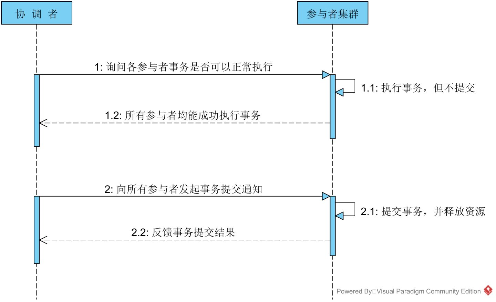
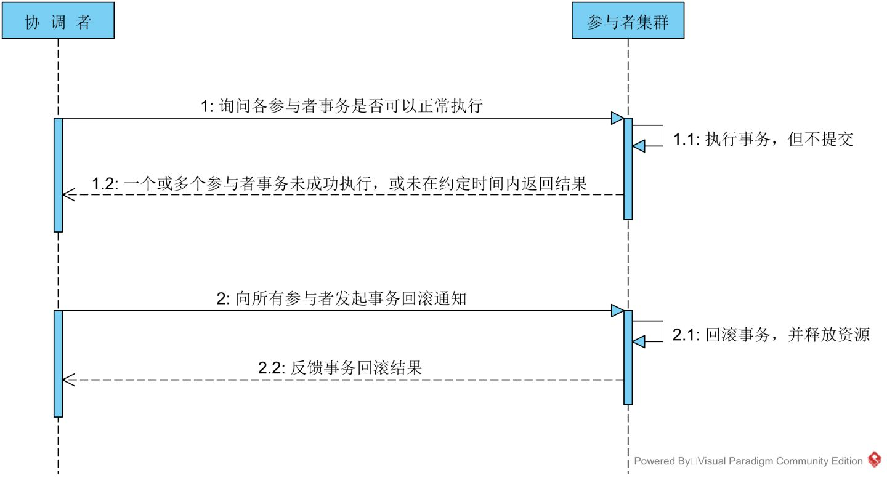
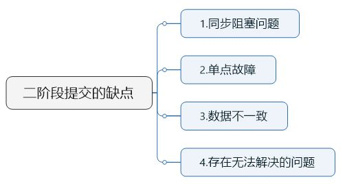
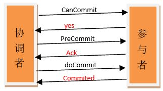
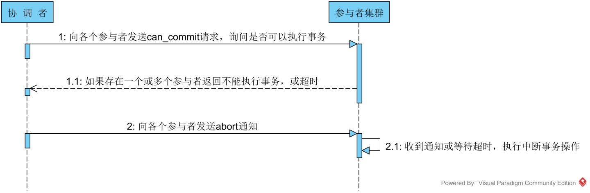
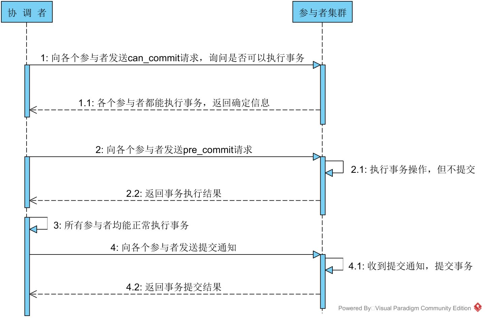
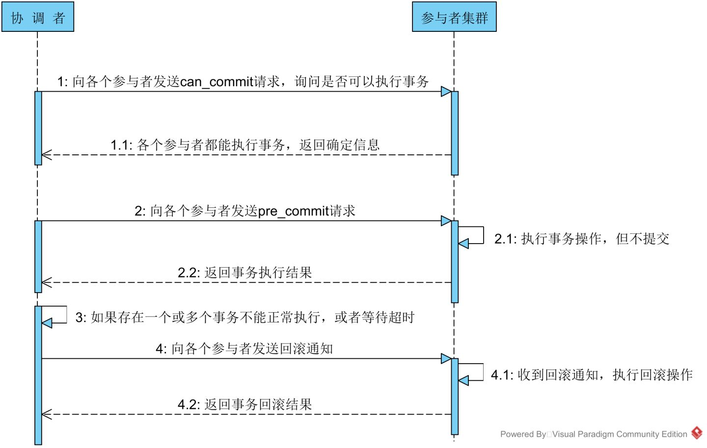

# 分布式事务之-两阶段/三阶段提交

参考原文：https://zhuanlan.zhihu.com/p/35616810

## 1、分布式事务

> ***事务与分布式的概念就类似于锁与分布式锁的概念，由于==事务本身是基于单机数据库的==，无法保证多机数据库间的事务一致性，因此出现分布式事务。这种场景==与分布式锁的出现如出一辙==。分布式事务的一致性通过引入一个==协调者==来保证。***

------

## 2PC-二阶段提交协议

> - **第一阶段：**事务**协调者**给每个**参与者**发送**Prepare消息**，每个参与者**要么直接返回失败**(如权限验证失败)，**要么在本地执行事务，写本地的redo和undo日志，但不提交**，到达一种“万事俱备，只欠东风”的状态。
> - **第二阶段：**如果协调者收到了参与者的失败消息或者超时，直接给每个参与者发送回滚(Rollback)消息；否则，发送提交(Commit)消息；参与者根据协调者的指令执行提交或者回滚操作，释放所有事务处理过程中使用的锁资源。(注意:必须在最后阶段释放锁资源)

------

### **情况-1**

当协调者节点从所有参与者节点获得的响应消息都为”同意”时，提交过程如下图所示：

------

### **情况-2** 

如果任一参与者节点在第一阶段返回的响应消息为”中止”，或者 协调者节点在第一阶段的询问超时之前无法获取所有参与者节点的响应消息时：

------

### 二阶段提交的缺陷

------

> 1、**同步阻塞问题**。
> ***执行过程中，所有参与节点都是事务阻塞型的。当参与者占有公共资源时，其他第三方节点访问公共资源不得不处于阻塞状态。也就是说从投票阶段到提交阶段完成这段时间，资源是被锁住的。***
>
> 2、**单点故障**。由于协调者的重要性，**一旦协调者发生故障。参与者会一直阻塞下去。**
> 尤其在第二阶段，协调者发生故障，那么所有的参与者还都处于**锁定事务资源的状态中**，而无法继续完成事务操作。
> 【协调者发出Commmit消息**之前**宕机的情况】
> （如果是协调者挂掉，可以重新选举一个协调者，但是**无法解决因为协调者宕机导致的参与者处于阻塞状态的问题**）
>
> 3、**数据不一致**。在二阶段提交的**阶段二中**，**当协调者向参与者发送commit请求之后，发生了局部网络异常或者在发送commit请求过程中协调者发生了故障，这回导致只有一部分参与者接受到了commit请求。**而在这部分参与者接到commit请求之后就会执行commit操作。但是其他部分未接到commit请求的机器则无法执行事务提交。于是整个分布式系统便出现了数据不一致性的现象。
>
> 4、二阶段无法解决的问题：------ **极限情况下,对某一事务的不确定性！**
> 【协调者发出Commmit消息**之后**宕机的情况】
> **协调者再发出commit消息之后宕机，而唯一接收到这条消息的参与者同时也宕机了。那么即使协调者通过选举协议产生了新的协调者，这条事务的状态也是不确定的，没人知道事务是否被已经提交。**

------

## **3PC-三阶段提交**

------

与两阶段提交不同的是，三阶段提交有两个改动点。

> 1、引入**超时机制**。同时在协调者和参与者中都引入超时机制。
> 2、在第一阶段和第二阶段中插入一个**准备阶段，**保证了在最后提交阶段之前各参与节点状态的一致。

也就是说，除了引入超时机制之外，3PC把**2PC的投票阶段再次一分为二**，这样三阶段提交就有`CanCommit`、`PreCommit`、`DoCommit`三个阶段。

> ### **为什么要把投票阶段一分为二？**
>
> **假设有1个协调者，9个参与者。其中有一个参与者不具备执行该事务的能力。**
> 协调者发出prepare消息之后，其余参与者都将资源锁住，执行事务，写入undo和redo日志。
> 协调者收到相应之后，发现有一个参与者不能参与。所以，又出一个roolback消息。其余8个参与者，又对消息进行回滚。这样子，是不是做了很多无用功？
> 所以**，**引入can-Commit阶段，***主要是为了在预执行之前，保证所有参与者都具备可执行条件，从而减少资源浪费。***

------

### 情况0-有参与者不具备执行条件

### **情况1-执行提交**

------

### **情况2-中断事务**

------

## 总结

3PC解决数据一致性问题：

> **简单概括一下就是，如果挂掉的那台机器已经执行了commit，那么协调者可以从所有未挂掉的参与者的状态中分析出来(==是否执行了pre_commit==)，并执行commit。如果挂掉的那个参与者执行了rollback，那么协调者和其他的参与者执行的肯定也是rollback操作。**

相对于2PC，**3PC主要解决的单点故障问题，并减少阻塞，*****因为一旦参与者无法及时收到来自协调者的信息之后，他会默认执行commit。而不会一直持有事务资源并处于阻塞状态。***

> 【在doCommit阶段，如果参与者无法及时接收到来自协调者的doCommit或者rebort请求时，**会在等待超时之后，会继续进行事务的提交。**
> 其实这个应该是基于概率来决定的，当进入第三阶段时，说明参与者在第二阶段已经收到了PreCommit请求，那么Coordinator产生PreCommit请求的前提条件是他在第二阶段开始之前，收到所有参与者的CanCommit响应都是Yes。一旦参与者收到了PreCommit，意味他知道大家其实都同意修改了。
> 所以，一句话概括就是，**当进入第三阶段时，由于网络超时等原因，虽然参与者没有收到commit或者abort响应，但是他有理由相信：成功提交的几率很大。**】

但是这种机制也会导致数据一致性问题，因为，由于网络原因，协调者发送的abort响应没有及时被参与者接收到，那么参与者在等待超时之后执行了commit操作。这样就和其他接到abort命令并执行回滚的参与者之间存在数据不一致的情况。

