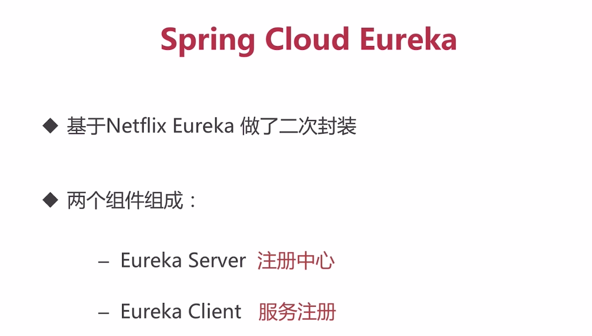
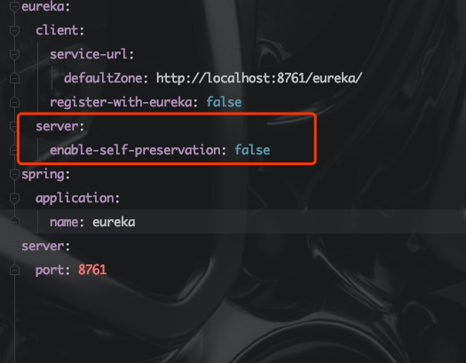
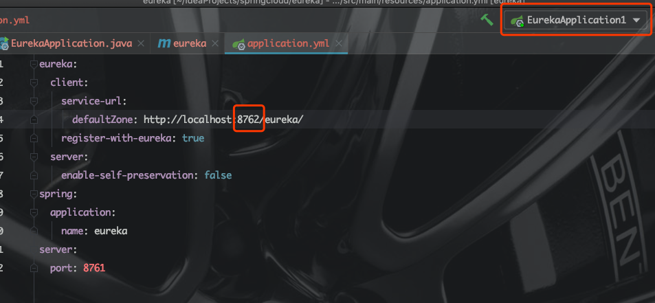
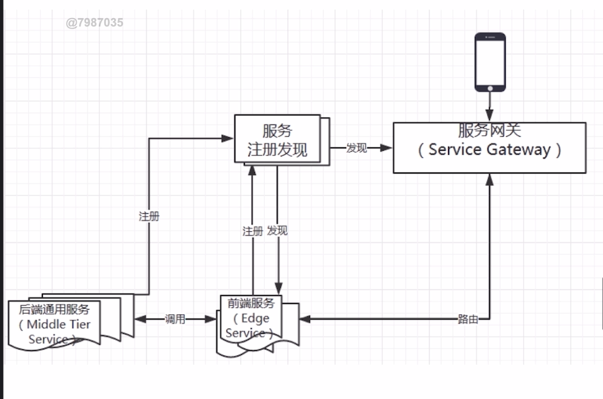
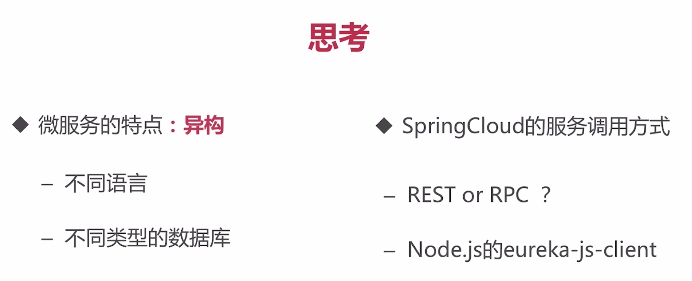

# Eureka

具体demo可见“分布式与微服务/springcloud”笔记。

server启动类加`@EnableEurekaServer`，client启动类加`@EnableDiscoveryClient`

## 后台启动eureka server：

>   1. 先将服务端代码打包为jar
>
>   2. 后台执行jar包：
>
>      `nohup java -jar target/eureka-0.0.1-SNAPSHOT.jar > /dev/null 2>&1 &`
>
> 		3. 执行情况及查看：
>
>      `ps -ef |grep eureka` ：通过关键字‘eureka’ 查找进程
>
>      
>
>      红框为进程号，可使用`kill -9 进程号` 来停止该进程

## 取消页面警告

红色警告意为有服务==上线率很低==，就是注册的服务一会儿上线一会儿下线，eureka默认把这种服务当作一直上线（==即段时间内不会将它从注册的列表中清除==），在生产环境中适合，故发出警告提醒。而在==开发环境==中我们可以关掉这个默认当作上线的功能，使服务按实际情况出现在注册列表中。

需要在eureka服务端配置如下：

## 高可用eureka

实现多台eureka服务器互通，可以同时为client提供服务。

> 1. 创建两个eureka，用端口区分，8761、8762
>
>    
>
> 2. 选择一个，启动前将yml中的注册url改成另一个的端口（==相互注册==），这样把两个eureka都启动，如：
>
>    
>
> 3. client的注册url可将两个eureka都写上：
>
>    `defaultZone: http://localhost:8761/eureka/,http://localhost:8762/eureka/`
>
> 4. 结果就是两台eureka上都会注册client，实现高可用
>
>    

更多eureka也需要相互注册，如三个eureka：

# 分布式系统中的服务发现

> 方式1: 客户端发现
>
> ​		b服务都注册到注册中心，a通过自己的机制（轮询、负载均衡等）直接从注册中心挑选一个b作为自己的服务提供者。如eureka。
>
> 方式2: 服务端发现
>
> ​		引入代理服务器，a直接向代理请求服务b，代理服务器通过一定的机制挑选出一个b返回给a。
>
> ​		如nginx，zookeeper，kubernetes。

服务架构图：

