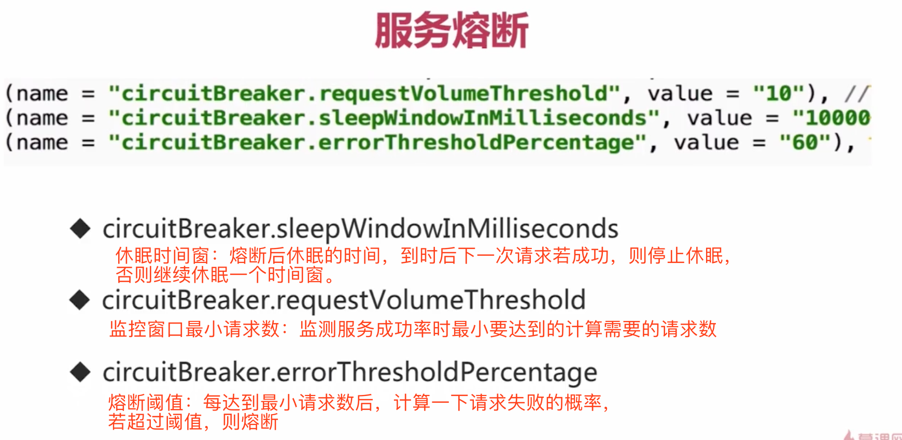

# Hystrix

***<font color='gree' size=5>实现“高可用”，防止服务雪崩</font>***

------


## 1、什么是Hystrix?

SOA/微服务架构中提供**<font color='purple' size=5>*服务(资源)隔离(每个服务有指定量的资源，不会因为对该服务的请求量大就无限分配资源）、熔断、降级机制的工具/框架*</font>**。**Netflix Hystrix是断路器的一种实现**，用于高微服务架构的可用性，是防止服务出现==雪崩==的利器。


## 2、为什么需要==断路器==？

在分布式架构中，**<font color='red'>一个应用依赖多个服务</font>**是非常常见的，如果其中一个依赖由于延迟过高发生阻塞，调用该依赖服务的线程就会阻塞，如果相关业务的==QPS较高，就可能产生大量阻塞，从而导致该应用/服务由于服务器资源被耗尽而拖垮==。另外，**<font color='red'>故障也会在应用之间传递，如果故障服务的上游依赖较多，可能会引起服务的==雪崩效应==</font>**。就跟数据瘫痪，会引起依赖该数据库的应用瘫痪是一样的道理。


## 3、Hystrix特点


> - 在通过网络依赖服务出现高延迟或者失败时，为系统提供保护和控制
> - 可以进行==快速失败==，缩短延迟等待时间和快速恢复：当异常的依赖回复正常后，失败的请求所占用的线程会被快速清理，不需要额外等待(<font color='red'>超时设置</font>)
> - <font color='red'>**提供==失败回退（Fallback）==和相对优雅的服务降级机制</font>**
> - **<font color='red'>*提供有效的服务容错监控、报警和运维控制手段（dashboard可视化监控）*</font>**

------


## 4、与springcloud整合注意

主要分为：

> 1. RestTemplate整合hystrix：==`@HystrixCommand(fallbackMethod = "fallback")`==，指定降级函数名。需要另定义一个fallback函数。
>
> 2. Feign整合hystrix：
>
>    ```java
>    @FeignClient(name = "product", fallback = ProductClient.ProductClientFallback.class)
>    public interface ProductClient {
>    
>        @PostMapping("/product/listForOrder")
>        List<ProductInfo> listForOrder(@RequestBody List<String> productIdList);
>    
>        @PostMapping("/product/decreaseStock")
>        void decreaseStock(@RequestBody List<CartDTO> cartDTOList);
>    
>        @Component // 勿忘
>        static class ProductClientFallback implements ProductClient{
>    
>            @Override
>            public List<ProductInfo> listForOrder(List<String> productIdList) {
>                return null;
>            }
>    
>            @Override
>            public void decreaseStock(List<CartDTO> cartDTOList) {
>    
>            }
>        }
>    
>    }
>    ```


主要功能：（场景：B服务中调用了A服务）

> 1. **==服务降级==**：B调用A服务失败后的处理逻辑：<font color='red'>**fallback**</font>
>
> 2. **==服务熔断==**：<font color='red'>通过监控B调用A服务的成功/失败比例，超过阈值后，执行熔断（打开断路器），此后请求B服务接回直接进入fallback(失败)，继续监控成功/失败比例，直到恢复，则关闭断路器，服务B恢复。继续监控。以下时配置熔断相关的三个重要参数：</font>
>
>    
>
> 3. 依赖隔离：对某个被监控的服务自动实现了进程隔离，使不同的服务互不影响。