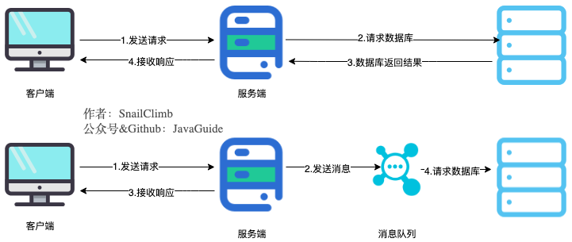
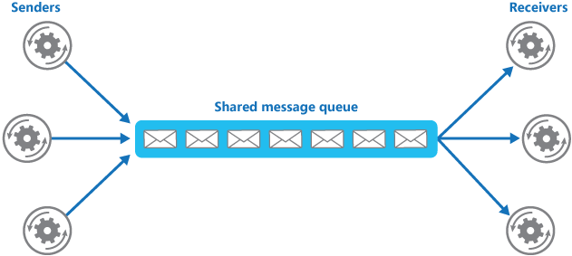

# 消息队列

## 1、作用

> - ***解耦：数据生产者不比担心数据消费者的各种改变，只需将数据放入mq中，让消费者自己决定订阅。***
> - ***异步：服务A需调用其他几个服务(延迟较高)，为了能减少延迟，服务A只需将调用消息放入mq，那几个服务订阅后执行即可，服务A就可以较早返回，实现好的用户体验。***
> - ***削峰：在客户端和数据库中间垫了一层缓存，避免数据库被打死。***

------

### 1) 通过==异步处理==提高系统性能（削峰、减少响应所需时间）

------

上图，**在不使用消息队列服务器的时候，用户的请求数据直接写入数据库，在高并发的情况下数据库压力剧增，使得响应速度变慢。但是在使用消息队列之后，用户的请求数据发送给消息队列之后立即 返回，再由消息队列的消费者进程从消息队列中获取数据，异步写入数据库。由于消息队列服务器处理速度快于数据库（消息队列也比数据库有更好的伸缩性），因此响应速度得到大幅改善。**

　　通过以上分析我们可以得出**消息队列具有很好的削峰作用的功能**——即**通过异步处理，将短时间高并发产生的事务消息存储在消息队列中，从而削平高峰期的并发事务。** 举例：在电子商务一些秒杀、促销活动中，合理使用消息队列可以有效抵御促销活动刚开始大量订单涌入对系统的冲击。如下图所示：

​	因为**用户请求数据写入消息队列之后就立即返回给用户了，但是请求数据在后续的业务校验、写数据库等操作中可能失败**。因此使用消息队列进行异步处理之后，需要**适当修改业务流程进行配合**，比如**用户在提交订单之后，订单数据写入消息队列，不能立即返回用户订单提交成功，需要在消息队列的订单消费者进程真正处理完该订单之后，甚至出库后，再==通过电子邮件或短信通知用户订单成功==**，以免交易纠纷。这就类似我们平时手机订火车票和电影票。

------

### 2）降低系统==耦合性==。

------

​	使用消息队列还可以降低系统耦合性。我们知道如果模块之间不存在直接调用，那么新增模块或者修改模块就对其他模块影响较小，这样系统的可扩展性无疑更好一些。还是直接上图吧：

**消息队列使利用==发布-订阅==模式工作，消息发送者（生产者）发布消息，一个或多个消息接受者（消费者）订阅消息。** 从上图可以看到**消息发送者（生产者）和消息接受者（消费者）之间==没有直接耦合==**，消息发送者将消息发送至分布式消息队列即结束对消息的处理，消息接受者从分布式消息队列获取该消息后进行后续处理，并不需要知道该消息从何而来。***对新增业务，只要对该类消息感兴趣，即可订阅该消息，对原有系统和业务没有任何影响，从而实现网站业务的可扩展性设计***。

------

## 2、缺陷与问题

- ==**系统可用性(容错性)降低：**== 系统可用性在某种程度上降低，为什么这样说呢？在加入MQ之前，你不用考虑消息丢失或者说MQ挂掉等等的情况，但是，引入MQ之后你就需要去考虑了！
- ==**系统复杂性提高：**== 加入MQ之后，你需要保证消息没有被重复消费、处理消息丢失的情况、保证消息传递的顺序性等等问题！
- ==**一致性问题：**== 我上面讲了消息队列可以实现异步，消息队列带来的异步确实可以提高系统响应速度。但是，万一消息的真正消费者并没有正确消费消息怎么办？这样就会导致数据不一致的情况了!

## 3、几种消息队列对比

### 1、各项指标对比表

| 特性                         |           ActiveMQ           |                           RabbitMQ                           |                           RocketMQ                           | Kafka                                                        |
| ---------------------------- | :--------------------------: | :----------------------------------------------------------: | :----------------------------------------------------------: | ------------------------------------------------------------ |
| 单机==吞吐量==               |           **万级**           |                           **万级**                           |                   **10 万级，支撑高吞吐**                    | **10 万级别，这是 kafka 最大的优点，就是吞吐量高。**一般配合大数据类的系统来进行实时数据计算、日志采集等场景 |
| **topic** 数量对吞吐量的影响 |                              |                                                              | topic 可以达到几百，几千个的级别，吞吐量会有较小幅度的下降这是 **RocketMQ 的一大优势，在同等机器下，可以支撑大量的 topic** | topic 从几十个到几百个的时候，吞吐量会大==幅度下降==。所以在同等机器下，**kafka 尽量保证 topic 数量不要过多**。 |
| 可用性                       | 高，基于主从架构实现高可用性 |                 高，基于主从架构实现高可用性                 |       非常高，**分布式架构**        | 非常高，kafka 是**分布式的**，一个数据多个副本 |
| 消息可靠性                   | **==有较低的概率丢失数据==** |                                                              |              经过参数优化配置，可以做到 0 丢失               | 经过参数优化配置，消息可以做到 0 丢失                        |
| 时效性                       |            ms 级             | **微秒级，这是 rabbitmq 的一大特点，延迟是最低的** |                            ms 级                             | 延迟在 ms 级以内                                             |
| 功能支持                     |  MQ 领域的**功能极其完备**   | 基于 erlang 开发，所以并发能力很强，性能极其好，**延时很低** |           MQ 功能较为完善，还是分布式的，扩展性好            | **==功能较为简单==**，主要支持简单的 MQ 功能，在大数据领域的实时计算以及日志采集被大规模使用，是事实上的标准 |
|                              |                              |                                                              |                                                              |                                                              |

### 2、总述对比

> 1. **ActiveMQ**：非常成熟，功能强大，在业内大量的公司以及项目中都有应用。偶尔会有较低概率丢失消息，而且现在社区以及国内应用都越来越少，官方社区现在对 ActiveMQ 5.x 维护越来越少，几个月才发布一个版本而且确实主要是基于解耦和异步来用的，较少在大规模吞吐的场景中使用
> 2. **RabbitMQ**：erlang 语言开发，性能极其好，延时很低；吞吐量到万级，MQ 功能比较完备而且开源提供的管理界面非常棒，用起来很好用。社区相对比较活跃，几乎每个月都发布几个版本分在国内一些互联网公司近几年用 rabbitmq 也比较多一些但是问题也是显而易见的，RabbitMQ 确实==吞吐量会低一些==，这是因为他做的实现机制比较重。而且 erlang 开发，国内有几个公司有实力做 erlang 源码级别的研究和定制？如果说你没这个实力的话，确实偶尔会有一些问题，你很难去看懂源码，你公司对这个东西的掌控很弱，基本职能依赖于开源社区的快速维护和修复 bug。而且 rabbitmq 集群动态扩展会很麻烦，不过这个我觉得还好。其实主要是 erlang 语言本身带来的问题。很难读源码，很难定制和掌控。
> 3. **RocketMQ**：接口简单易用，而且毕竟在阿里大规模应用过，有阿里品牌保障。日处理消息上百亿之多，可以做到大规模吞吐，性能也非常好，分布式扩展也很方便，社区维护还可以，可靠性和可用性都是 ok 的，还可以支撑大规模的 topic 数量，支持复杂 MQ 业务场景。而且一个很大的优势在于，阿里出品都是 java 系的，我们可以自己阅读源码，定制自己公司的 MQ，可以掌控。社区活跃度相对较为一般，不过也还可以，文档相对来说简单一些，然后接口这块不是按照标准 JMS 规范走的有些系统要迁移需要修改大量代码。还有就是阿里出台的技术，你得做好这个技术万一被抛弃，社区黄掉的风险，那如果你们公司有技术实力我觉得用 RocketMQ 挺好的
> 4. **Kafka**：kafka 的特点其实很明显，就是仅仅提供较少的核心功能，但是提供超高的吞吐量，ms 级的延迟，极高的可用性以及可靠性，==而且分布式可以任意扩展==。同时 kafka 最好是支撑较少的 topic 数量即可，保证其超高吞吐量。而且 kafka 唯一的一点劣势是有可能消息重复消费，那么对数据准确性会造成极其轻微的影响，在大数据领域中以及日志采集中，这点轻微影响可以忽略这个特性天然适合大数据实时计算以及日志收集。