# 统一配置中心


## 1、概述

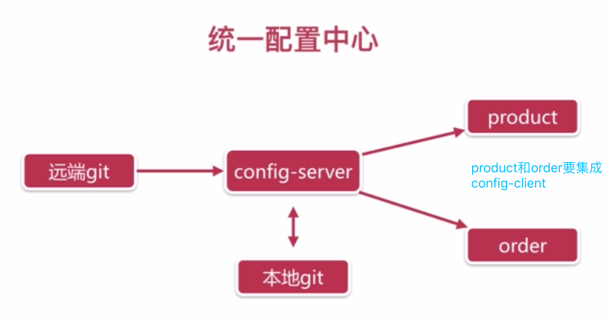


------


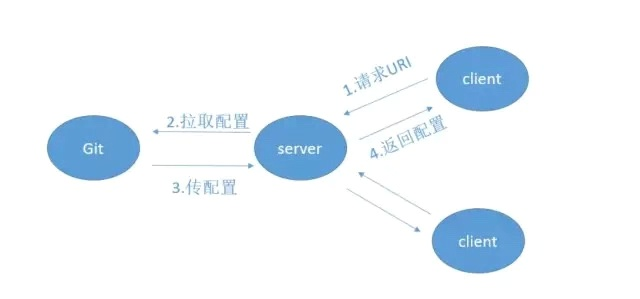

------


## 2、搭建config-server


> 1. 新建config工程
>
>    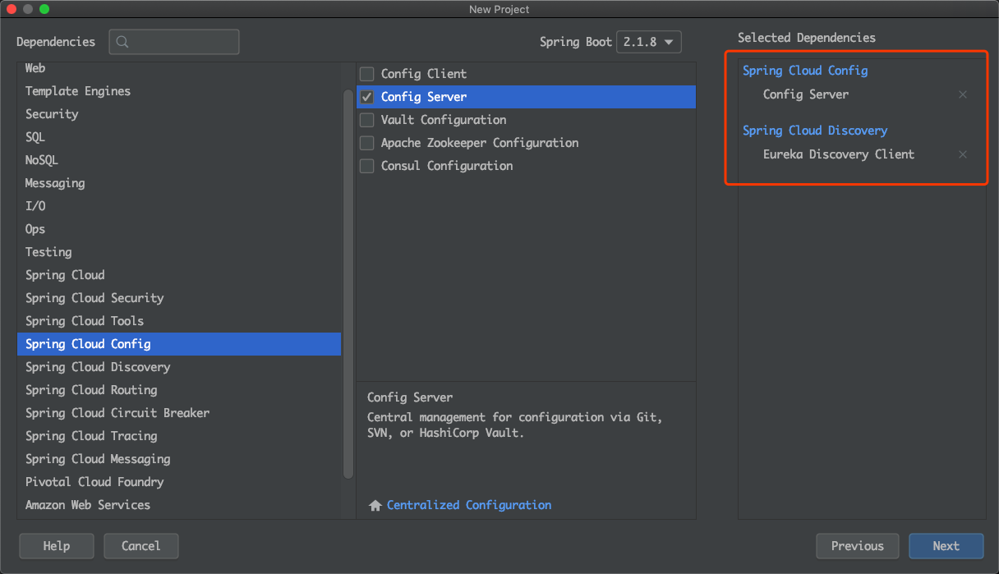
>
>    ==并将其注册到eureka上==
>
> 2. 启动类注解
>
>    ```java
>    @SpringBootApplication
>    @EnableDiscoveryClient
>    @EnableConfigServer
>    ```
>
> 3. yml
>
>    ```yml
>    spring:
>      application:
>        name: config
>      cloud:
>        config:
>          server:
>            git:
>              uri: https://github.com/JachinDu/springcloud-config.git
>              username: jiachengdd@icloud.com
>              password: jiacheng0801
>              basedir: /Users/jc/IdeaProjects/springcloud/Sell/config/basedir
>    
>    eureka:
>      client:
>        service-url:
>          defaultZone: http://localhost:8761/eureka
>    
>    
>    ```
>
>    <font color='red'>uri: git仓库地址；username/password：github账户名和密码；basedir：将远程git拉取到本地的指定路径</font>
>
> 4. github上创建相应仓库及配置文件
>
>    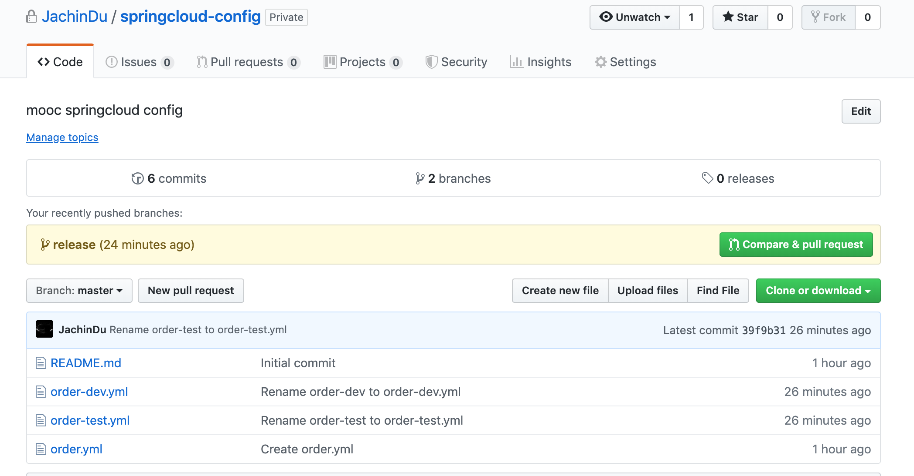
>
> 5. 浏览器端访问url格式
>
>    例如：http://localhost:8080/release/order-dev.yml
>
>    <font color='red'>release: 仓库分支名称；order：对应应用的名称；-dev是环境，后面会详述</font>
>
> 6. 结果（==在release分支下的order-dev.yml与master中的相比，多了label: release==）
>
>    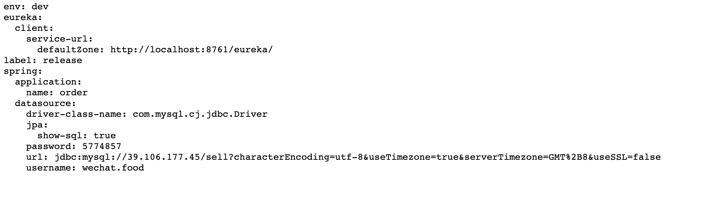
>
> 7. 本地查看拉取结果
>
>    在指定目录(basedir)使用命令：`git log`
>
>    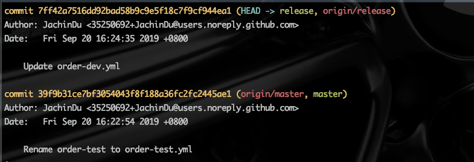
>
>    

<font color='red' size=5>config-server应用可以高可用，多起几个，不同端口即可</font>


## 3、使用统一配置来配置order应用

<font color='red' size=5>核心要义：应用拿着自己需要的配置文件的名称与环境标识，去找config-server应用(统一配置中心)从github上拉取对应的配置文件到本地</font>


> 1. 在order工程中引入依赖
>
> ```xml
> <!--        引入config-client依赖以使用统一配置-->
>         <dependency>
>             <groupId>org.springframework.cloud</groupId>
>             <artifactId>spring-cloud-config-client</artifactId>
>             <version>2.1.4.RELEASE</version>
>         </dependency>
> 				<!-- https://mvnrepository.com/artifact/org.springframework.cloud/spring-cloud-starter-bus-amqp -->
>         <dependency>
>             <groupId>org.springframework.cloud</groupId>
>             <artifactId>spring-cloud-starter-bus-amqp</artifactId>
>             <!--            <version>2.1.1.RELEASE</version>-->
>         </dependency>
> ```
>
> 2. yml
>
> ```yml
> spring:
>   application:
>     name: order
>   cloud:
>     config:
>       discovery:
>         enabled: true
>         service-id: CONFIG
>       profile: test
> eureka:
>   client:
>     service-url:
>       defaultZone: http://localhost:8761/eureka
> ```
>
> <font color='red'>只留下应用名order和config相关配置，service-id：eureka上注册的配置中心应用名；还有eureka的地址，以防eureka改地址后，连接不到eureka，就更不要提获取CONFIG等了</font>
>
> 
>
> ==这里的name+profile就拼接为url中的order-dev==
>
> 将yml名称修改：
>
> 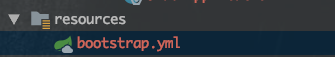
>
> <font color='red'>作用是启动引导，先执行yml，拉取远程配置后，再启动springboot，不然肯定要报错数据库连接失败什么的导致启动失败</font>
>
> 3. 启动
>
> 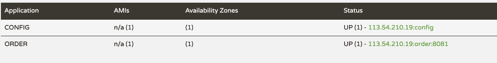
>
> 可以看到，ORDER应用注册上来了


<font color='red' size=5>至此，还没做到自动更新配置，及github更新配置后，config-client对应应用要重启才可获取最新配置</font>


## 4、消息通知实现自动更新

即每次远程配置更新后，配置中心通过消息通知对应应用

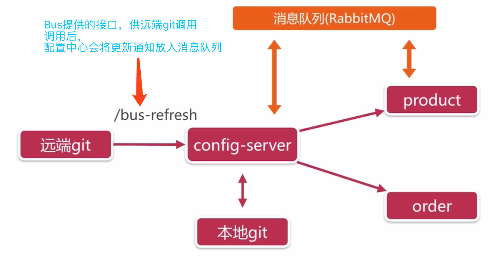


以order应用为例：

>1. 配置中心引入依赖
>
>```xml
><!-- https://mvnrepository.com/artifact/org.springframework.cloud/spring-cloud-starter-bus-amqp -->
><dependency>
> <groupId>org.springframework.cloud</groupId>
> <artifactId>spring-cloud-starter-bus-amqp</artifactId>
></dependency>
>```
>
>2. 配置中心yml
>
>```yml
>spring:
>application:
> name: config
>cloud:
> config:
>   server:
>     git:
>       uri: https://github.com/JachinDu/springcloud-config.git
>       username: jiachengdd@icloud.com
>       password: jiacheng0801
>       basedir: /Users/jc/IdeaProjects/springcloud/Sell/config/basedir
>rabbitmq:
> host: 39.106.177.45
> port: 5672
> username: guest
> password: guest
>eureka:
>client:
> service-url:
>   defaultZone: http://localhost:8761/eureka
>management:
>endpoints:
> web:
>   exposure:
>     include: "*"
>```
>
>其中，rabbitmq因为我是部署在远端服务器的docker上，故需要配置
>
>此外，`management.endpoints.web.exposure.include:"*"`是暴露所有端口，目的是暴露出`/actuator/bus-refresh`。
>
>3. order应用引入依赖(同配置中心)，且yml加上rabbitmq相应配置，原因同上。
>
>4. 对应controller加`@RefreshScope`实现自动刷新
>
>```java
>package com.jachincloud.order.controller;
>
>import org.springframework.beans.factory.annotation.Value;
>import org.springframework.cloud.context.config.annotation.RefreshScope;
>import org.springframework.web.bind.annotation.GetMapping;
>import org.springframework.web.bind.annotation.RequestMapping;
>import org.springframework.web.bind.annotation.RestController;
>
>/**
>  * @description:
>  * @Author: JachinDo
>  * @Date: 2019/09/20 17:09
>*/
>@RequestMapping("/env")
>@RestController
>@RefreshScope
>public class EnvController {
>
> @Value("${env}")
> private String env;
>
> @GetMapping("/print")
> public String print() {
>     return env;
> }
>}
>```
>
>5. 启动上述两个应用
>
>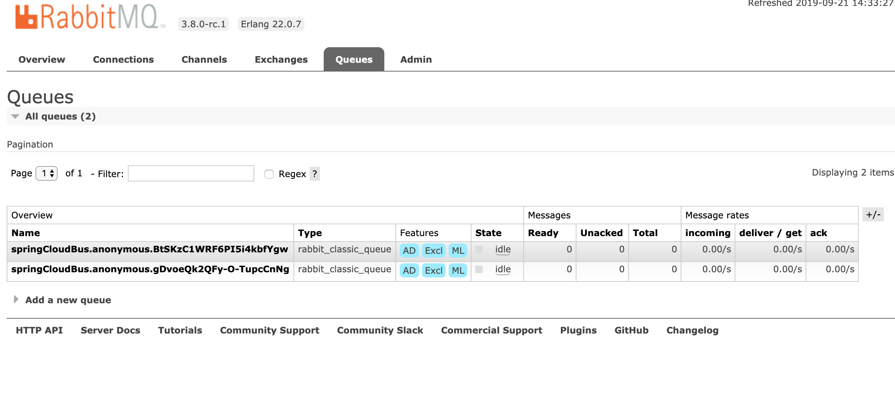
>
>可见rabbitmq中多出两个队列，分别对应上述两个应用。
>
>6. 此时，更改github上对应配置文件后，只需访问`/actuator/bus-refresh`接口后，即可实现自动更新。
>
>命令行访问：
>
>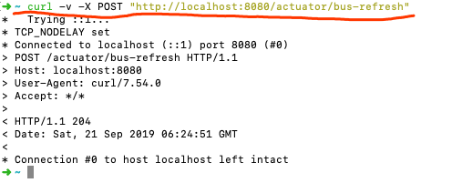
>
>7. 在github上配置webhooks自动访问`/actuator/bus-refresh`
>
>  注意红色部分！！
> 
>  ==这里域名必须为公网==
>
>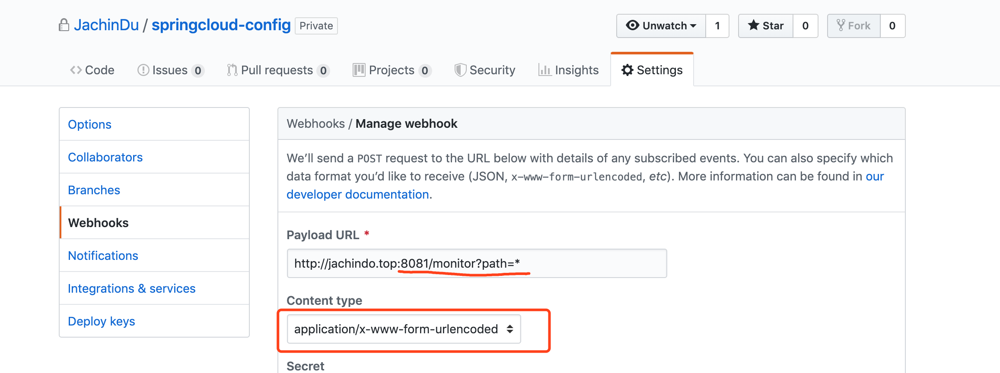
>
><font color='red' size=5>至此，实现了github更新配置文件，应用自动拉取并更新，无需重启应用</font>
>
>==注意：url中的端口为配置中心运行端口==

