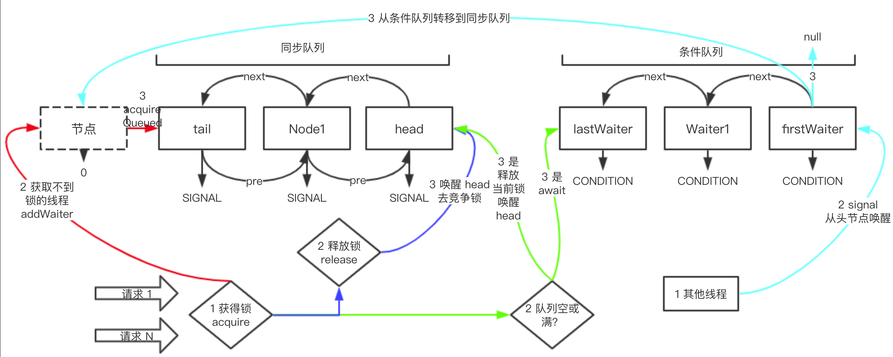
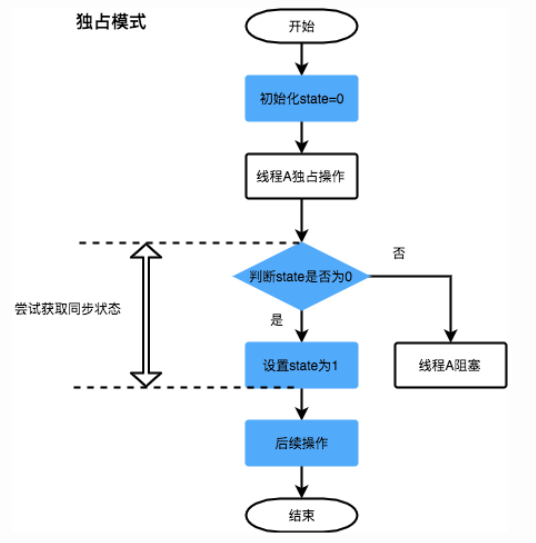
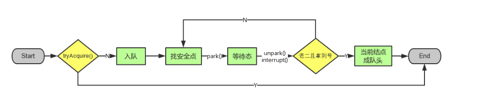
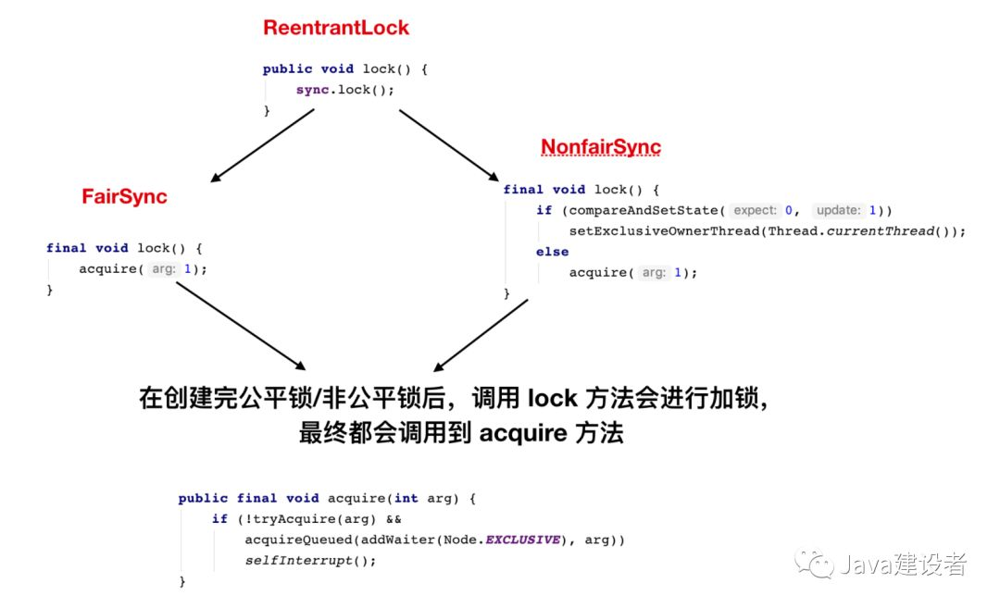

# AQS原理与源码剖析（结合ReentrantLock源码）

介绍：AQS是一种提供了==原子式管理同步状态、阻塞和唤醒线程==功能以及==队列模型==的简单框架





------


## 2. AQS数据结构

### &sect; 队列概述

***<font color='gree'>AQS包含两种队列：同步队列和条件队列，实现都如下：</font>***


维护一个由==双向链表==实现的等待队列，链表元素被封装为一个==Node对象(其中包含线程信息)==，这些节点都尝试通过==CAS获取/修改state==。

节点的详细信息如下：

**<font color='red'>注意：head节点(队头)是一个虚节点(*`thread字段为null`*)，仅保留waitStatus属性供后继节点做相应的判断。它代表其中的线程正在工作。</font>**


------

### &sect; 同步队列属性

当多个线程都来请求锁时，某一时刻有且只有一个线程能够获得锁（排它锁），那么剩余获取不到锁的线程，都会到同步队列中去排队并阻塞自己，当有线程主动释放锁时，就会从同步队列头开始释放一个排队的线程，让线程重新去竞争锁。

所以同步队列的主要作用是<font color='red'>***阻塞获取不到锁的线程，并在适当时机释放这些线程。***</font>

同步队列底层数据结构是个双向链表，我们从源码中可以看到链表的头尾，如下：

```java
// 同步队列的头。
private transient volatile Node head;

// 同步队列的尾
private transient volatile Node tail;
```

------

### &sect; 条件队列属性

条件队列和同步队列的功能一样，管理获取不到锁的线程，底层数据结构也是链表队列，<mark>但条件队列不直接和锁打交道，但常常和锁配合使用</mark>，是一定的场景下，对锁功能的一种补充。

条件队列的属性如下：

```java
// 条件队列，从属性上可以看出是链表结构
public class ConditionObject implements Condition, java.io.Serializable {
    private static final long serialVersionUID = 1173984872572414699L;
    // 条件队列中第一个 node
    private transient Node firstWaiter;
    // 条件队列中最后一个 node
    private transient Node lastWaiter;
}  
```

> ConditionObject 我们就称为条件队列，我们需要使用时，直接 new ConditionObject () 即可。

------

### &sect; Node

```java
static final class Node {
    /**
     * 同步队列单独的属性
     */
    static final Node SHARED = new Node(); // node 是共享模式
    static final Node EXCLUSIVE = null; // node 是排它模式
    // 当前节点的前节点
    // 节点 acquire 成功后就会变成head
    // head 节点不能被 cancelled
    volatile Node prev;

    // 当前节点的下一个节点
    volatile Node next;
    /**
     * 两个队列共享的属性
     */
    // 表示当前节点的状态，通过节点的状态来控制节点的行为
    // 普通同步节点，就是 0 ，条件节点是 CONDITION -2
    volatile int waitStatus;

    // waitStatus 的状态有以下几种
    // 被取消
    static final int CANCELLED =  1;

    // SIGNAL 状态的意义：同步队列中的节点在自旋获取锁的时候，如果前一个节点的状态是 SIGNAL，那么自己就可以阻塞休息了，否则自己一直自旋尝试获得锁
    static final int SIGNAL    = -1;

    // 表示当前 node 正在条件队列中，当有节点从同步队列转移到条件队列时，状态就会被更改成 CONDITION
    static final int CONDITION = -2;

    // 无条件传播,共享模式下，该状态的进程处于可运行状态
    static final int PROPAGATE = -3;

    // 当前节点的线程
    volatile Thread thread;

    // 在同步队列中，nextWaiter 并不真的是指向其下一个节点，我们用 next 表示同步队列的下一个节点，nextWaiter 只是表示当前 Node 是排它模式还是共享模式
    // 但在条件队列中，nextWaiter 就是表示下一个节点元素
    Node nextWaiter;
}
```

> - 从 Node 的结构中，<font color='red' size=4>***我们需要重点关注 waitStatus 字段***</font>，Node 的很多操作都是围绕着 waitStatus 字段进行的。
>
> - Node 的 pre、next 属性是同步队列中的链表前后指向字段，==**nextWaiter 是条件队列中下一个节点的指向字段，但在同步队列中，nextWaiter 只是一个标识符，表示当前节点是共享还是排它模式。**==

------


## 3. AQS维护核心变量--state和waitStatus

> 1. <font color='red'>**state 是锁的状态**</font>，是 int 类型，子类继承 AQS 时，都是要根据 state 字段来判断有无得到锁，比如当前同步器状态是 0，表示可以获得锁，当前同步器状态是 1，表示锁已经被其他线程持有，当前线程无法获得锁；
> 2. <font color='red'>**waitStatus 是节点（Node，可以理解为线程）的状态**</font>，种类很多，一共有初始化 (0)、CANCELLED (1)、SIGNAL (-1)、CONDITION (-2)、PROPAGATE (-3)，各个状态的含义可以见上文。

------

我们可以通过修改state字段实现多线程的==独占/共享==加锁模式：



------


------


## 4. AQS核心代码


> 1. 首先调用可以由子类重写的<font color='red'>`tryAcquire`方法获取资源（修改state）。</font>
> 2. 成功则无事，<font color='red'>失败则入队`addWaiter(Node.EXCLUSIVE)`。</font>
> 3. <font color='red'>`acquireQueued`方法对入队节点进行相应操作使其获取资源/停止获取，中断。</font>


一般来说，自定义同步器要么是==独占方式，要么是共享方式==，它们也只需实现<font color='red'>`tryAcquire-tryRelease、tryAcquireShared-tryReleaseShared`</font>中的一种即可。AQS也支持自定义同步器同时实现独占和共享两种方式，如ReentrantReadWriteLock。ReentrantLock是独占锁，所以实现了`tryAcquire-tryRelease`。

------


### 1）`acquire()`以下整个过程以排他锁为例

> <font color='red' size=5>***acquire指定了获取锁的框架***</font>分为排他锁和共享锁。

```java
// 排它模式下，尝试获得锁
public final void acquire(int arg) {
    // tryAcquire 方法是需要实现类去实现的，实现思路一般都是 cas 给 state 赋值来决定是否能获得锁
    if (!tryAcquire(arg) &&
        // addWaiter 入参代表是排他模式
        acquireQueued(addWaiter(Node.EXCLUSIVE), arg))
        selfInterrupt();
}
```


------


#### a) `tryAcquire()`

​	需要子类重写。

#### b）`addWaiter()`

```java
private Node addWaiter(Node mode) {
    Node node = new Node(Thread.currentThread(), mode);
    Node pred = tail;
    // 1. 先尝试将node插入尾部
    if (pred != null) {// a
        node.prev = pred;
        if (compareAndSetTail(pred, node)) {// b
            pred.next = node;
            return node;
        }
    }
  	// 2. 尝试插入失败，则调用enq()自旋插入
    enq(node);
    return node; // 返回新入队的节点，用于acquireQueued()对其进行处理
}
```

> 有两种情况会导致过程1插入失败：
>
> 1. <font color = 'red'>a处判断失败，`pred`是null，说明等待队列中没有元素。</font>
> 2. <font color = 'red'>b处判断失败，cas校验失败，即`pred`被其他线程更改过。</font>


#### c）`enq()`

==CAS自旋==

```java
private Node enq(final Node node) {
    for (;;) { // CAS自旋
        Node t = tail;
        if (t == null) { // 等待队列为空
            if (compareAndSetHead(new Node())) // 头节点初始化--虚节点
                tail = head;
        } else {
           // 同addWaiter中一样，只是这里是CAS自旋，直到入队成功
            node.prev = t;
            if (compareAndSetTail(t, node)) {
                t.next = node;
                return t;
            }
        }
    }
}
```


#### d）`acquireQueued()`

==一个Node被放入等待队列后会做些什么？==

> 1. 通过不断的<font color='red'>***自旋尝试使自己前一个节点的状态变成 signal，然后阻塞自己。***</font>
> 2. <font color='red'>***获得锁的线程执行完成之后，释放锁时，会把阻塞的 node 唤醒,node 唤醒之后再次自旋，尝试获得锁***</font>
> 3. <font color='red'>**注意：这里获取锁成功后会将其设置成head节点，而在共享锁的获取时，这里还会唤醒其他后续的阻塞节点**</font>

```java
// 返回 false 表示获得锁成功，返回 true 表示失败
final boolean acquireQueued(final Node node, int arg) {
    boolean failed = true;
    try {
        boolean interrupted = false;
        // 自旋
        for (;;) {
            // 选上一个节点
            final Node p = node.predecessor();
            // 有两种情况会走到 p == head：
            // 1:node 之前没有获得锁，进入 acquireQueued 方法时，才发现他的前置节点就是头节点，于是尝试获得一次锁；
            // 2:node 之前一直在阻塞沉睡，然后被唤醒，此时唤醒 node 的节点正是其前一个节点，也能走到 if
            // 如果自己 tryAcquire 成功，就立马把自己设置成 head，把上一个节点移除
            // 如果 tryAcquire 失败，尝试进入同步队列
            if (p == head && tryAcquire(arg)) {
                // 获得锁，设置成 head 节点
                setHead(node); 
                //p被回收
                p.next = null; // help GC
                failed = false;
                return interrupted;
            }

            // shouldParkAfterFailedAcquire 把 node 的前一个节点状态置为 SIGNAL
            // 只要前一个节点状态是 SIGNAL了，那么自己就可以阻塞(park)了
            // parkAndCheckInterrupt 阻塞当前线程
            if (shouldParkAfterFailedAcquire(p, node) &&
                // 线程是在这个方法里面阻塞的，醒来的时候仍然在无限 for 循环里面，就能再次自旋尝试获得锁
                parkAndCheckInterrupt())
                interrupted = true;
        }
    } finally {
        // 如果获得node的锁失败，将 node 从队列中移除
        if (failed)
            cancelAcquire(node);
    }
}
```


此方法的注释还是很清楚的，我们接着看下此方法的核心：`shouldParkAfterFailedAcquire`，<font color='red'>***这个方法的主要目的就是把前一个节点的状态置为 SIGNAL，只要前一个节点的状态是 SIGNAL，当前节点就可以阻塞了（parkAndCheckInterrupt 就是使节点阻塞的方法）***</font>，源码如下：

```java
// 当前线程可以安心阻塞的标准，就是前一个节点线程状态是 SIGNAL 了。
// 入参 pred 是前一个节点，node 是当前节点。

// 关键操作：
// 1：确认前一个节点是否有效，无效的话，一直往前找到状态不是取消的节点。
// 2: 把前一个节点状态置为 SIGNAL。
// 1、2 两步操作，有可能一次就成功，有可能需要外部循环多次才能成功（外面是个无限的 for 循环），但最后一定是可以成功的
private static boolean shouldParkAfterFailedAcquire(Node pred, Node node) {
    int ws = pred.waitStatus;
    // 如果前一个节点 waitStatus 状态已经是 SIGNAL 了，直接返回，不需要在自旋了
    if (ws == Node.SIGNAL)
        return true;
    // 如果当前节点状态已经被取消了。
    if (ws > 0) {
        // 找到前一个状态不是取消的节点，因为把当前 node 挂在有效节点身上
        // 因为节点状态是取消的话，是无效的，是不能作为 node 的前置节点的，所以必须找到 node 的有效节点才行
        do {
            node.prev = pred = pred.prev;
        } while (pred.waitStatus > 0);
        pred.next = node;
    // 否则直接把节点状态置 为SIGNAL
    } else {
        compareAndSetWaitStatus(pred, ws, Node.SIGNAL);
    }
    return false;
}
```

```java
// 进入等待状态，等待唤醒
private final boolean parkAndCheckInterrupt() {
        LockSupport.park(this);
        return Thread.interrupted(); // 判断自己是否被中断唤醒
    }
```


#### e）整个`acquire()`流程



> 1. 使用 tryAcquire 方法尝试获得锁，获得锁直接返回，获取不到锁的走 2；
> 2. 把当前线程组装成节点（Node），==追加到同步队列的尾部（addWaiter）==；
> 3. <font color='red'>***自旋，使同步队列中当前节点的前置节点状态为 signal 后，然后阻塞自己。***</font>

------


### 2）`release()`

也分为释放排他锁和共享锁

```java
public final boolean release(int arg) {
    // tryRelease 交给实现类去实现，一般就是用当前同步器状态减去 arg，如果返回 true 说明成功释放锁。
    if (tryRelease(arg)) {
        Node h = head;
        // 头节点不为空，并且非初始化状态
        if (h != null && h.waitStatus != 0)
            // 从头开始唤醒等待锁的节点
            unparkSuccessor(h);
        return true;
    }
    return false;
}
```

> <font color='red'>***排他锁只有释放锁时唤醒后续节点，共享锁在获取和释放时都会唤醒后续节点。***</font>

```java
// 共享模式下，释放当前线程的共享锁
public final boolean releaseShared(int arg) {
    if (tryReleaseShared(arg)) {
        // 这个方法就是线程在获得锁时，唤醒后续节点时调用的方法
        doReleaseShared();
        return true;
    }
    return false;
}
```


------


## 5、条件队列相关

==锁 + 队列结合的场景==

### &sect; 入队等待await方法

获得锁的线程，如果在碰到队列满或空的时候，就会阻塞住，这个阻塞就是用条件队列实现的，这个动作我们叫做入条件队列：

```java
// 线程入条件队列
public final void await() throws InterruptedException {
    if (Thread.interrupted())
        throw new InterruptedException();
    // 加入到条件队列的队尾
    Node node = addConditionWaiter();
    // 标记位置 A
    // 加入条件队列后，会释放 lock 时申请的资源，唤醒同步队列队列头的节点
    // 自己马上就要阻塞了，必须马上释放之前 lock 的资源，不然自己不被唤醒的话，别的线程永远得不到该共享资源了
    int savedState = fullyRelease(node);
    int interruptMode = 0;
    // 确认node不在同步队列上，再阻塞，如果 node 在同步队列上，是不能够上锁的
    // 目前想到的只有两种可能：
    // 1:node 刚被加入到条件队列中，立马就被其他线程 signal 转移到同步队列中去了
    // 2:线程之前在条件队列中沉睡，被唤醒后加入到同步队列中去
    while (!isOnSyncQueue(node)) {
        // this = AbstractQueuedSynchronizer$ConditionObject
        // 阻塞在条件队列上
        LockSupport.park(this);
        if ((interruptMode = checkInterruptWhileWaiting(node)) != 0)
            break;
    }
    // 标记位置 B
    // 其他线程通过 signal 已经把 node 从条件队列中转移到同步队列中的数据结构中去了
    // 所以这里节点苏醒了，直接尝试 acquireQueued
    if (acquireQueued(node, savedState) && interruptMode != THROW_IE)
        interruptMode = REINTERRUPT;
    if (node.nextWaiter != null) // clean up if cancelled
        // 如果状态不是CONDITION，就会自动删除
        unlinkCancelledWaiters();
    if (interruptMode != 0)
        reportInterruptAfterWait(interruptMode);
}
```

> 1. 上述代码标记位置 A 处，<font color='red'>***节点在准备进入条件队列之前，一定会先释放当前持有的锁***</font>，不然自己进去条件队列了，其余的线程都无法获得锁了；
> 2. 上述代码标记位置 B 处，<font color='red'>***此时节点是被 Condition.signal 或者 signalAll 方法唤醒的，此时节点已经成功的被转移到==同步队列==中去了（整体架构图中蓝色流程），所以可以直接执行 acquireQueued 方法；***</font>
> 3. Node 在条件队列中的命名，源码喜欢用 Waiter 来命名，所以我们在==条件队列中看到 Waiter，其实就是 Node。==

------

### &sect; 单个唤醒signal方法

signal 方法是唤醒的意思，比如之前队列满了，有了一些线程因为 take 操作而被阻塞进条件队列中，突然队列中的元素被线程 A 消费了，线程 A 就会调用 signal 方法，唤醒之前阻塞的线程，==会从条件队列的头节点开始唤醒==（流程见整体架构图中蓝色部分），源码如下：

```java
// 唤醒阻塞在条件队列中的节点
public final void signal() {
    if (!isHeldExclusively())
        throw new IllegalMonitorStateException();
    // 从头节点开始唤醒
    Node first = firstWaiter;
    if (first != null)
        // doSignal 方法会把条件队列中的节点转移到同步队列中去
        doSignal(first);
}
```

```java
// 把条件队列头节点转移到同步队列去
private void doSignal(Node first) {
    do {
        // nextWaiter为空，说明到队尾了
        if ( (firstWaiter = first.nextWaiter) == null)
            lastWaiter = null;
        // 从队列头部开始唤醒，所以直接把头节点.next 置为 null，这种操作其实就是把 node 从条件队列中移除了
        // 这里有个重要的点是，每次唤醒都是从队列头部开始唤醒，所以把 next 置为 null 没有关系，如果唤醒是从任意节点开始唤醒的话，就会有问题，容易造成链表的割裂
        first.nextWaiter = null;
        // transferForSignal 方法会把节点转移到同步队列中去
        // 通过 while 保证 transferForSignal 能成功
        // 等待队列的 node 不用管他，在 await 的时候，会自动清除状态不是 Condition 的节点(通过 unlinkCancelledWaiters 方法)
        // (first = firstWaiter) != null  = true 的话，表示还可以继续循环， = false 说明队列中的元素已经循环完了
    } while (!transferForSignal(first) &&
             (first = firstWaiter) != null);
}  
```

> <font color='red' size=4>***唤醒条件队列中的节点，实际上就是把条件队列中的节点转移到同步队列中，==并把其前置节点状态置为 SIGNAL。==***</font>

------

### &sect; 全部唤醒signalAll

```java
public final void signalAll() {
        if (!isHeldExclusively())
            throw new IllegalMonitorStateException();
        // 拿到头节点
        Node first = firstWaiter;
        if (first != null)
            // 从头节点开始唤醒条件队列中所有的节点
            doSignalAll(first);
    }
    // 把条件队列所有节点依次转移到同步队列去
    private void doSignalAll(Node first) {
        lastWaiter = firstWaiter = null;
        do {
            // 拿出条件队列队列头节点的下一个节点
            Node next = first.nextWaiter;
            // 把头节点从条件队列中删除
            first.nextWaiter = null;
            // 头节点转移到同步队列中去
            transferForSignal(first);
            // 开始循环头节点的下一个节点
            first = next;
        } while (first != null);
    }
```

> 从源码中可以看出，其本质就是 for ==**循环调用 transferForSignal 方法**==，将条件队列中的节点循环转移到同步队列中去。


## 6. AQS与ReentantLock的关联

==**ReentrantLock 类本身是不继承 AQS 的**==，实现了 Lock 接口，如下：

```java
public class ReentrantLock implements Lock, java.io.Serializable {}
```

Lock 接口定义了各种加锁，释放锁的方法，接口有如下几个：

```java
// 获得锁方法，获取不到锁的线程会到同步队列中阻塞排队
void lock();
// 获取可中断的锁
void lockInterruptibly() throws InterruptedException;
// 尝试获得锁，如果锁空闲，立马返回 true，否则返回 false
boolean tryLock();
// 带有超时等待时间的锁，如果超时时间到了，仍然没有获得锁，返回 false
boolean tryLock(long time, TimeUnit unit) throws InterruptedException;
// 释放锁
void unlock();
// 得到新的 Condition
Condition newCondition();
```

ReentrantLock 就负责实现这些接口，我们使用时，直接面对的也是这些方法，这些方法的==***底层实现都是交给 Sync 内部类去实现***的==，Sync 类的定义如下：

```java
abstract static class Sync extends AbstractQueuedSynchronizer {}
```

<font color='red'>***Sync 继承了 AbstractQueuedSynchronizer ，所以 Sync 就具有了锁的框架，根据 AQS 的框架，Sync 只需要实现 AQS 预留的几个方法即可，但 Sync 也只是实现了部分方法，还有一些交给子类 NonfairSync 和 FairSync 去实现了***</font>，NonfairSync 是非公平锁，FairSync 是公平锁，定义如下：

```java
// 同步器 Sync 的两个子类锁
static final class FairSync extends Sync {}
static final class NonfairSync extends Sync {}
```


------




ReentrantLock重写了`tryAcquire-tryRelease`方法。并且根据公平锁和非公平锁分了两种锁的获取方式。


### 1）公平锁加锁重写`tryAcquire()`

```java
final void lock() {
  					// 内部调用了重写过的tryAcquire()方法
            acquire(1);
        }

protected final boolean tryAcquire(int acquires) {
    final Thread current = Thread.currentThread();
    int c = getState();
    if (c == 0) {
        // hasQueuedPredecessors 是实现公平的关键
        // 会判断当前线程是不是属于同步队列的头节点的下一个节点(头节点是释放锁的节点)
        // 如果是(返回false)，符合先进先出的原则，可以获得锁
        // 如果不是(返回true)，则继续等待
        if (!hasQueuedPredecessors() &&
            compareAndSetState(0, acquires)) {
            setExclusiveOwnerThread(current);
            return true;
        }
    }
    // 可重入锁
    else if (current == getExclusiveOwnerThread()) {
        int nextc = c + acquires;
        if (nextc < 0)
            throw new Error("Maximum lock count exceeded");
        setState(nextc);
        return true;
    }
    return false;
}
```


### 2）非公平锁加锁重写`tryAcquire()`

```java
final void lock() {
  					// 一上来先尝试获取锁，“插队”
            if (compareAndSetState(0, 1))
                setExclusiveOwnerThread(Thread.currentThread());
            else
              // 插队失败才调用，注意该方法内部调用了重写过的tryAcquire()方法
                acquire(1);
        }

protected final boolean tryAcquire(int acquires) {
    return nonfairTryAcquire(acquires);
}

final boolean nonfairTryAcquire(int acquires) {
    final Thread current = Thread.currentThread();
    int c = getState();
    // 同步器的状态是 0，表示同步器的锁没有人持有
    if (c == 0) {
        // 当前线程持有锁
        if (compareAndSetState(0, acquires)) {
            // 标记当前持有锁的线程是谁
            setExclusiveOwnerThread(current);
            return true;
        }
    }
    //可重入锁
    else if (current == getExclusiveOwnerThread()) {
        // 当前线程持有锁的数量 + acquires
        int nextc = c + acquires;
        // int 是有最大值的，<0 表示持有锁的数量超过了 int 的最大值
        if (nextc < 0) // overflow
            throw new Error("Maximum lock count exceeded");
        setState(nextc);
        return true;
    }
    //否则线程进入同步队列
    return false;
}
```

------

> <font color='red' size=4>***注意：都要先判断锁的状态，如果未被获取则走各自的获取流程，若被获取，则要看一下是不是自己，即判断能否重入。***</font>
>
> - <font color='purple' size=4>***锁的获取：就是CAS修改state字段值（`compareAndSetState(0, acquires)`） + 设置独占线程为自己`setExclusiveOwnerThread(current)`***</font>

------


### 3）`tryRelease()`


```java
// 方法返回当前锁是不是空闲
protected final boolean tryRelease(int releases) {
  	// 1. 减少可重入次数
    int c = getState() - releases;
  	// 当前线程不是持有锁的线程，抛出异常
    if (Thread.currentThread() != getExclusiveOwnerThread())
        throw new IllegalMonitorStateException();
    boolean free = false; 
  	// 2. 如果持有线程全部释放，将当前独占锁所有线程设置为null
    if (c == 0) {
        free = true;
        setExclusiveOwnerThread(null);
    }
  	// 3. 更新state
    setState(c); 
    return free;
}
```


参考地址：https://tech.meituan.com/2019/12/05/aqs-theory-and-apply.html

https://www.cnblogs.com/waterystone/p/4920797.html