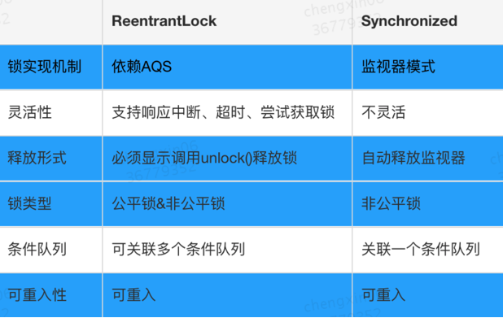

# ReentrantLock与Synchronized

## &sect; ReentrantLock与Synchronized区别：

------

- **存在层面**：***syncronized 是Java 中的一个关键字，==存在于 JVM 层面==，Lock 是 Java 中的一个接口***

- **锁的释放条件**：1. 获取锁的线程执行完同步代码后，自动释放；2. 线程发生异常时，JVM会让线程释放锁；**Lock 必须在 finally 关键字中释放锁，不然容易造成线程死锁**

- **锁的获取**: 在 Syncronized 中，假设线程 A 获得锁，B 线程等待。如果 A 发生阻塞，那么 B 会一直等待。在 Lock 中，会分情况而定，Lock 中有尝试获取锁的方法，如果尝试获取到锁，则不用一直等待

- **锁的状态**：==***Synchronized 无法判断锁的状态，Lock 则可以判断***==

- **锁的类型**：Synchronized 是可重入，不可中断，***非公平锁***；Lock 锁则是 可重入，可判断，==可公平锁==

- **锁的性能**：Synchronized 适用于少量同步的情况下，性能开销比较大。Lock 锁适用于大量同步阶段：

  Lock 锁可以提高多个线程进行读的效率(使用 readWriteLock)

- **在==竞争不是很激烈==的情况下，Synchronized的性能要优于ReetrantLock（因为优化出了偏向锁、自旋、轻量级锁等）**，但是在资源竞争很激烈的情况下，Synchronized的性能会下降几十倍，但是ReetrantLock的性能能维持常态；

- ReetrantLock 提供了多样化的同步，比如有时间限制的同步，***可以被Interrupt的同步（synchronized的同步是不能Interrupt的***）等

------

### **1、 两者都是可重入锁**

两者都是可重入锁。“可重入锁”概念是：自己可以再次获取自己的内部锁。比如一个线程获得了某个对象的锁，此时这个对象锁还没有释放，当其再次想要获取这个对象的锁的时候还是可以获取的，如果不可锁重入的话，就会造成死锁。同一个线程每次获取锁，锁的计数器都自增 1，所以要等到锁的计数器下降为 0 时才能释放锁。

### **2、 synchronized 依赖于 JVM 而 ReentrantLock 依赖于 API**

synchronized 是依赖于 JVM 实现的，前面我们也讲到了 虚拟机团队在 JDK1.6 为 synchronized 关键字进行了很多优化，**但是这些优化都是在虚拟机层面实现的**，并没有直接暴露给我们。**ReentrantLock 是 JDK 层面实现的（也就是 API 层面，需要 lock() 和 unlock() 方法配合 try/finally 语句块来完成）**，所以我们可以通过查看它的源代码，来看它是如何实现的。

### **3、 ReentrantLock 比 synchronized 增加了一些高级功能**

相比 synchronized，ReentrantLock 增加了一些高级功能。主要来说主要有三点：

**① 等待可中断；**

**② 可实现公平锁；**

### **4、 ReentrantLock可实现选择性通知（Condition: 锁可以绑定多个条件）**

==**场景：锁+队列**==

- **ReentrantLock 提供了一种能够中断等待锁的线程的机制**，通过 `lock.lockInterruptibly()` 来实现这个机制。也就是说正在等待的线程可以选择放弃等待，改为处理其他事情。
- **ReentrantLock 可以指定是公平锁还是非公平锁。而 synchronized 只能是非公平锁。所谓的公平锁就是先等待的线程先获得锁。** ReentrantLock 默认情况是非公平的，可以通过 ReentrantLock 类的`ReentrantLock(boolean fair)`构造方法来制定是否是公平的。
- **synchronized 关键字与 `wait()`和 `notify/notifyAll()`方法相结合可以实现等待/通知机制。**
- ReentrantLock 类当然也可以实现，但是**需要借助于 `Condition` 接口与 newCondition() 方法**。Condition 是 JDK1.5 之后才有的，它具有很好的灵活性，比如可以实现多路通知功能也就是在一个 Lock 对象中可以创建多个 Condition 实例（即对象监视器），**线程对象可以注册在指定的 Condition 中，从而可以有选择性的进行线程通知，在调度线程上更加灵活。 在使用 notify/notifyAll()方法进行通知时，被通知的线程是由 JVM 选择的，用 ReentrantLock 类结合 Condition 实例可以实现“选择性通知”** ，这个功能非常重要，而且是 Condition 接口默认提供的。而 synchronized 关键字就相当于整个 Lock 对象中只有一个 Condition 实例，所有的线程都注册在它一个身上。如果执行 notifyAll()方法的话就会通知所有处于等待状态的线程这样会造成很大的效率问题，而 Condition 实例的 signalAll()方法 只会唤醒注册在该 Condition 实例中的所有等待线程。

如果你想使用上述功能，那么选择 ReentrantLock 是一个不错的选择。

------

### **5、 两者的性能已经相差无几**

在 JDK1.6 之前，synchronized 的性能是比 ReentrantLock 差很多。具体表示为：synchronized 关键字吞吐量随线程数的增加，下降得非常严重。而 ReentrantLock 基本保持一个比较稳定的水平。我觉得这也侧面反映了， synchronized 关键字还有非常大的优化余地。后续的技术发展也证明了这一点，我们上面也讲了在 JDK1.6 之后 JVM 团队对 synchronized 关键字做了很多优化。JDK1.6 之后，synchronized 和 ReentrantLock 的性能基本是持平了。所以网上那些说因为性能才选择 ReentrantLock 的文章都是错的！JDK1.6 之后，性**能已经不是选择 synchronized 和 ReentrantLock 的影响因素了！**而且虚拟机在未来的性能改进中会更偏向于原生的 synchronized，所以还是提倡在 synchronized 能满足你的需求的情况下，优先考虑使用 synchronized 关键字来进行同步！**优化后的 synchronized 和 ReentrantLock 一样，在很多地方都是用到了 CAS 操作。**