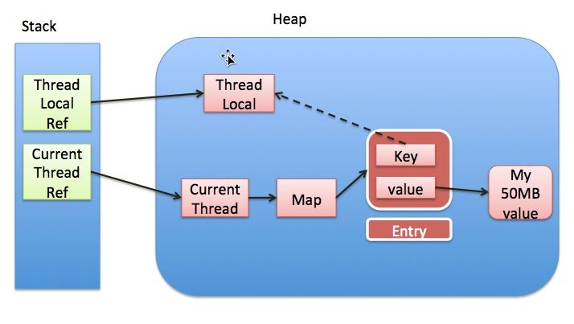

# ThreadLocal

参考：https://zhuanlan.zhihu.com/p/56214714

## 1、简介

通常情况下，我们创建的变量是可以被任何一个线程访问并修改的。**<font color='red'>如果想实现每一个线程都有自己的专属本地变量</font>该如何解决呢？** JDK中提供的`ThreadLocal`类正是为了解决这样的问题。 **`ThreadLocal`类主要解决的就是让每个线程绑定自己的值，可以将`ThreadLocal`类形象的比喻成存放数据的盒子，盒子中可以存储每个线程的私有数据。**

**如果你创建了一个`ThreadLocal`变量，那么访问这个变量的每个线程都会有这个变量的本地副本，这也是`ThreadLocal`变量名的由来。他们可以使用 `get（）` 和 `set（）` 方法来获取默认值或将其值更改为当前线程所存的副本的值，从而避免了线程安全问题。**


## 2、原理

 **<font color='red'>`ThreadLocal` 本身并不存储值，它只是作为一个 `key` 来让线程从 `ThreadLocalMap` 获取 `value`。值得注意的是图中的虚线，表示 `ThreadLocalMap` 是使用 `ThreadLocal` 的弱引用作为 `Key`的，弱引用的对象在 GC 时会被回收。</font>**




## 3、使用举例

```java
public static void main(String[] args) {
  		// 切记是在线程外统一创建threadlocal！！
        final ThreadLocal threadLocal = new ThreadLocal();
        threadLocal.set("hello");
        System.out.println("main thread:" + threadLocal.get());
        new Thread(new Runnable() {
            @Override
            public void run() {
                threadLocal.set("world"); // 线程内部对threadlocal赋不同值
                System.out.println("new Thread1:" + threadLocal.get());
            }
        }).start();
        new Thread(new Runnable() {
            @Override
            public void run() {
                threadLocal.set("!!!");// 线程内部对threadlocal赋不同值
                System.out.println("new Thread2:" + threadLocal.get());
            }
        }).start();
    }
```

------


## 4、 `ThreadLocal`为什么会内存泄漏


`ThreadLocalMap`使用`ThreadLocal`的弱引用作为`key`，如果一个`ThreadLocal`没有外部强引用来引用它，那么系统 GC 的时候，这个`ThreadLocal`势必会被回收，这样一来，`ThreadLocalMap`中就会出现`key`为`null`的`Entry`，就没有办法访问这些`key`为`null`的`Entry`的`value`，如果当前线程再迟迟不结束的话，这些`key`为`null`的`Entry`的`value`就会一直存在一条强引用链：`Thread Ref -> Thread -> ThreaLocalMap -> Entry -> value`永远无法回收，造成内存泄漏。

其实，`ThreadLocalMap`的设计中已经考虑到这种情况，也加上了一些防护措施：<font color='red'>在`ThreadLocal`的`get()`,`set()`,`remove()`的时候都会清除线程`ThreadLocalMap`里所有`key`为`null`的`value`。</font>

但是这些被动的预防措施并不能保证不会内存泄漏：

- 使用`static`的`ThreadLocal`，延长了`ThreadLocal`的生命周期，可能导致的内存泄漏（参考ThreadLocal 内存泄露的实例分析）。
- 分配使用了`ThreadLocal`又不再调用`get()`,`set()`,`remove()`方法，那么就会导致内存泄漏。


## 5、为什么使用弱引用

从表面上看内存泄漏的根源在于使用了弱引用。网上的文章大多着重分析`ThreadLocal`使用了弱引用会导致内存泄漏，但是另一个问题也同样值得思考：为什么使用弱引用而不是强引用？

我们先来看看官方文档的说法：

> To help deal with very large and long-lived usages, the hash table entries use WeakReferences for keys.

为了应对非常大和长时间的用途，哈希表使用弱引用的 key。

下面我们分两种情况讨论：

- ***<font color='red' size=4>key 使用强引用：引用的`ThreadLocal`的==对象==被回收了，但是==`ThreadLocalMap`还持有`ThreadLocal`的强引用==，如果没有手动删除，`ThreadLocal`不会被回收，导致`Entry`内存泄漏。</font>***（强引用必须手动置为null，GC不会回收它）
- **key 使用弱引用**：引用的`ThreadLocal`的对象被回收了，由于`ThreadLocalMap`持有`ThreadLocal`的弱引用，即使没有手动删除，`ThreadLocal`也会被回收。`value`在下一次`ThreadLocalMap`调用`set`,`get`，`remove`的时候会被清除。


关于几种引用，参考：https://juejin.im/post/5b82c02df265da436152f5ad