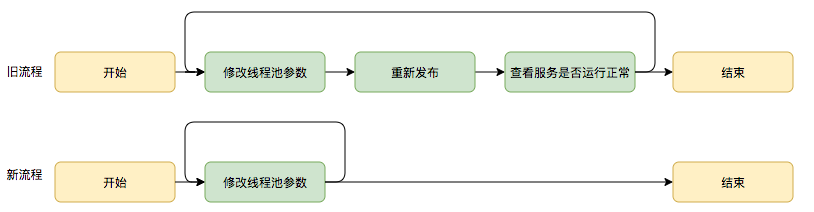

# 线程池的业务实践

## **场景1：快速响应用户请求**

> **描述**：用户发起的实时请求，服务追求响应时间。比如说用户要查看一个商品的信息，**那么我们需要将商品维度的一系列信息如商品的价格、优惠、库存、图片等等聚合起来，展示给用户。**

> **分析**：从用户体验角度看，这个结果响应的越快越好，如果一个页面半天都刷不出，用户可能就放弃查看这个商品了。而面向用户的功能聚合通常非常复杂，伴随着调用与调用之间的级联、多级级联等情况，业务开发同学往往会选择使用线程池这种简单的方式，将调用封装成任务并行的执行，缩短总体响应时间。另外，使用线程池也是有考量的，**这种场景最重要的就是获取最大的响应速度去满足用户，所以应该不设置队列去缓冲并发任务，该使用SynchronousQueue，没有什么任务应该被缓存下来，而是应该立即执行，调高corePoolSize和maxPoolSize去尽可能创造多的线程快速执行任务。**
>
> 

------

## **场景2：快速处理批量任务**

> **描述**：**离线的大量计算任务**，需要快速执行。比如说，统计某个报表，需要计算出全国各个门店中有哪些商品有某种属性，用于后续营销策略的分析，那么我们需要查询全国所有门店中的所有商品，并且记录具有某属性的商品，**然后快速生成报表。**

> **分析**：这种场景需要执行大量的任务，我们也会希望任务执行的越快越好。这种情况下，也应该使用多线程策略，并行计算。**但与响应速度优先的场景区别在于，这类场景任务量巨大，并不需要瞬时的完成，而是关注如何使用有限的资源，尽可能在单位时间内处理更多的任务，也就是吞吐量优先的问题。所以应该设置队列去缓冲并发任务，使用队列去缓冲大批量的任务，队列容量必须声明，防止任务无限制堆积。调整合适的corePoolSize去设置处理任务的线程数。在这里，设置的线程数过多可能还会引发线程上下文切换频繁的问题，也会降低处理任务的速度，降低吞吐量。**
>
> 

------

## 线程池大小的确定

有一个简单并且适用面比较广的公式：

- ==**CPU 密集型任务(N+1)：**== 这种任务消耗的主要是 CPU 资源，可以将线程数设置为 N（CPU 核心数）+1，比 CPU 核心数多出来的一个线程是为了防止线程偶发的缺页中断，或者其它原因导致的任务暂停而带来的影响。一旦任务暂停，CPU 就会处于空闲状态，而在这种情况下多出来的一个线程就可以充分利用 CPU 的空闲时间。
- ==**I/O 密集型任务(2N)：**== 这种任务应用起来，系统会用大部分的时间来处理 I/O 交互，而线程在处理 I/O 的时间段内不会占用 CPU 来处理，这时就可以将 CPU 交出给其它线程使用。因此在 I/O 密集型任务的应用中，我们可以多配置一些线程，具体的计算方法是 2N。

------

## 线程池会带来的问题

> ***核心就是线程池的参数难以配置***

> - **线程数设置过小导致抛出拒绝，导致服务降级**
>
>   
>
> - **线程池队列长度设置过长、corePoolSize设置过小导致任务执行速度低，然后导致服务的不可用**
>
>   
>
>   

------

## 能不能不用线程池？

> ***线程池的另一个不可避免的问题就是其内部Worker的连续争用，锁资源的竞争与分配是要消耗资源的，但这个目前无法解决哈哈哈。***

> 
>
> 这些方案还是不太成熟，所以还是需要线程池。。

------

## 那如何更好的配置参数呢？

### **线程池参数动态化**

> **将线程池的参数从代码中迁移到分布式配置中心上，实现线程池参数可动态配置和即时生效，**线程池参数动态化前后的参数修改流程对比如下：
>
> 

------

### 实现

> JDK原生线程池ThreadPoolExecutor提供了如下几个public的setter方法，如下图所示：
>
> 

JDK允许线程池使用方通过ThreadPoolExecutor的实例来动态设置线程池的核心策略，以setCorePoolSize为方法例，在运行期线程池使用方调用此方法设置corePoolSize之后，线程池会直接覆盖原来的corePoolSize值，并且基于当前值和原始值的比较结果采取不同的处理策略。对于当前值小于当前工作线程数的情况，说明有多余的worker线程，此时会向当前idle的worker线程发起中断请求以实现回收，多余的worker在下次idle的时候也会被回收；对于当前值大于原始值且当前队列中有待执行任务，则线程池会创建新的worker线程来执行队列任务，setCorePoolSize具体流程如下：

> **也就是说：set新值后，线程池内部会处理好当前状态做到平滑修改**

------

具体更完善的架构设计见：https://mp.weixin.qq.com/s/baYuX8aCwQ9PP6k7TDl2Ww

如：

