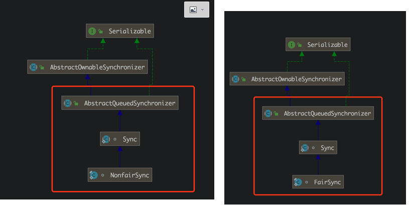
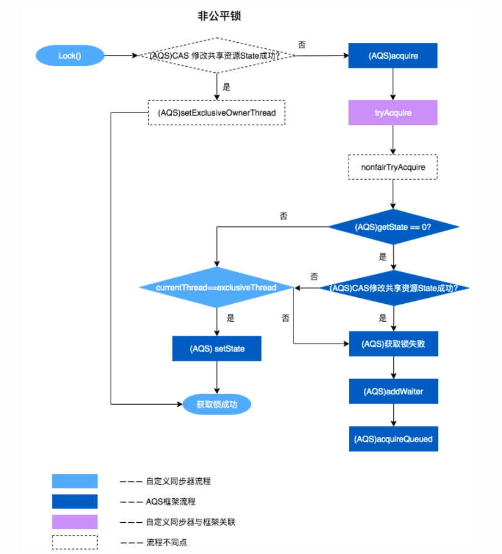

# AQS原理与源码剖析（结合ReentrantLock源码）

介绍：AQS是一种提供了==原子式管理同步状态、阻塞和唤醒线程==功能以及==队列模型==的简单框架


##  1.ReentrantLock即为使用AQS框架实现的

下图为ReentrantLock类中的静态内部类Sync、即其两个子类（对应公平和非公平）的类图。可见，==均继承自AQS。==




## 2. AQS数据结构（CLH双端队列-等待队列）


维护一个由==双向链表==实现的等待队列，链表元素被封装为一个==Node对象(其中包含线程信息)==，这些节点都尝试通过==CAS获取/修改state==。

节点的详细信息如下：

**<font color='red'>注意：head节点(队头)是一个虚节点，仅保留waitStatus属性供后继节点做相应的判断。它代表其中的线程正在工作。</font>**


```java
static final class Node {
    /** 表示线程以共享的模式等待锁 */
    static final Node SHARED = new Node();
    /** 表示线程正在以独占的方式等待锁 */
    static final Node EXCLUSIVE = null;

    /** 等待队列中节点的状态值 , >0 的状态认为是取消，要出队*/
    static final int CANCELLED =  1; // 表示线程获取锁的请求已经取消了, 将会被移出队列。
    static final int SIGNAL    = -1; // 表示线程已经准备好了，就等资源释放了，后继结点在等待当前结点唤醒
   static final int CONDITION = -2; // 表示节点在等待队列中，节点线程等待唤醒
   static final int PROPAGATE = -3; // 当前线程处在SHARED情况下，该字段才会使用
   
   volatile int waitStatus;  // 等待队列中节点的状态, 默认状态为0，代表初始化完成
   volatile Node prev; // 前驱节点
   volatile Node next; // 后继节点
   volatile Thread thread; // 该节点所对应的等待线程。
   
   Node nextWaiter;

    /**
     * Returns true if node is waiting in shared mode.
     */
    final boolean isShared() {
        return nextWaiter == SHARED;
    }

    // 获取前驱节点
    final Node predecessor() throws NullPointerException {
        Node p = prev;
        if (p == null)
            throw new NullPointerException();
        else
            return p;
    }

    Node() {    // Used to establish initial head or SHARED marker
    }

    Node(Thread thread, Node mode) {     // Used by addWaiter
        this.nextWaiter = mode;
        this.thread = thread;
    }

    Node(Thread thread, int waitStatus) { // Used by Condition
        this.waitStatus = waitStatus;
        this.thread = thread;
    }
}
```


## 3. AQS维护核心变量--state

```java
private volatile int state;

protected final int getState() {
    return state;
}

protected final void setState(int newState) {
    state = newState;
}
protected final boolean compareAndSetState(int expect, int update) {
    return unsafe.compareAndSwapInt(this, stateOffset, expect, update);
}
```

我们可以通过修改state字段实现多线程的独占/共享加锁模式：


------


------


## 4. AQS核心代码


> 1. 首先调用可以由子类重写的<font color='red'>`tryAcquire`方法获取资源（修改state）。</font>
> 2. 成功则无事，<font color='red'>失败则入队`addWaiter(Node.EXCLUSIVE)`。</font>
> 3. <font color='red'>`acquireQueued`方法对入队节点进行相应操作使其获取资源/停止获取，中断。</font>


一般来说，自定义同步器要么是==独占方式，要么是共享方式==，它们也只需实现<font color='red'>`tryAcquire-tryRelease、tryAcquireShared-tryReleaseShared`</font>中的一种即可。AQS也支持自定义同步器同时实现独占和共享两种方式，如ReentrantReadWriteLock。ReentrantLock是独占锁，所以实现了`tryAcquire-tryRelease`。


### 1）`acquire()`

```java
public final void acquire(int arg) {
    if (!tryAcquire(arg) &&
        acquireQueued(addWaiter(Node.EXCLUSIVE), arg))
        selfInterrupt();
}
```


------


#### a) `tryAcquire()`

​	需要子类重写。

#### b）`addWaiter()`

```java
private Node addWaiter(Node mode) {
    Node node = new Node(Thread.currentThread(), mode);
    Node pred = tail;
    // 1. 先尝试将node插入尾部
    if (pred != null) {// a
        node.prev = pred;
        if (compareAndSetTail(pred, node)) {// b
            pred.next = node;
            return node;
        }
    }
  	// 2. 尝试插入失败，则调用enq()重新插入
    enq(node);
    return node;
}
```

> 有两种情况会导致过程1插入失败：
>
> 1. <font color = 'red'>a处判断失败，`pred`是null，说明等待队列中没有元素。</font>
> 2. <font color = 'red'>b处判断失败，cas校验失败，即`pred`被其他线程更改过。</font>


#### c）`enq()`

==CAS自旋==

```java
private Node enq(final Node node) {
    for (;;) { // CAS自旋
        Node t = tail;
        if (t == null) { // 等待队列为空
            if (compareAndSetHead(new Node())) // 头节点初始化--虚节点
                tail = head;
        } else {
           // 同addWaiter中一样，只是这里是CAS自旋，直到入队成功
            node.prev = t;
            if (compareAndSetTail(t, node)) {
                t.next = node;
                return t;
            }
        }
    }
}
```


#### d）`acquireQueued()`

==一个Node被放入等待队列后会做些什么？==

```java
final boolean acquireQueued(final Node node, int arg) {
  	// 获取资源失败？
    boolean failed = true;
    try {
        // 被中断？
        boolean interrupted = false;
      	// CAS自旋
        for (;;) {
            final Node p = node.predecessor(); // 获得前驱
            if (p == head && tryAcquire(arg)) {// 若前驱是头(虚节点)，则当前线程尝试获取锁
              	// 获取成功后，将当前节点打造为头节点(虚节点)
                setHead(node);
                p.next = null; 
                failed = false;
                return interrupted;
            }
          	// 前驱不是头节点/前驱是头节点但当前线程获取锁失败
            if (shouldParkAfterFailedAcquire(p, node) &&
                parkAndCheckInterrupt())
                interrupted = true;
        }
    } finally {
        if (failed)
            cancelAcquire(node); // 设置为取消状态
    }
}

private void setHead(Node node) {
	head = node;
	node.thread = null;
	node.prev = null;
}

// 靠前驱节点判断当前线程是否应该被阻塞
private static boolean shouldParkAfterFailedAcquire(Node pred, Node node) {
	// 获取前驱结点的节点状态
	int ws = pred.waitStatus;
	// 说明前驱结点处于唤醒状态(即当前驱释放锁后会通知其后继)
	if (ws == Node.SIGNAL)
		return true; // 可以放心阻塞了
  
	// waitStatus>0是取消状态cancel
	if (ws > 0) {
		do {
			// 循环向前查找取消节点，把取消节点从队列中剔除
			node.prev = pred = pred.prev;
		} while (pred.waitStatus > 0);
		pred.next = node;
	} else {
		// 找到一个正常状态的前驱后，设置前驱节点等待状态为SIGNAL，让其释放锁后通知自己
    // 这里是cas设置，因为有可能设置失败(前驱刚好已经释放完锁了，状态变了)
		compareAndSetWaitStatus(pred, ws, Node.SIGNAL);
	}
	return false;
}

// 进入等待状态，等待唤醒
private final boolean parkAndCheckInterrupt() {
        LockSupport.park(this);
        return Thread.interrupted(); // 判断自己是否被中断唤醒
    }
```

> - 主要会有两个分支判断，首先会进行无限循环中，**<font color='red'>循环中每次都会判断给定当前节点的先驱节点</font>**，如果没有先驱节点会直接抛出空指针异常，直到返回 true。
>
> - **<font color='red'>然后判断给定节点的先驱节点是不是头节点，并且当前节点能否获取独占式锁，如果是头节点并且成功获取独占锁后，队列头指针用指向当前节点，然后释放前驱节点。如果没有获取到独占锁，就会进入 `shouldParkAfterFailedAcquire` 和 `parkAndCheckInterrupt` 方法中</font>**
>
> - <font color='red'>`shouldParkAfterFailedAcquire` 方法主要逻辑是使用`compareAndSetWaitStatus(pred, ws, Node.SIGNAL)`使用CAS将节点状态由 INITIAL 设置成 SIGNAL，表示当前线程阻塞。</font>当 compareAndSetWaitStatus 设置失败则说明 shouldParkAfterFailedAcquire 方法返回 false，然后会在 acquireQueued 方法中死循环中会继续重试，直至compareAndSetWaitStatus 设置节点状态位为 SIGNAL 时 <font color='red'>shouldParkAfterFailedAcquire 返回 true 时才会执行方法 parkAndCheckInterrupt 方法。</font>
>
> - `parkAndCheckInterrupt` 该方法的关键是会调用 LookSupport.park 方法，该方法是用来阻塞当前线程。
>
>   

总结：所以 `acquireQueued` 主要做了两件事情：

1. **<font color='red'>如果当前节点的前驱节点是头节点，并且能够获取独占锁，那么当前线程能够获得锁该方法执行结束退出</font>**

2. **<font color='red'>如果获取锁失败的话，先将节点状态设置成 SIGNAL，然后调用 `LookSupport.park` 方法使得当前线程阻塞。</font>**

3. **<font color='red'>如果 `!tryAcquire` 和 `acquireQueued` 都为 true 的话，则打断当前线程。</font>**


#### e）整个`acquire()`流程


### 2）`release()`

```java
public final boolean release(int arg) {
  	// tryRelease返回当前锁是否空闲
    if (tryRelease(arg)) {
      	// 锁没有被任何线程持有(空闲)
        Node h = head;
        if (h != null && h.waitStatus != 0)
        // 头结点不为空&&头结点的等待状态不是初始化节点情况，解除线程挂起状态
            unparkSuccessor(h);
        return true;
    }
    return false;
}
```


## 5. AQS与ReentantLock的关联


------


ReentrantLock重写了`tryAcquire-tryRelease`方法。并且根据公平锁和非公平锁分了两种锁的获取方式。


### 1）公平锁加锁重写`tryAcquire()`

```java
final void lock() {
  					// 内部调用了重写过的tryAcquire()方法
            acquire(1);
        }

protected final boolean tryAcquire(int acquires) {
    final Thread current = Thread.currentThread();
    int c = getState(); // 获取锁的状态
    if (c == 0) { // 如果是0说明还没有加锁
      	// 判断队列中是否存在有效节点
        if (!hasQueuedPredecessors() &&
            compareAndSetState(0, acquires)) {
            setExclusiveOwnerThread(current);
            return true;
        }
    }
    else if (current == getExclusiveOwnerThread()) {
        int nextc = c + acquires;
        if (nextc < 0)
            throw new Error("Maximum lock count exceeded");
        setState(nextc);
        return true;
    }
    return false;
}

public final boolean hasQueuedPredecessors() {
        Node t = tail; 
        Node h = head;
        Node s;
        return h != t &&
            ((s = h.next) == null || s.thread != Thread.currentThread());
    }
```


### 2）非公平锁加锁重写`tryAcquire()`

```java
final void lock() {
  					// 一上来先尝试获取锁，“插队”
            if (compareAndSetState(0, 1))
                setExclusiveOwnerThread(Thread.currentThread());
            else
              // 插队失败才调用，注意该方法内部调用了重写过的tryAcquire()方法
                acquire(1);
        }

protected final boolean tryAcquire(int acquires) {
    return nonfairTryAcquire(acquires);
}

final boolean nonfairTryAcquire(int acquires) {
            final Thread current = Thread.currentThread();
            int c = getState();
            if (c == 0) {
                if (compareAndSetState(0, acquires)) {
                    setExclusiveOwnerThread(current);
                    return true;
                }
            }
            else if (current == getExclusiveOwnerThread()) {
                int nextc = c + acquires;
                if (nextc < 0) // overflow
                    throw new Error("Maximum lock count exceeded");
                setState(nextc);
                return true;
            }
            return false;
        }
```





### 3）`tryRelease()`


```java
// 方法返回当前锁是不是空闲
protected final boolean tryRelease(int releases) {
  	// 1. 减少可重入次数
    int c = getState() - releases;
  	// 当前线程不是持有锁的线程，抛出异常
    if (Thread.currentThread() != getExclusiveOwnerThread())
        throw new IllegalMonitorStateException();
    boolean free = false; 
  	// 2. 如果持有线程全部释放，将当前独占锁所有线程设置为null
    if (c == 0) {
        free = true;
        setExclusiveOwnerThread(null);
    }
  	// 3. 更新state
    setState(c); 
    return free;
}
```


参考地址：https://tech.meituan.com/2019/12/05/aqs-theory-and-apply.html

https://www.cnblogs.com/waterystone/p/4920797.html