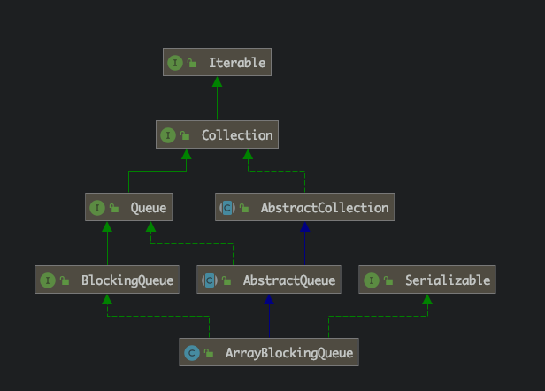

# JAVA并发容器之ArrayBlockingQueue源码解析


**<JDK1.8/JDK8>**





## 1、主要成员变量

```java
/** 数组实现的存储结构 */
final Object[] items; 

/** 下一个 take, poll, peek or remove 操作的下标*/
int takeIndex;

/** 下一个 put, offer, or add 操作的下标 */
int putIndex;

/** 存储的元素个数 */
int count;

/*
 * Concurrency control uses the classic two-condition algorithm
 * found in any textbook.
 */

/** 队列的可重入锁 */
final ReentrantLock lock;

/** take操作等待的Condition */
private final Condition notEmpty;

/** put操作等待的Condition */
private final Condition notFull;
```


## 2、构造方法

```java
/**
 * 指定队列容量，
 * false，为默认非公平实现
 */
public ArrayBlockingQueue(int capacity) {
    this(capacity, false);
}

/**
 * 通过指定fair参数实现公平队列
 */
public ArrayBlockingQueue(int capacity, boolean fair) {
    if (capacity <= 0)
        throw new IllegalArgumentException();
    this.items = new Object[capacity]; // 初始化数组对象来实际存储数据
    lock = new ReentrantLock(fair);  // 初始化锁
    notEmpty = lock.newCondition();  // 初始化两个Condition
    notFull =  lock.newCondition();
}

/**
 *  使用实现Collection接口的对象初始化队列
 */
public ArrayBlockingQueue(int capacity, boolean fair,
                          Collection<? extends E> c) {
    this(capacity, fair);

    final ReentrantLock lock = this.lock;
    lock.lock(); // Lock only for visibility, not mutual exclusion
    try {
        int i = 0;
        try {
            for (E e : c) {
                checkNotNull(e);
                items[i++] = e;
            }
        } catch (ArrayIndexOutOfBoundsException ex) {
            throw new IllegalArgumentException();
        }
        count = i;
        putIndex = (i == capacity) ? 0 : i;
    } finally {
        lock.unlock();
    }
}
```

## 2、有关阻塞的实现方法


```java
/**
 * Inserts the specified element at the tail of this queue, waiting
 * for space to become available if the queue is full.
 *
 * @throws InterruptedException {@inheritDoc}
 * @throws NullPointerException {@inheritDoc}
 */
public void put(E e) throws InterruptedException {
    checkNotNull(e);
    final ReentrantLock lock = this.lock;
    lock.lockInterruptibly();
    try {
        while (count == items.length)
            notFull.await(); // 队列满，当前生产者线程阻塞在notFull
        enqueue(e); // 否则插入数据
    } finally {
        lock.unlock();
    }
}

 /**
     * Inserts element at current put position, advances, and signals.
     * Call only when holding lock.
     */
    private void enqueue(E x) {
        // assert lock.getHoldCount() == 1;
        // assert items[putIndex] == null;
        final Object[] items = this.items;
        items[putIndex] = x;
        if (++putIndex == items.length)
            putIndex = 0;
        count++;
        notEmpty.signal(); // 通知在notEmpty阻塞着的消费者线程有数据可取
    }
```

<font color='red' size=4>重点为第14、33行。</font>


```java
public E take() throws InterruptedException {
    final ReentrantLock lock = this.lock;
    lock.lockInterruptibly();
    try {
        while (count == 0)
            notEmpty.await(); // 当前消费者线程阻塞在notEmpty
        return dequeue(); // 否则删除数据
    } finally {
        lock.unlock();
    }
}


/**
     * Extracts element at current take position, advances, and signals.
     * Call only when holding lock.
     */
    private E dequeue() {
        // assert lock.getHoldCount() == 1;
        // assert items[takeIndex] != null;
        final Object[] items = this.items;
        @SuppressWarnings("unchecked")
        E x = (E) items[takeIndex];
        items[takeIndex] = null;
        if (++takeIndex == items.length)
            takeIndex = 0;
        count--;
        if (itrs != null)
            itrs.elementDequeued();
        notFull.signal(); // 通知在notNull阻塞着的生产者线程队列不满，可以插入数据
        return x;
    }
```


## 3、await方法

```java
/**
         * Implements interruptible condition wait.
         * <ol>
         * <li> If current thread is interrupted, throw InterruptedException.
         * <li> Save lock state returned by {@link #getState}.
         * <li> Invoke {@link #release} with saved state as argument,
         *      throwing IllegalMonitorStateException if it fails.
         * <li> Block until signalled or interrupted.
         * <li> Reacquire by invoking specialized version of
         *      {@link #acquire} with saved state as argument.
         * <li> If interrupted while blocked in step 4, throw InterruptedException.
         * </ol>
         */
        public final void await() throws InterruptedException {
            if (Thread.interrupted())
                throw new InterruptedException();
            Node node = addConditionWaiter();
            long savedState = fullyRelease(node);
            int interruptMode = 0;
            while (!isOnSyncQueue(node)) {
                LockSupport.park(this);
                if ((interruptMode = checkInterruptWhileWaiting(node)) != 0)
                    break;
            }
            if (acquireQueued(node, savedState) && interruptMode != THROW_IE)
                interruptMode = REINTERRUPT;
            if (node.nextWaiter != null) // clean up if cancelled
                unlinkCancelledWaiters();
            if (interruptMode != 0)
                reportInterruptAfterWait(interruptMode);
        }
```

<font color='red' size=4>主要是第21行，调用`LockSupport.park(this)`来阻塞当前线程。</font>

进一步查看该方法：

```java
public static void park(Object blocker) {
    Thread t = Thread.currentThread();
    setBlocker(t, blocker);
    UNSAFE.park(false, 0L);
    setBlocker(t, null);
}
```

<font color='red' size=4>先调用`setBlocker`方法保存要阻塞的线程，然后调用`UNSAFE.park`阻塞。</font>

