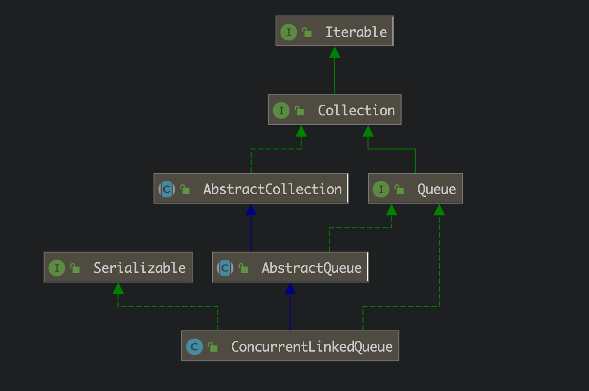

# JAVA并发容器之ConcurrentLinkedQueue源码解析

参考：https://juejin.im/post/5aeeae756fb9a07ab11112af


==这是一个非阻塞队列==


1. ## 类图





2. ## 源码

   a) 数据结构：

   ​	链表：存储对象Node(在内部类中定义)

   ​	

   ```java
   private static class Node<E> {
       volatile E item;
       volatile Node<E> next;
   
       /**
        * Constructs a new node.  Uses relaxed write because item can
        * only be seen after publication via casNext.
        */
       Node(E item) {
           UNSAFE.putObject(this, itemOffset, item);
       }
   
       boolean casItem(E cmp, E val) {
           return UNSAFE.compareAndSwapObject(this, itemOffset, cmp, val);
       }
   
       void lazySetNext(Node<E> val) {
           UNSAFE.putOrderedObject(this, nextOffset, val);
       }
   
       boolean casNext(Node<E> cmp, Node<E> val) {
           return UNSAFE.compareAndSwapObject(this, nextOffset, cmp, val);
       }
     ......
   }
   ```

   

   且ConcurrentLinkedQueue类维护了两个Node的引用，分别与队头和队尾“相关”

   ```java
   private transient volatile Node<E> head;
   
   private transient volatile Node<E> tail;
   
   public ConcurrentLinkedQueue() {
       head = tail = new Node<E>(null);
   }
   ```

   b) 入队：offer方法

   ```java
   public boolean offer(E e) {
       checkNotNull(e); // 检查插入对象是否为null
       final Node<E> newNode = new Node<E>(e); // 将插入对象封装为Node对象
   
     	// p是维护的真正的队尾节点，tail是“延迟”更新的队尾
       for (Node<E> t = tail, p = t;;) { 
           Node<E> q = p.next;
           if (q == null) { // 即当前p确实为尾节点
               if (p.casNext(null, newNode)) {
                   // 利用cas机制将新节点插入到尾节点的next
                   if (p != t) 
                       casTail(t, newNode);  // 更新tail引用，使其指向新插入的节点(尾部).
                   return true;
               }
           }
           else if (p == q)
               // 
               p = (t != (t = tail)) ? t : head;
           else
               // 寻找尾节点
               p = (p != t && t != (t = tail)) ? t : q;
       }
   }
   ```

   > - `t != (t = tail)`：该判断在单线程之中是不会为true的，只有在多线程中，线程A刚读完t后，线程B又修改了t，这时，该判断就会为true。


​		(c) 出队：poll方法

```java
public E poll() {
    restartFromHead:
    for (;;) {
      // p 为维护的真正可删除的头节点的引用
        for (Node<E> h = head, p = h, q;;) {
            E item = p.item;

            if (item != null && p.casItem(item, null)) { // 先将要删除的节点值设为null
                if (p != h)
                  // 将删除的头节点变为“哨兵节点”，即next指向自己
                    updateHead(h, ((q = p.next) != null) ? q : p);
                return item;
            }
            else if ((q = p.next) == null) {
                updateHead(h, p);
                return null;
            }
            else if (p == q)
                continue restartFromHead;
            else
                p = q;
        }
    }
}
```